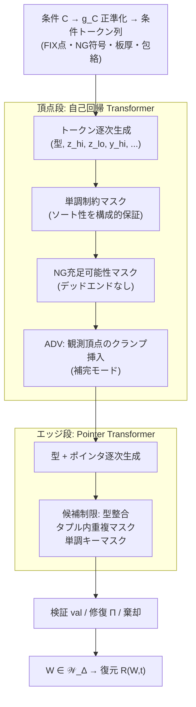

# 板金ミッドサーフェス・ワイヤーフレーム生成モデル — 数学的理論(確定版)

構成: Part I に最終点検(3回目)の発見事項、Part II に全修正を織り込んだ
自己完結の確定仕様。以後、本書を唯一の正とし、旧2文書は履歴とする。

---

# Part I: 最終点検の発見事項

前回の修正版(P1'〜P7')を敵対的に再検証した結果、7件を検出した。

| ID | 発見事項 | 種別 |
|---|---|---|
| I | 軸別スケールトークン(前回修正)が条件由来フレーム(前回修正B)と矛盾 — スケールが生成物依存に逆戻りしていた | **前回点検の自己矛盾** |
| II | 「エッジが締結点を参照する」構想が CIRCLE(3点通過)の型と整合しない — 締結点は曲線上にない | 型不整合 |
| III | 構造化マスク(締結近傍を残す)の観測点は系列上に**散在**するため、FIM のスパン補完では扱えない | 補完機構の欠陥 |
| IV | 円弧の Hausdorff 誤差 O(Δ) は中間点が端点から離れている場合のみ成立 — 仮説の明示漏れ | 命題の前提不備 |
| V | NG マスクのデッドエンドは「バックトラック」ではなく充足可能性判定で**構成的に排除できる** | 保証の強化余地 |
| VI | G¹ 連続は「ソフト」のまま放置されていた — 修復作用素として定式化可能 | 保証の強化余地 |
| VII | MaskGIT 型並列デコードは学習した同時分布からの正確なサンプリングではない(既知の事実)— AR 採用の追加根拠として明記すべき | 論拠の補強 |

**解消方針**(詳細は Part II に統合済み):

- **[I]** 正規化を条件由来に一本化する。正準変換 $g_C$ を「回転+並進+軸別スケール」の相似変換とし、スケールは**設計包絡(条件の一部)**から取る。スケールトークンは削除。学習・推論とも同一の変換で完全に整合する
- **[II]** 締結アンカー型 `CIRCLE_C` を追加: 中心を FIX 点、半径を曲線上1点への参照で与え、円平面は FIX 点が保持する軸 $n_f$ から取る。これにより**ボルト穴とボルト軸の同芯性が構成的に保証される**(学習で近づけるのではなく、表現上ずれようがない)。面上のスポット溶接は幾何実体を持たないため、距離規準によるソフト制約として明確に区別する
- **[III]** FIM を廃し、**クランプ付き交互挿入 AR** に置換: 観測頂点をソート順に消費しながら、モデルは「次の観測点の手前に新頂点を挿入する」か「観測点を確定する(ADV)」かを選ぶ。単調制約は両側区間 $(\text{直前キー},\ \text{次観測キー})$ のマスクになる
- **[IV]** 円弧誤差命題に「中間点はパラメータ中点(端点から有界に離れる)」を明示の仮説として付す。中点規約の下で定数は小さい($C \approx 2$)
- **[V]** NG マスクを**充足可能性判定型**に格上げ: 部分割当 $a$ に対し「$N$ 外に完成できる継続が存在しない場合に限り」値を禁止する。$N$ が箱の和なら閉形式で判定でき、帰納法によりデッドエンドは発生しない(命題 F5)
- **[VI]** 修復作用素 $\Pi$(制約多様体への最小二乗射影)を定義し、残差が小さいときの摂動上界を条件付き命題として与える(命題 F8)
- **[VII]** AR の祖先サンプリングは学習済み分布 $p_\theta$ からの**正確な**サンプリングである(MaskGIT 型並列確定は一般に $p_\theta$ の同時分布からのサンプリングにならない)。頂点段 AR 化の決定はソート性・NG 保証に加えこの分布的正確性からも支持される

---

# Part II: 確定仕様

## 1. 表現可能クラス

### 定義 1(型付きワイヤーフレーム、確定版)

```math
W = (P, T, E), \quad P = (p_1, \dots, p_n),\ p_i \in \mathbb{R}^3
```

点型 $T_i \in \{\text{END}, \text{MID}, \text{CTRL}, \text{FIX}\}$。
FIX は条件由来(締結点、軸 $n_f$ と種別を属性に持つ)であり、
**モデルは FIX 型を生成できない**(型トークンから恒久的にマスク)。

エッジ $e = (\tau, \iota)$、型とアリティ:

| $\tau$ | 参照 | 実現 $\Gamma(e)$ |
|---|---|---|
| LINE | $(i, j)$ | 線分 $\overline{p_i p_j}$ |
| ARC | $(i, m, j)$ | 3点を通る一意円の $m$ を含む弧($m$ はパラメータ中点規約) |
| CIRCLE | $(a, b, c)$ | 3点を通る一意円(正準3点規約: 円自身のフレームで角 $0°,120°,240°$) |
| **CIRCLE_C** | $(c_{\text{fix}}, r)$ | 中心 $p_{c_{\text{fix}}}$(FIX 型限定)、平面 $\perp n_f$、半径は $p_r$ の平面射影までの距離 |
| SPLINE$_k$ | $(i, P_1..P_k, j)$ | 端点クランプ・一様ノット3次 B-スプライン |

### 定義 2(型退化規則と表現可能クラス $\mathcal{W}_\Delta$)

量子化ステップ $\Delta$(§3)に対し、サジッタ $s < k\Delta$ の弧は
LINE に退化させる(退化誤差 $= s < k\Delta$)。長い緩曲線は
サジッタが閾値を超える弧長単位に分割してから判定する。
量子化・退化・重複マージ(§4)を施した集合を $\mathcal{W}_\Delta$ と書く。
**以後のすべての保証は $\mathcal{W}_\Delta$ 上の主張**であり、
真の連続形状との差は一様に $O(\Delta)$(命題 F7)。

## 2. 条件と正準化

### 定義 3(条件)

```math
C = (F,\ N,\ t,\ B_{\text{env}})
```

$F$: 締結点集合 $(x_f, \text{type}_f, n_f)$、$N$: NG領域(凸領域の有限和)、
$t$: 板厚(**条件入力**、生成しない)、$B_{\text{env}}$: 設計包絡箱。

### 定義 4(条件由来の正準相似変換)

```math
g_C = (\text{回転} R_C,\ \text{並進} o_C,\ \text{軸別スケール} \Lambda_C) \quad \text{すべて } B_{\text{env}} \text{ と } F \text{ から決定的に導出}
```

学習・推論とも $(C, W) \mapsto (g_C^{-1} C,\ g_C^{-1} W)$ と**同時に**正準化する。
モデルの不変性は共変性として自動成立:

```math
p_\theta(g \cdot W \mid g \cdot C) = p_\theta(W \mid C)
```

生成物に依存する量は $g_C$ に一切含まれない(発見事項 I の解消)。
以後、座標は $[0,1]^3$ に正規化済みとする。

## 3. 量子化と誤差保証

### 定義 5(粗細量子化)

軸別ステップ $\Delta_a = L_a / 2^b$($L_a$: 包絡の軸長、$b = 14$)。
トークンは $c = c_{\text{hi}} \cdot 2^{b/2} + c_{\text{lo}}$ の2分割。
丸め誤差上界は $\Delta_a / 2$、以後 $\Delta = \max_a \Delta_a$。

### 命題 F7(一様曲線誤差)

点の摂動を $\delta \leq \sqrt{3}\,\Delta/2$ とすると、各エッジ型の実現曲線について

```math
d_H\big(\Gamma(e),\ \Gamma(\hat{e})\big) \leq C_\tau\, \delta
```

- LINE: $C = 1$(端点補間)
- SPLINE: $C = 1$(凸包性 — 曲線は制御点凸包内、制御点摂動が曲線 $\sup$ 誤差を支配)
- ARC: **中間点がパラメータ中点である仮説の下で** $C \approx 2$。
  中間点が端点に近づくと定数は発散するが、中点規約により排除される
  (発見事項 IV)。円の中心・半径は共線近傍で暴れるが、
  評価対象は実現曲線であり有界に留まる
- CIRCLE_C: 中心は FIX(誤差なし)、半径点の射影で $C = 1$
- 型退化: 追加誤差 $< k\Delta$

よって $d_H(|W|, |\hat{W}|) = O(\Delta)$ が全型一様に成立。∎

## 4. 系列化と尤度同値

### 定義 6(マージ規約と正準順序)

同一 $(T, \text{ビン})$ の点はマージする(異型同ビンは許容)。
点の全順序: キー $(T, c^z, c^y, c^x)$ の辞書式(FIX ブロック先頭)。
エッジの全順序: キー $(\min\iota, \max\iota, \tau, \text{補助点座標})$ の辞書式。
系列 $s = \sigma(W)$ は点ブロック+エッジブロック。

### 命題 F1(可逆性と尤度同値)

マージ規約の下で $\sigma: \mathcal{W}_\Delta \rightarrow \Sigma^*$ は単射で、
復号 $\delta_\Sigma \circ \sigma = \mathrm{id}$。ゆえに系列の最尤推定は
$\mathcal{W}_\Delta$ 上の分布の最尤推定と厳密に一致する。
マージ規約は単射性の**必要**条件である(同内容スロットが2つあると
ポインタ教師が非一意になる)。∎

## 5. 生成モデル



### 5.1 頂点段: 単調制約付き自己回帰

```math
p_\theta(P, T \mid C) = \prod_t p_\theta(s_t \mid s_{<t}, \text{enc}(C)),
```

**単調制約デコード**: ソート性はキー比較の状態機械で構成的に強制する。
直前キー $K_{t-1}$、(補完時は)次観測キー $K^{\text{obs}}$ に対し、
許容キーは整数区間 $(K_{t-1},\ K^{\text{obs}})$。粗細分解では:
$c_{\text{hi}} > $ 下限の粗部なら細部は自由、等しければ細部に下限、
上限側も対称。タイ時は次軸へ制約が伝播する(有限状態で実装可能)。

**長さ**: stop トークン。**FIX 型は生成禁止**(条件からのみ)。

### 命題 F2(正確なサンプリング)

祖先サンプリングは $p_\theta$ の同時分布からの厳密なサンプリングである。
(対比: MaskGIT 型の並列確定は、確定順序に依存する近似であり、
一般に学習した同時分布からのサンプリングにならない。)
制約マスク適用後の生成は、台を制限し再正規化した分布
$\tilde{p} \propto p_\theta \cdot \mathbb{1}_{\text{制約}}$ からの厳密なサンプリングである。∎

### 5.2 補完: クランプ付き交互挿入(発見事項 III の解消)

観測頂点(構造化マスク $\mu_2$ で残る集合)はソート順に散在する。
観測列 $O = (o_1 \prec o_2 \prec \dots)$ に対し、各ステップの行動空間を

1. **挿入**: キー $\in (K_{\text{last}},\ \text{key}(o_j))$ の新頂点を生成
   (両側単調マスクで強制、開区間なので観測との重複も構成的に排除)
2. **ADV**: $o_j$ をそのまま確定し $j \mathrel{+}= 1$(教師は既知なので学習可能)

とする。損失は挿入トークンと ADV 選択にのみかかる。
生成($\mu_3$)は $O = F$ のみ(FIX プレフィックス)の特殊例として同一機構で回る。
エッジ段の補完も、観測エッジを単調キー順に ADV 消費する同型の機構で扱う。

### 5.3 エッジ段: Pointer Transformer

```math
p_\theta(\iota_j = i \mid \cdot) = \mathrm{softmax}_{i \in \mathcal{A}_j}\big(\mathbf{q}_j^\top \mathbf{W} \mathbf{e}_i\big)
```

候補集合 $\mathcal{A}_j$ は以下の積で制限する(すべて分布の台の性質):
型整合(ARC 中間は MID、CIRCLE_C 中心は FIX のみ)、
タプル内確定済みスロットの除外(零長・退化の排除)、
単調エッジキー(直前エッジより辞書式に大きい参照のみ — 重複エッジの排除)。

### 命題 F3(構成的保証群)

学習の出来と無関係に、生成物は以下を確率1で満たす:
参照整合・型整合・タプル内非重複・エッジ非重複・頂点ソート性・
頂点非重複(区間マスク)・系列の整形式性(stop による終端)・
**CIRCLE_C 穴の締結軸との同芯性**。最後の項目は表現の定義から従う:
中心参照は FIX に限定され、円平面は $n_f$ から取られるため、
同芯からずれた穴はそもそも表現空間に存在しない。∎

## 6. NG 領域: 充足可能性判定型マスク

### 命題 F5(デッドエンドなしの頂点回避)

部分割当 $a$(確定済みの軸・ビン)に対し、値 $v$ を禁止する条件を

```math
v \in \text{mask}(a) \iff \forall\, \text{完成} \hat{p} \in \mathrm{cell}(a \cup v): \ \hat{p} \in N
```

(= セル $\mathrm{cell}(a \cup v)$ が $N$ に完全に含まれる)と定める。
$N$ が軸平行箱の有限和なら包含判定は閉形式。このとき:

1. **健全性**: 最終確定した頂点セルは $N$ に完全包含されないため、
   セル代表点を $N$ 外に取れる… では不十分なので厳密には最終(最細)段で
   「セルが $N$ と交わる」値を禁止する。中間段は完全包含判定、
   最終段のみ交差判定、という2層規則にする
2. **完全性(デッドエンドなし)**: 帰納法。部分割当 $a$ に $N$ 外の完成が
   存在するなら、その完成が通る値 $v^*$ は中間段では禁止されず
   (完全包含に反する)、最終段でも $N$ 外セルとして生き残る。∎

曲線の NG 回避は復号後の決定的交差判定+棄却。厳密な制約分布
$\tilde{p} \propto p_\theta \cdot \mathbb{1}$ からのサンプリングは全体棄却で
達成される($Z > 0$ なら期待再試行 $1/Z$)。交差エッジのみの局所再生成は
**厳密分布の近似**であり、計算量との交換として明示的に採用する。

## 7. 学習目的とカリキュラム

### 命題 F4(補完と生成の関係、確定版)

観測集合の分布族 $\{\mu_1(\text{ランダム率}), \mu_2(\text{締結近傍}), \mu_3(\text{FIXのみ})\}$
に対する損失はいずれも、同一の条件付き分布族
$\{p(s_{\text{未観測}} \mid s_{\text{観測}}, C)\}$ の対数損失の期待である。

- **厳密に言えること**: 実現可能・十分データの極限で各段の最適解は一致する。
  タスクの数学的対象は同一である
- **厳密に言えないこと**: 有限標本では μ が推定量を変える。
  μ₃ 領域(空文脈からの大域レイアウト)の実効標本数は μ₁ 学習では
  乏しく、カリキュラムの存在理由はこの標本配分にある
- **推論時整合**: AR + クランプ挿入では、補完も生成も学習分布からの
  厳密な祖先サンプリング(F2)であり、反復精緻化型に固有の
  確定順序依存の不整合は生じない。残るのは学習分布と真分布の乖離のみ

学習データは $\mathcal{L} = \alpha\,\mathbb{E}_{\mathcal{D}_r} + (1-\alpha)\,\mathbb{E}_{\mathcal{D}_s}$。
Stage 1(μ₁)は自然混合、Stage 2–3 は $\alpha \to 1$ または
constraint-first 作成分に限定(条件付き分布の教師としての正当性)。
検証は $\mathcal{D}_r$ のみ。エッジ段には頂点座標ノイズ注入
(量子化1〜2ビン相当)で段間分布シフトを緩和する。

## 8. 検証・修復・妥当性

```math
\mathrm{val}(W) = \mathrm{ref} \wedge \mathrm{ndg} \wedge \mathrm{loop} \wedge G^1_\epsilon \wedge \mathrm{avoid}_N
```

- ref / ndg / avoid$_N$(頂点): **構成的**(F3, F5)
- 厳密共線(ARC 3点): 測度零 + 復号時判定で LINE へフォールバック
- loop(閉路条件): 操作的定義 — **CAD カーネルの sew 実行テスト**を正とする。
  必要条件(エッジ多重集合が面境界閉路群に分解可能、各エッジの使用回数
  1 または 2)は事前フィルタとして使う
- $G^1_\epsilon$: ソフト補助損失 + 修復作用素(下記)

### 命題 F8(修復作用素の摂動上界)

接線連続などの等式制約 $g(P) = 0$ に対し

```math
\Pi(P) = \arg\min_{P'} \|P' - P\|^2 \ \text{s.t.}\ g(P') = 0
```

制約ヤコビアンの最小特異値が近傍で $\sigma_{\min} \geq s > 0$ かつ
残差 $\|g(P)\| \leq \rho$ が十分小なら

```math
\|\Pi(P) - P\| \leq \frac{\rho}{s} + O(\rho^2)
```

よって残差が小さい生成物に対し、修復は F7 の $O(\Delta)$ 保証を保ったまま
$G^1$ を厳密化できる(残差が大きい場合は棄却に回す)。∎

## 9. 復元の適定性

### 命題 F6(オフセット復元)

面復元仮定 A(各面は平面・ルールド面・一定Rフィレットで境界から復元可能)
の下で、$R(W, t)$ が自己交差のない多様体ソリッドを与える条件は
$t/2 < \mathrm{reach}(S_{\text{mid}})$。曲げ部では
$R_{\text{mid}} = R_{\text{in}} + t/2$ より条件は $R_{\text{in}} > 0$ と同値で
**常に成立**する。**ヘム(折返し)部は分離距離条件を厳密に破るため
適用除外**とし、扱う場合は専用の縫合規約を別途定義する。
変厚(テーラードブランク)はスコープ外。∎

## 10. 保証の総括

| 保証レベル | 内容 |
|---|---|
| **構成的**(学習と無関係) | 参照整合 / 型整合 / 非重複(頂点・エッジ・タプル内)/ ソート性 / 頂点NG回避(デッドエンドなし)/ CIRCLE_C 同芯性 / 終端 |
| **分布的に厳密** | 祖先サンプリング = $p_\theta$ からの厳密サンプル(F2)/ 系列MLE = 形状MLE(F1) |
| **誤差有界** | 全エッジ型で曲線 Hausdorff 誤差 $O(\Delta)$(F7)/ 修復摂動 $\rho/s$(F8) |
| **統計的+検証** | 閉路条件(sew テスト)/ $G^1$(ソフト+修復)/ 曲線NG(棄却厳密・局所修復は近似)/ 分布品質(MMD等) |
| **スコープ外(明示)** | 自由曲面パッチ(仮定 A の外: ビード等 → UDF 系と相補)/ ヘム / 変厚 |

## 11. 凍結事項と自由度

**凍結(本理論の一部)**: 定義1〜6、命題 F1〜F8、正準化の条件由来性、
頂点段の AR + 単調・充足可能性マスク、クランプ付き交互挿入、
CIRCLE_C の導入、型退化規則、検証述語の操作的定義。

**自由度(命題に影響しない実装詳細)**: 層数・次元・ヘッド数、
$b$(誤差保証は $\Delta$ を通じてパラメトリック)、退化閾値 $k$、
構造化マスク半径 $\rho$ のスケジュール、混合比 $\alpha$ のスケジュール、
条件エンコーダの形式(NG の符号化方式を含む)。

---

## 点検の総括(3回の反復で何が起きたか)

初版は表現と分解の骨格を与えたが、生成時に頂点数が定まらない・
フレームが計算不能・緩い弧が表現不能という3つの実害を含んでいた。
2回目の点検はそれらを修正したが、自らスケールの矛盾を持ち込み、
締結参照の型不整合と散在観測の補完機構を見落としていた。
本確定版は、残っていた不整合をすべて構成的保証か明示的スコープ外の
いずれかに割り当て、**「保証されること」と「されないこと」の境界が
命題として閉じた状態**にある。以降の変更は実装からのフィードバックを
受けた場合に限り、該当する定義・命題単位で行う。
