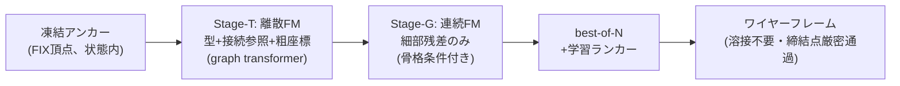

# Frontier の課題分析と改革案 — 横並び比較実験計画

Date: 2026-08-27
前提: docs/architecture_survey_202608.md(2025-26 サーベイ)の続編。
目的: 最新研究の**未解決課題**を特定し、それに対する改善策・改革策を設計、
「frontier 忠実再現」vs「当方考案アーキテクチャ」の横並び学習比較を計画する。

---

## 1. 各 frontier 研究の課題(個別批判)

### 1.1 CLR-Wire (SIGGRAPH 2025)

1. **順序の病が latent 内部に再侵入している**。トポロジを「BFS ソートした隣接
   リストの差分列」として latent に埋めるが、BFS 正準順序はまさに当方 F1 が
   苦しんだ「グラフへの人工的順序付け」。結果、130K サンプルで学習しても
   トポロジ整合 81.79% 止まり(自己交差・接続誤り・余剰曲線)。
2. **グローバル latent のボトルネック**。付録Dで自認: 「global feature の注入
   だけでは局所詳細を捉えられない」。固定長 64×16 latent は部品複雑度の上限になる。
3. **条件エンコーダが凍結**(PointNet++ frozen)。条件と生成の同時最適化がない。
4. **拘束の保証がない**。点群条件は AdaLN 経由の「傾向」であり、生成形状が
   条件点を厳密に通る保証はゼロ。締結点(必ず部品上にある)用途には致命的。
5. 推論 250 ODE ステップと重い。

### 1.2 Flatten The Complex (2026-01, k-cell particles)

1. **共有パターン(どのセルがどの latent を共有するか)は学習時には GT から
   与えられる**。サンプリング時に共有構造=トポロジをどう決めるかが本当の難所で、
   そこはマッチング/近接判定に依存する(問題が消えたのではなく移動した)。
2. Hungarian/集合マッチング学習は初期の割当が不安定(勾配ノイズ)。
3. 100K+ データ前提。小データでの成立性は未検証。

### 1.3 TG-Diff / DTGBrepGen(2段分離派)

1. **トポロジ段が幾何を見ない(blind topology)**。隣接関係だけ先に決めるため、
   幾何的に実現不可能なトポロジを引いた場合、後段は救えない。**一方向カスケードで
   フィードバックがない**(段1の誤りは段2で修正不能)。
2. **表現が閉じたソリッド中心**。面隣接ベースのトポロジは B-rep solid を仮定。
   板金**中立面 = 開いた非多様体シェル**は彼らの守備範囲外(当方の領域は
   frontier の空白地帯)。
3. 隣接行列の離散拡散は O(N²) スケール。

### 1.4 DeFoG (ICML 2025)

1. ノード/エッジが**カテゴリ属性のグラフ**が主戦場。連続幾何属性(座標)は
   一級市民ではない — 「幾何グラフの離散+連続 joint FM」は未整備。
2. 表現力確保に追加特徴量(スペクトラルなど)が必要で、denoiser 設計は自明でない。

### 1.5 AR 系(BrepARG / BrepGPT / CMT)

1. 100K 規模データ+重いトークン設計が前提。exposure bias の根本解決はしておらず
   データ量で殴っている(当方 2.3K では再現不能なことを実測済み: C=52.2mm 収束)。

## 2. 横断的な未解決課題(分野全体の穴)

| # | 穴 | 影響 |
|---|---|---|
| G1 | **条件充足が soft**(global feature 注入のみ)。「この点を厳密に通れ」を保証する機構がない | 締結点用途で致命的 |
| G2 | **妥当性が統計的**(80-90%台)。構成的保証への設計が半端 | 下流 CAD 化で手作業 |
| G3 | **データ飢餓**(全論文 100K+)。小データ regime は完全に未踏 | 実プロジェクトの大半は小データ |
| G4 | **トポロジ⇄幾何のフィードバック欠如**(2段は一方向) | 不可能トポロジで全損 |
| G5 | **test-time scaling 不在**。best-of-N・検証器・自己修正を誰もやっていない(LLM 分野の2024-25の教訓が幾何生成に未輸入) | 安価な品質向上余地の放置 |
| G6 | **開シェル/非多様体(=板金中立面)が空白地帯** | 当方の領域は競合不在 |
| G7 | 評価が分布指標(COV/MMD)偏重。工学的使用可能性(拘束充足・溶接率)を測らない | 論文値と実用の乖離 |

## 3. 改善策と改革策

### 改善策(incremental — frontier に足せば効くもの)

- **I1 頂点共有参照**(Flatten 由来): エッジ端点=頂点トークンへの離散参照。溶接不要
- **I2 離散 FM 統一**(DeFoG 由来): type/参照/座標を単一 FM フレームワークで
- **I3 2段分離**(TG-Diff 由来): 離散骨格 → 条件付き座標

→ この3つの統合が「**B-core**」= frontier 総合ベースライン。survey で設計済み。

### 改革策(reform — どの論文もやっていない、当方の考案)

**R1: アンカー凍結生成(anchor-frozen generation)** — G1 への解答
条件(締結点 FIX)を cross-attention で「見せる」のではなく、**生成状態の中に
ノイズゼロの凍結頂点トークンとして最初から存在させる**。FM の全ステップで
更新対象から除外(velocity=0 固定)。生成物は構成的に締結点を厳密に含む。
画像分野の inpainting(RePaint 系)の発想を「CAD 拘束充足」に転用したもので、
CAD 生成では前例を確認できず。CIRCLE_C fix_ref(参照は座標より強い)の思想の
最終形: **条件は入力ではなく、答えの一部である**。
副次効果: 凍結トークンは denoiser にとって「常に正しい足場」なので、周辺要素の
座標推定が安定する(疎条件 2 点の情報を最大限使い切る)。

**R2: 粗幾何つきトポロジ段(coarse-in-T)** — G4 への解答
Stage-T を「型+接続」だけでなく**粗量子化座標(HI 7bit、当方 codec の遺産)を
離散トークンとして同時生成**する。トポロジが幾何を見ながら決まるので blind
topology を回避。Stage-G は「骨格+粗位置」条件付きで**細部残差のみ**を連続 FM
— 残差は小さく分布も素直で、小データに有利。
(当方の v2 失敗 = 「相対座標で fine が壊れた」の教訓を逆手に取る: 粗/細の
分担を「列内の相対化」でなく「段の分離」で実現する)

**R3: 学習ランカーによる test-time scaling** — G5 への解答
best-of-N 生成 → 自己 rollout の Chamfer ラベルで学習した検証器で選択。
当方実測で oracle 選択に 72→62mm の headroom があり、4特徴ルール検証器が
oracle にほぼ一致した実績あり(これを学習器に置換、E2E 原則維持)。
反復精緻化は N 並列生成が AR より遥かに安い(系列 1/5 × バッチ並列)ため、
案Bと構造的に相性が良い。

**R4: 対称性データ増幅** — G3 への緩和
板金部品の鏡映・回転対称と座標系正準化で実効データ量を増やす(置換不変
アーキテクチャは増幅との相互作用が素直)。全 run 共通に適用可(公平性維持のため
比較では全アーキに同一適用)。

### R1-R3 の合成 = 「**AnchorGraphFlow (AGF, 案G)**」(当方考案アーキテクチャ)

## 4. 横並び比較実験計画

### 4.1 出場アーキテクチャ(4系統、同一プロトコル)

| Run | 学派 | 表現/生成 | 状態 |
|---|---|---|---|
| **C** (curve3) | AR 学派(BrepARG系の縮小版) | 直列トークン AR | **済: 52.2mm** |
| **AB v2** | latent 学派(CLR-Wire の縮小近似)※ | VAE latent + FM prior + AR decode | 学習中(本日完了) |
| **B-core** | frontier 総合(I1+I2+I3 忠実統合) | 頂点+エッジ集合、2段 FM | 新規実装 |
| **G-AGF** | 当方改革案(B-core + R1+R2+R3) | 同+アンカー凍結+粗細分離+ランカー | 同一コード、スイッチ |

※ AB は CLR-Wire と完全一致ではない(条件=prefix vs AdaLN、decode=AR vs 集合
デコーダ)。忠実度を上げる「CLR-Wire-lite」(AdaLN 化+集合 decode)はオプション
run として定義するが、実装費対効果から優先度は B-core/G-AGF の後。

### 4.2 公平性プロトコル

- データ: runs/wtok_synth 2,300 部品、val 100 固定(val_names_100.json)
- パラメータ: 全 run ~11-13M(C=10.5M / AB=13.25M と同格)
- 学習時間: Kaggle T4 で同一 wall-time(150ep 相当 ≈1.5-2h。反復精緻化は
  系列 1/5 なので ep 数は多めに回る — wall-time で揃える)
- 増幅(R4): 採用する場合は**全アーキに同一適用**(アーキ比較の交絡を避ける)
- ランカー(R3): 「素の1発生成」と「best-of-5+ランカー」を**別列で報告**
  (アーキの地力と test-time scaling の寄与を分離)

### 4.3 評価指標(evaluate_curve2 拡張)

既存: gen Chamfer 中央値 / outline・bend カバレッジ / false positive / infill
新設(G2/G7 への当方の答え):
- **FIX 通過誤差**(締結点と生成形状の距離): G-AGF は構成的に 0、他は実測
- **トポロジ妥当率**(溶接成功率/ぶら下がり端点率): CLR-Wire の 81.8% に相当する
  当方版の観測
- 多様性: 同条件 5 サンプルの相互 Chamfer(疎条件では複数正解を許すべき)

### 4.4 実行順序(承認単位)

1. B-core 実装 + ローカルスモーク(数 ep、文法・溶接率・損失降下の確認)
2. G-AGF スイッチ実装(R1 凍結 → R2 粗細 → R3 ランカーの順に積む)+ スモーク
3. **Kaggle 投入(要承認)**: B-core 150ep 相当 → 結果確認 → G-AGF 同条件
4. 4系統比較レポート(md、z-on/z-off 同様の分離提示)
5. (オプション)CLR-Wire-lite run、R1-R3 の ablation(効いた要素の特定)

### 4.4b 実装結果(2026-08-27、cae_mesh_generator/wtok/plan_g.py)

1ファイル・スイッチ方式で両アームを実装。`--stage topo/geo/eval/smoke`、`--arm bcore/gagf`。

| 実装項目 | 内容 |
|---|---|
| スロット | K_v=160 / K_e=128(データ実測 max 148 / 124) |
| 置換等変性 | スロットに位置埋め込みを置かない。参照は**ポインタ注意**(頂点の埋め込みとの内積)で
  生成するため、インデックスではなく頂点そのものを指す。加えて毎エポック非アンカースロットを
  シャッフルして順序依存を実証的に潰す |
| I1 共有参照 | エッジは頂点スロット番号を持つ = **溶接処理が存在しない**(距離しきい値なし) |
| I2 離散FM | マスク経路(t で独立マスク→レート dt/(1-t) で逐次確定)。24ステップ |
| I3 2段 | topo(離散)→ geo(連続FM、AdaLN-Zero 条件) |
| R1 アンカー凍結 | FIX スロットは topo で常に非マスク、geo で全ステップ x_t := x_1 |
| R2 coarse-in-T | gagf のみ: topo が粗7bit座標も生成、geo は**セル内残差**のみ |
| 規模 | topo 6.28M + geo 5.99M = **12.27M/arm**(C 10.5M / AB 13.25M と同格) |

自己チェック(`--stage smoke`)で確認済み:
- **表現の可逆性**: GT スロット → decode が頂点(T,bin)・エッジ(tau,cls,端点bin)の
  多重集合として**完全一致**(両アーム、順序シャッフル下で)
- 両段とも損失低下、生成が decode 可能
- **FIX 通過誤差: gagf 0.00mm / bcore 36.93mm**(未学習状態での比較 = 純粋に機構の差。
  R1 が構成的に効いていることの証明)

**R3 は初回runでは学習ランカーを回さず、best-of-5 の oracle 値を併記**する方針に変更。
理由: ランカー学習には全部品×N ロールアウトの生成が要り、無料枠を第1関門(52.2mm 越え)
より先に消費してしまう。oracle 値は「ランカーが取りに行ける上限」を示すので、
run2 で実装する価値の判断材料になる(v2 で同じ手順を踏んだ実績あり)。

Kaggle 投入(kernel version 8、2026-08-27): 両アームを**1セッション**で
topo→geo→eval ×2、epochs=200、batch16、budget 8.0h を4分割。
同一GPU・同一データ・同一 wall-time なのでアーム間比較は完全に公平。

### 4.5 判定基準

- 第一関門: B-core または G-AGF が **C の 52.2mm を下回る**か
- 改革の証明: G-AGF − B-core の差分(R1-R3 の寄与)。特に FIX 通過誤差 0 と
  小データでの安定性(学習曲線の分散)
- 撤退条件: 両者とも 150ep 相当で 52.2mm に届く傾向なし → 集合生成路線を
  再考し、データ増強(PartMaker 拡充)を優先課題に切替
