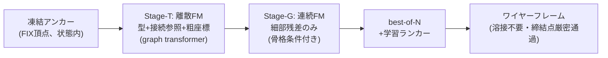

# Frontier の課題分析と改革案 — 横並び比較実験計画

Date: 2026-08-27
前提: docs/architecture_survey_202608.md(2025-26 サーベイ)の続編。
目的: 最新研究の**未解決課題**を特定し、それに対する改善策・改革策を設計、
「frontier 忠実再現」vs「当方考案アーキテクチャ」の横並び学習比較を計画する。

---

## 1. 各 frontier 研究の課題(個別批判)

### 1.1 CLR-Wire (SIGGRAPH 2025)

1. **順序の病が latent 内部に再侵入している**。トポロジを「BFS ソートした隣接
   リストの差分列」として latent に埋めるが、BFS 正準順序はまさに当方 F1 が
   苦しんだ「グラフへの人工的順序付け」。結果、130K サンプルで学習しても
   トポロジ整合 81.79% 止まり(自己交差・接続誤り・余剰曲線)。
2. **グローバル latent のボトルネック**。付録Dで自認: 「global feature の注入
   だけでは局所詳細を捉えられない」。固定長 64×16 latent は部品複雑度の上限になる。
3. **条件エンコーダが凍結**(PointNet++ frozen)。条件と生成の同時最適化がない。
4. **拘束の保証がない**。点群条件は AdaLN 経由の「傾向」であり、生成形状が
   条件点を厳密に通る保証はゼロ。締結点(必ず部品上にある)用途には致命的。
5. 推論 250 ODE ステップと重い。

### 1.2 Flatten The Complex (2026-01, k-cell particles)

1. **共有パターン(どのセルがどの latent を共有するか)は学習時には GT から
   与えられる**。サンプリング時に共有構造=トポロジをどう決めるかが本当の難所で、
   そこはマッチング/近接判定に依存する(問題が消えたのではなく移動した)。
2. Hungarian/集合マッチング学習は初期の割当が不安定(勾配ノイズ)。
3. 100K+ データ前提。小データでの成立性は未検証。

### 1.3 TG-Diff / DTGBrepGen(2段分離派)

1. **トポロジ段が幾何を見ない(blind topology)**。隣接関係だけ先に決めるため、
   幾何的に実現不可能なトポロジを引いた場合、後段は救えない。**一方向カスケードで
   フィードバックがない**(段1の誤りは段2で修正不能)。
2. **表現が閉じたソリッド中心**。面隣接ベースのトポロジは B-rep solid を仮定。
   板金**中立面 = 開いた非多様体シェル**は彼らの守備範囲外(当方の領域は
   frontier の空白地帯)。
3. 隣接行列の離散拡散は O(N²) スケール。

### 1.4 DeFoG (ICML 2025)

1. ノード/エッジが**カテゴリ属性のグラフ**が主戦場。連続幾何属性(座標)は
   一級市民ではない — 「幾何グラフの離散+連続 joint FM」は未整備。
2. 表現力確保に追加特徴量(スペクトラルなど)が必要で、denoiser 設計は自明でない。

### 1.5 AR 系(BrepARG / BrepGPT / CMT)

1. 100K 規模データ+重いトークン設計が前提。exposure bias の根本解決はしておらず
   データ量で殴っている(当方 2.3K では再現不能なことを実測済み: C=単発67.9mm 収束)。

## 2. 横断的な未解決課題(分野全体の穴)

| # | 穴 | 影響 |
|---|---|---|
| G1 | **条件充足が soft**(global feature 注入のみ)。「この点を厳密に通れ」を保証する機構がない | 締結点用途で致命的 |
| G2 | **妥当性が統計的**(80-90%台)。構成的保証への設計が半端 | 下流 CAD 化で手作業 |
| G3 | **データ飢餓**(全論文 100K+)。小データ regime は完全に未踏 | 実プロジェクトの大半は小データ |
| G4 | **トポロジ⇄幾何のフィードバック欠如**(2段は一方向) | 不可能トポロジで全損 |
| G5 | **test-time scaling 不在**。best-of-N・検証器・自己修正を誰もやっていない(LLM 分野の2024-25の教訓が幾何生成に未輸入) | 安価な品質向上余地の放置 |
| G6 | **開シェル/非多様体(=板金中立面)が空白地帯** | 当方の領域は競合不在 |
| G7 | 評価が分布指標(COV/MMD)偏重。工学的使用可能性(拘束充足・溶接率)を測らない | 論文値と実用の乖離 |

## 3. 改善策と改革策

### 改善策(incremental — frontier に足せば効くもの)

- **I1 頂点共有参照**(Flatten 由来): エッジ端点=頂点トークンへの離散参照。溶接不要
- **I2 離散 FM 統一**(DeFoG 由来): type/参照/座標を単一 FM フレームワークで
- **I3 2段分離**(TG-Diff 由来): 離散骨格 → 条件付き座標

→ この3つの統合が「**B-core**」= frontier 総合ベースライン。survey で設計済み。

### 改革策(reform — どの論文もやっていない、当方の考案)

**R1: アンカー凍結生成(anchor-frozen generation)** — G1 への解答
条件(締結点 FIX)を cross-attention で「見せる」のではなく、**生成状態の中に
ノイズゼロの凍結頂点トークンとして最初から存在させる**。FM の全ステップで
更新対象から除外(velocity=0 固定)。生成物は構成的に締結点を厳密に含む。
画像分野の inpainting(RePaint 系)の発想を「CAD 拘束充足」に転用したもので、
CAD 生成では前例を確認できず。CIRCLE_C fix_ref(参照は座標より強い)の思想の
最終形: **条件は入力ではなく、答えの一部である**。
副次効果: 凍結トークンは denoiser にとって「常に正しい足場」なので、周辺要素の
座標推定が安定する(疎条件 2 点の情報を最大限使い切る)。

**R2: 粗幾何つきトポロジ段(coarse-in-T)** — G4 への解答
Stage-T を「型+接続」だけでなく**粗量子化座標(HI 7bit、当方 codec の遺産)を
離散トークンとして同時生成**する。トポロジが幾何を見ながら決まるので blind
topology を回避。Stage-G は「骨格+粗位置」条件付きで**細部残差のみ**を連続 FM
— 残差は小さく分布も素直で、小データに有利。
(当方の v2 失敗 = 「相対座標で fine が壊れた」の教訓を逆手に取る: 粗/細の
分担を「列内の相対化」でなく「段の分離」で実現する)

**R3: 学習ランカーによる test-time scaling** — G5 への解答
best-of-N 生成 → 自己 rollout の Chamfer ラベルで学習した検証器で選択。
当方実測で headroom は大きい: **C は単発 67.9mm → best-of-5 オラクル 47.4mm(30%減)**。
v2 でも oracle 72→62mm、かつ4特徴ルール検証器が oracle にほぼ一致した実績あり
(これを学習器に置換、E2E 原則維持)。
反復精緻化は N 並列生成が AR より遥かに安い(系列 1/5 × バッチ並列)ため、
案Bと構造的に相性が良い。

**R4: 対称性データ増幅** — G3 への緩和
板金部品の鏡映・回転対称と座標系正準化で実効データ量を増やす(置換不変
アーキテクチャは増幅との相互作用が素直)。全 run 共通に適用可(公平性維持のため
比較では全アーキに同一適用)。

### R1-R3 の合成 = 「**AnchorGraphFlow (AGF, 案G)**」(当方考案アーキテクチャ)



## 4. 横並び比較実験計画

### 4.1 出場アーキテクチャ(4系統、同一プロトコル)

| Run | 学派 | 表現/生成 | 状態 |
|---|---|---|---|
| **C** (curve3) | AR 学派(BrepARG系の縮小版) | 直列トークン AR | **済: 単発67.9 / oracle47.4mm** |
| **AB v2** | latent 学派(CLR-Wire の縮小近似)※ | VAE latent + FM prior + AR decode | **済: 86.5mm(下記)** |
| **B-core** | frontier 総合(I1+I2+I3 忠実統合) | 頂点+エッジ集合、2段 FM | 新規実装 |
| **G-AGF** | 当方改革案(B-core + R1+R2+R3) | 同+アンカー凍結+粗細分離+ランカー | 同一コード、スイッチ |

※ AB は CLR-Wire と完全一致ではない(条件=prefix vs AdaLN、decode=AR vs 集合
デコーダ)。忠実度を上げる「CLR-Wire-lite」(AdaLN 化+集合 decode)はオプション
run として定義するが、実装費対効果から優先度は B-core/G-AGF の後。

### 4.1a 【重要】比較プロトコルの訂正(2026-08-27)

`evaluate_curve2.py` の `--seeds` **既定値は 2**、しかも「2サンプル生成して
**正解 Chamfer が小さい方**を採る」best-of-2 **オラクル**選択だった
(docstring に "best of N seeds" と明記、`--seeds` を渡していない全 run が該当)。
正解は推論時に手に入らないので、**これは単発生成の実力値ではない**。
加えて間引き率も evaluate_curve2 は `[::2]`、plan_ab/plan_g は `[::3]` と不一致だった。

**従って従来の「C = 52.2mm」は単発値ではない。** 以後の全比較は
**単発生成・`[::3]`** を主指標、**best-of-N オラクル**を別列(= R3 ランカーが
取りに行ける上限)とする。plan_g の stage_eval は元からこの二列構成。

C を plan_g と同一プロトコルで測り直した確定値(ep150、40部品、中央値):

| 指標 | C 単発 | C best-of-5 オラクル |
|---|---|---|
| gen Chamfer | **67.9mm** | 47.4mm |

seed 0 では単発 72.5mm、seed 7 では 67.9mm。**seed 差 ~5mm(7%)は誤差の範囲**で、
アーム間の差がこれ未満なら有意ではないと判断すること。

### 4.1b 確定結果(2026-08-27、40部品、中央値、単発生成・`[::3]`)

| 指標 | C (curve3 ep150) | AB v2 (ep110) |
|---|---|---|
| gen Chamfer(単発) | **67.9mm** | z-on 86.6 / z-off **86.5mm** |
| best-of-5 オラクル | 47.4mm | 未計測 |
| 外形カバレッジ | **12.7mm**※ | 53.0mm |
| 曲げ線カバレッジ | **12.7mm**※ | 45.9mm |
| **FIX 通過誤差** | **9.6mm** | 63.7mm |
| エッジ比 | 1.59 | 1.67(145本 vs GT 87) |
| span_ratio(生成寸法/教師寸法) | **3.11**(出しすぎ) | **0.52**(潰れ。個別は0.06-0.30) |

※ カバレッジは旧 evaluate_curve2 の値(best-of-2 選択後)なので単発より甘い。

同一条件では **C 67.9 vs AB 86.5 で C が 19% 優位**(従来報告の「66%優位」は
プロトコル不一致による誤り)。ただし**形状の質的な差は変わらない**:
C は span_ratio 3.11 で「形は合うが出しすぎ」、AB は 0.52 で「形が成立しない」。

**AB は形状として成立していない**。レンダリングで確認した破綻は2モード:
(a) 潰れ — 145本以上のエッジが実寸の6-30%の小さな塊に固まり締結点から離れる。
(b) 発散 — 円弧/円が包絡外へ散乱(1件 span_ratio 45、Chamfer 3503mm)。
`infill` が潰れ事例で8-15mmと小さいのに外形カバレッジが72-103mm、という
**縮退解のシグネチャ**(小さな塊は「生成点はどれも教師の近く」を安く満たす)。
C は「形は大まかに合って細部が違う」、AB は「形自体が成立しない」という質的な差。

**計画チャネルは不活性**: 中央値で z-on 86.57 / z-off 86.52 とほぼ同一。
GT の正解計画を渡してもデコーダの成績が変わらない = 潜在計画が情報を運んでいない。
AB案の前提(潜在計画が細部生成を導く)が成立していない。
(注: 平均値では z-off 85.7 < z-on 103.8 と逆転して見えるが、これは外れ値由来。
同じ理由で「v2 は v1 より悪化」も平均の artifact で、z-off 平均は 84.0→85.7 と実質同等。
**規模拡大は効かなかった**が悪化とは言えない、が正確な記述)

留保: AB v2 は val NLL 下降中(2.907)の未収束で打ち切り。ただし より収束した
v1 でも z-off 84.0mm(平均)で C に遠く及ばず、路線の劣位は学習不足では説明できない。

### 4.2 公平性プロトコル

- データ: runs/wtok_synth 2,300 部品、val 100 固定(val_names_100.json)
- パラメータ: 全 run ~11-13M(C=10.5M / AB=13.25M と同格)
- 学習時間: Kaggle T4 で同一 wall-time(150ep 相当 ≈1.5-2h。反復精緻化は
  系列 1/5 なので ep 数は多めに回る — wall-time で揃える)
- 増幅(R4): 採用する場合は**全アーキに同一適用**(アーキ比較の交絡を避ける)
- ランカー(R3): 「素の1発生成」と「best-of-5+ランカー」を**別列で報告**
  (アーキの地力と test-time scaling の寄与を分離)

### 4.3 評価指標(evaluate_curve2 拡張)

既存: gen Chamfer 中央値 / outline・bend カバレッジ / false positive / infill
新設(G2/G7 への当方の答え):
- **FIX 通過誤差**(締結点と生成形状の距離): G-AGF は構成的に 0、他は実測
- **トポロジ妥当率**(溶接成功率/ぶら下がり端点率): CLR-Wire の 81.8% に相当する
  当方版の観測
- 多様性: 同条件 5 サンプルの相互 Chamfer(疎条件では複数正解を許すべき)

### 4.4 実行順序(承認単位)

1. B-core 実装 + ローカルスモーク(数 ep、文法・溶接率・損失降下の確認)
2. G-AGF スイッチ実装(R1 凍結 → R2 粗細 → R3 ランカーの順に積む)+ スモーク
3. **Kaggle 投入(要承認)**: B-core 150ep 相当 → 結果確認 → G-AGF 同条件
4. 4系統比較レポート(md、z-on/z-off 同様の分離提示)
5. (オプション)CLR-Wire-lite run、R1-R3 の ablation(効いた要素の特定)

### 4.4b 実装結果(2026-08-27、cae_mesh_generator/wtok/plan_g.py)

1ファイル・スイッチ方式で両アームを実装。`--stage topo/geo/eval/smoke`、`--arm bcore/gagf`。

| 実装項目 | 内容 |
|---|---|
| スロット | K_v=160 / K_e=128(データ実測 max 148 / 124) |
| 置換等変性 | スロットに位置埋め込みを置かない。参照は**ポインタ注意**(頂点の埋め込みとの内積)で
  生成するため、インデックスではなく頂点そのものを指す。加えて毎エポック非アンカースロットを
  シャッフルして順序依存を実証的に潰す |
| I1 共有参照 | エッジは頂点スロット番号を持つ = **溶接処理が存在しない**(距離しきい値なし) |
| I2 離散FM | マスク経路(t で独立マスク→レート dt/(1-t) で逐次確定)。24ステップ |
| I3 2段 | topo(離散)→ geo(連続FM、AdaLN-Zero 条件) |
| R1 アンカー凍結 | FIX スロットは topo で常に非マスク、geo で全ステップ x_t := x_1 |
| R2 coarse-in-T | gagf のみ: topo が粗7bit座標も生成、geo は**セル内残差**のみ |
| 規模 | topo 6.28M + geo 5.99M = **12.27M/arm**(C 10.5M / AB 13.25M と同格) |

自己チェック(`--stage smoke`)で確認済み:
- **表現の可逆性**: GT スロット → decode が頂点(T,bin)・エッジ(tau,cls,端点bin)の
  多重集合として**完全一致**(両アーム、順序シャッフル下で)
- 両段とも損失低下、生成が decode 可能
- **FIX 通過誤差: gagf 0.00mm / bcore 36.93mm**(未学習状態での比較 = 純粋に機構の差。
  R1 が構成的に効いていることの証明)

**R3 は初回runでは学習ランカーを回さず、best-of-5 の oracle 値を併記**する方針に変更。
理由: ランカー学習には全部品×N ロールアウトの生成が要り、無料枠を第1関門(単発67.9mm 越え)
より先に消費してしまう。oracle 値は「ランカーが取りに行ける上限」を示すので、
run2 で実装する価値の判断材料になる(v2 で同じ手順を踏んだ実績あり)。

Kaggle 投入(kernel version 8、2026-08-27): 両アームを**1セッション**で
topo→geo→eval ×2、epochs=200、batch16、budget 8.0h を4分割。
同一GPU・同一データ・同一 wall-time なのでアーム間比較は完全に公平。

### 4.4c 【結果】Kaggle run 完了(2026-08-27、各200ep、40部品・中央値・単発・`[::3]`)

| 指標 | 検索(学習なし) | **B-core** | G-AGF(当方改革) | C (curve3) | AB v2 |
|---|---|---|---|---|---|
| **gen Chamfer 単発** | 23.4mm | **31.7mm** | 54.5mm | 67.9mm | 86.5mm |
| best-of-5 オラクル | 18.6mm | **24.7mm** | 35.7mm | 47.4mm | — |
| 外形カバレッジ | — | 16.0mm | **10.7mm** | 12.7mm※ | 53.0mm |
| 曲げ線カバレッジ | — | 11.5mm | **9.4mm** | 12.7mm※ | 45.9mm |
| infill(偽陽性) | — | **16.5mm** | 46.2mm | — | 22.2mm |
| FIX通過誤差 | 12.3mm | **5.9mm** | 9.4mm | 9.6mm | 63.7mm |
| エッジ比 | 0.99 | 0.70(出し足りない) | 1.18 | 1.59 | 1.67 |
| トポロジ妥当率 | — | 63.1% | **86.3%** | — | — |

**結論1: 集合ベース(直列化の廃止)は正しかった。B-core が C を 2.1 倍上回る。**
best-of-5 では 24.7mm と**検索ベースライン 23.4mm にほぼ到達**。同一データ・同一
パラメータ規模・同一 wall-time での比較なので、差はアーキテクチャに帰属する。

**結論2: 当方の改革案 R1・R2 はいずれも失敗した。** 以下、原因の特定。

#### R2(coarse-in-T)が失敗した理由 — 設計上の誤り

学習曲線が決定的: bcore/geo は train 0.356 / val 0.384(乖離なし)に対し
**gagf/geo は train 0.507 / val 1.352 と激しい過学習**。

原因: R2 は「重要な幾何(粗座標)を離散トポロジ段へ、細部残差を連続段へ」と
分割したが、**包絡 234mm ÷ 128 セル ≈ 1.8mm** なので geo 段に残る残差は
**サブミリの、Chamfer 31mm には無関係な量**だった。学習可能な信号がほぼ無く、
訓練残差の丸暗記に陥った。同時に**本当に効く粗座標を、連続FMが得意な問題から
128way 離散分類という不得意な問題へ移してしまった**。
→ **R2 は破棄**。幾何は B-core 方式(連続FMで絶対座標)に戻す。

#### R1(アンカー凍結)が保証を果たさなかった理由 — 実装の欠落

`fix_err < 1mm` は **0/40 部品**。診断で原因が確定:

```
bcore: FIX頂点 2個が生き、そのうち 2個がエッジから参照される → 5.9mm
gagf : FIX頂点 2個が生きるが、**参照するエッジが 0個**       → 9.4mm(5部品すべて)
```

**R1 は頂点の「配置」を固定するが、エッジがそれを「参照する」ことは強制していない。**
どのエッジからも参照されない頂点は realize_points に現れないので、
ワイヤーは締結点を通らない。しかも凍結した結果、**むしろ参照されなくなった**。
→ **R1 は破棄ではなく修正**: 必要なのは *anchor placement* でなく
**anchor incidence**(各アンカーを最低1本のエッジが参照する制約)。
これは curve3 のスロット型マスクと同種の文法制約で E2E 原則を侵さない。

#### 形状の質(レンダリング所見)

- **B-core: 位置・寸法・向き・包絡が合っている**(締結点にも近い)。
  しかし内部が走り書きで、平行な曲げ線や閉じた外形ループになっていない。
- G-AGF: 包絡外へ大きな円弧が散乱し中央は密な走り書き(infill 46mm と整合)。

**理論(整合長)との関係で重要な観察**: AR系は「局所は正しく大域が破綻」だったが、
**集合ベースでは逆転し「大域(配置)は正しく局所(接続)が破綻」している**。
集合表現は大域配置を連続FMの得意な問題に変換した一方、
**難所を『どの頂点とどの頂点が繋がるか』という組合せ問題へ移した**。
B-core の**エッジの 34% が PAD 頂点を参照して破棄されている**(妥当率 63.1%)のが
その定量表現で、残る誤差はここに集中している。

### 4.5 判定基準

- 第一関門: B-core または G-AGF が **C の単発 67.9mm を下回る**か
  (旧記載 52.2mm は best-of-2 オラクル値だった。4.1a 参照。
   オラクル同士なら C 47.4mm が相手)
- 改革の証明: G-AGF − B-core の差分(R1-R3 の寄与)。特に FIX 通過誤差 0 と
  小データでの安定性(学習曲線の分散)
- 撤退条件: 両者とも 150ep 相当で 67.9mm に届く傾向なし → 集合生成路線を
  再考し、データ増強(PartMaker 拡充)を優先課題に切替
