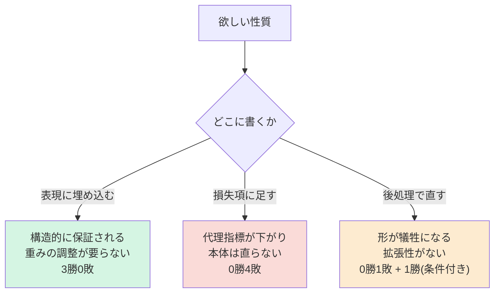
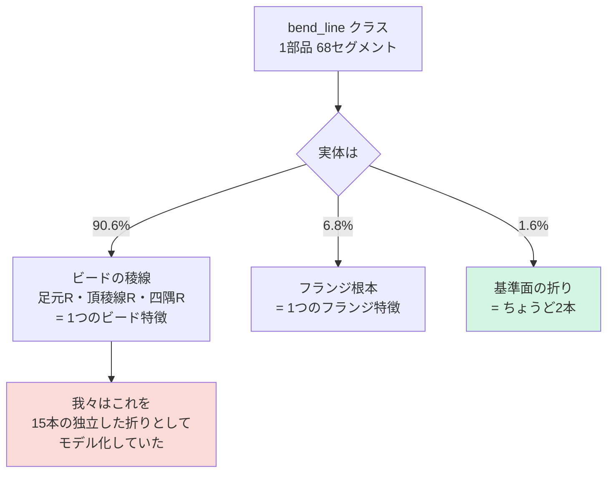
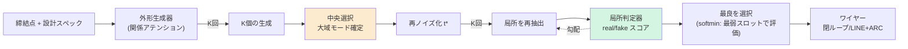
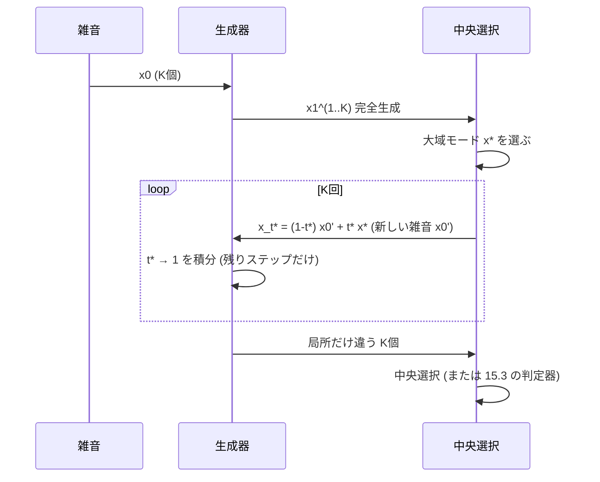
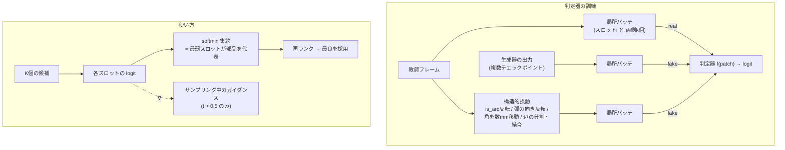
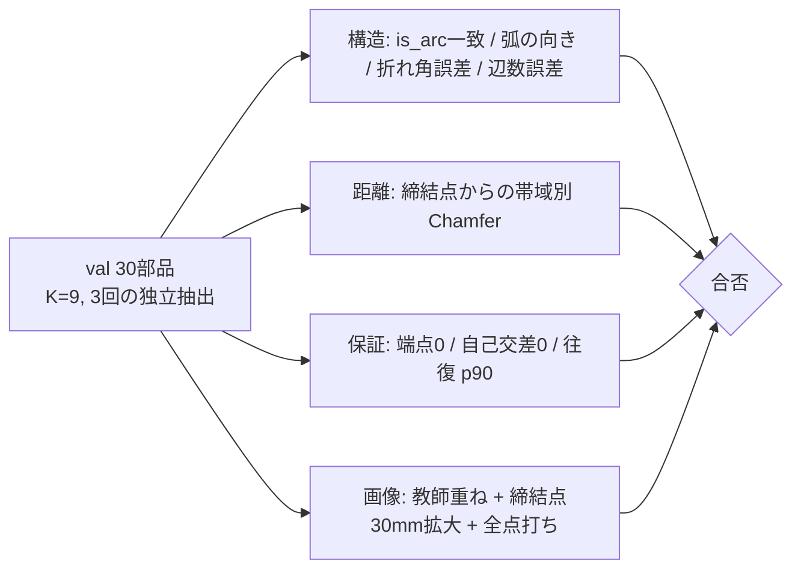
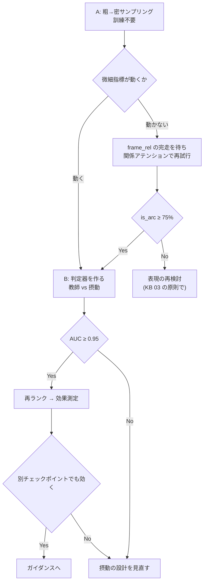
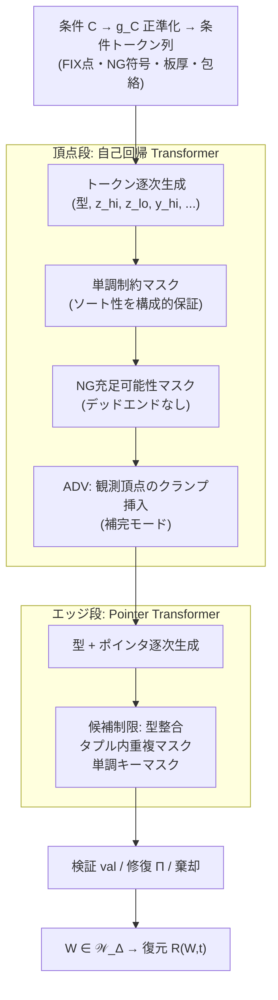

# 表現の変遷(KB 03, 10, 14, 15 + 理論メモ)

> 統合日 2026-09-05。以下は元文書を順に**そのまま**収録(見出し番号は元のまま。`KB 21.24` のような参照はこのファイル内を検索)。
> 収録元: `KB\03_representations.md`, `KB\10_sidecar_finding.md`, `KB\14_delta_tokens.md`, `KB\15_micro_structure_design.md`, `stage2_bend_result.md`, `final_wireframe_theory.md`, `wireframe_theory_rev_curve_major.md`


---

<!-- 元文書: KB\03_representations.md -->

# 3. 表現の変遷 — 本研究の中心的な物語

**この文書が KB の核心。**個々の施策より、ここに書かれた1つの原則のほうが価値がある。

---

## 3.0 原則

> **性質は表現に埋め込め。損失に書くな。**

この形で3回勝ち、逆をやって4回負けた。例外は見つかっていない。



---

## 3.1 第1幕 — 点群では閉ループが作れない

**症状**: 外形の生成点群が「帯」になる。端点の割合が 65〜70%。

**4つの原因が積み重なっていた。全部、数値ではなく絵から見つかった。**

| # | 原因 | 修正 | 端点 |
|---|---|---|---|
| 1 | 目標の点密度が **70倍** 不均一(LINE は 35.7mm に2点、ARC は 15.6mm に33点) | 弧長で再サンプル | 65-70% → 53-60% |
| 2 | **段に条件が一切届いていない**(`Block.forward` がクロスアテンションを条件分岐していた) | クロスアテンションを無条件化 | → 53-62% |
| 3 | 点が曲線に沿って**順序付いていない**(`curve_points` は辺ごとに連結するだけ) | `ordered_outline` で辺を辿る | → 15.3% |
| 4 | **点集合は帯を許す**(置換同変な集合に閉ループを強制できない) | **順序付きリング** + `ring_pe` | → **2.2%** |

原因4が本質。1〜3を全部直しても、表現が点集合のままなら帯になりうる。

**教訓**: `smooth_curve` を順序なしの点に適用したら曲率が 0.98→4.38 と**悪化**した。
`np.roll` が無関係な点どうしを繋いだため。曲線を扱う処理は全部、traversal を要求する。

---

## 3.2 第2幕 — 曲げ線: スロット足場は動くが伸びない

外形が解けたので同じ発想を曲げに適用。**32本 x 20点のストランド**。

うまくいったこと:
- `strand_pe`(非周期の位置エンコーディング)を入れると損失 0.114→0.045、
  フラグ誤り 29.9%→15.0%。**入れる前は自明な基準(全スロット使用=19%)より悪かった。**
- 「外形を条件に入れると効く」は成立(潰すと被覆3.76倍、フラグ1.56倍、直線性2.24倍悪化)

うまくいかなかったこと:
- **絵で見ると配置が崩れている。**長さ・直線性・対の間隔・方向の数は教師とほぼ同等
  なのに、絵は明らかに違う。→ [[05_measurement_pitfalls]]
- **32枠は既に足りていない。**13.4% の部品が超過(最大40本)。上限を48にすると
  アテンションが 2.25倍。中央値の部品は26本しか使わないのに全部品が最悪ケースの
  費用を払う。

### 素の点群 (`bend_pc`) を試した → 失敗

スロット足場を外し、300点の素の点群にした。**2.1倍速く学習できるが、出力は
線ではなく滲んだ塊。**第1段が順序付きリングを得る前と同じ失敗。

**この否定的結果が、フレーム方式に進む決め手になった。**

---

## 3.3 第3幕 — パラメトリックフレーム(現行)

ユーザー発案: **点をサンプリングするのをやめ、ワイヤーフレームの端点と辺の型を出す。**

なぜこれが効くか:

> 点は「線の上に乗れ」を**学習しなければならない**。辺は線であることが**定義**。

データが後押しした:

| | 点群方式 | フレーム方式 |
|---|---|---|
| 表現の大きさ | 300点 x 7ch = 2100 | **32枠 x 11ch = 352** |
| 学習速度 | 38秒/epoch | **4.3秒/epoch** |
| 端点の割合 | 0.020 | **0.000** |
| 教師からのずれ | 8.08mm | **6.84mm** |

閉ループなので**接続を生成しなくてよい**。以前の自己回帰路線を潰した組み合わせ
構造(個数・順序・参照・停止トークン)が丸ごと消える。

---

## 3.4 第4幕 — 平面性: 表現に載せる vs 後処理

**症状**: 平らになるはずのパネルがねじれる。教師 0.004mm に対し生成 0.368mm(90倍)。

### 試行1: 平面リストを固定枠で持つ → 却下

`MAX_PLANES=4` + 手動許容値でスナップ。**ねじれはゼロになるが形が 0.34mm 遠ざかる。**
さらにデータでは辺法線が最大10種類あり、**4枠では今のデータですら足りない。**

### 試行2: 法線を教師付けするだけ → 失敗

チャネルを +3 して法線を目標に加えた。**ねじれ 0.365→0.352(4%)、形状は悪化。**
法線がただの追加チャネルで、**自分が出した角と結びついていない。**

### 試行3: モデル自身の法線に角を整合させる → 成功

診断で分かったこと:

| | |
|---|---|
| 出力法線 vs **教師の法線** | **3.8°** |
| 出力法線 vs **自分が出した角** | **6.7°** |

**モデルは平面を知っていた。使っていなかっただけ。**最小二乗で角を法線に整合
させると、lam=2 で **ねじれ 5.5分の1、形状はむしろ改善**(7.31→7.22mm)。

**拡張性の鍵**: 平面を**辺に載せた**こと。パネルは「同じ法線を共有する辺の連なり」
として創発するので、平面数に上限がなく、締結点の数もどこにも現れない。

---

## 3.5 次: 曲げワイヤーをフレーム方式で

**曲げ点群は破綻済み。フレーム方式は未試行。**

外形と違う点、設計で扱う必要があるもの:

| | 外形 | 曲げ |
|---|---|---|
| 位相 | **1つの閉ループ** | **複数の開いた線分** |
| 接続 | 順序付きリングで無料 | **無料にならない** ← 最大の課題 |
| 本数 | 18(最大26) | 15(統合後、最大24) |
| 浮遊 | 起こりえない(閉じている) | **起こりうる** ← ユーザー指摘 |

「浮遊したワイヤーが出ない工夫」が要る。候補は [[07_plan_8h]] に。


---

<!-- 元文書: KB\10_sidecar_finding.md -->

# 10. サイドカーが明らかにしたこと — 曲げ表現は根本的に誤っていた

Date: 2026-08-30
きっかけ: PartMaker 側からの特徴サイドカー提供
場所: `C:\Users\hide2\IdeaBox\PartMaker\synthetic_parts\<group>\features\<part_id>.json`

---

## 10.1 結論

**曲げ生成器が生成していたものの 90.6% は、折りではなくビードの稜線だった。**

| 我々の `fold_lines` の正体 | 本数 | 割合 | 長さ割合 |
|---|---|---|---|
| **ビードの稜線** | 1726 | **90.6%** | 86.2% |
| フランジ | 130 | 6.8% | 11.5% |
| **本物の折り(基準面)** | 30 | **1.6%** | 1.5% |
| 未説明 | 20 | 1.0% | 0.8% |

正解の折り数は **1部品ちょうど2本**(中央値2、最大2)。我々は中央値15本を出していた。
**7.5倍の過大計上**で、その中身はビードのテッセレーション断片だった。



---

## 10.2 正しい表現の規模

サイドカーが与える設計意図:

| 要素 | 数 | パラメータ |
|---|---|---|
| **折り** | ちょうど 2 | `angle_deg`(0.5〜134.6、中央値37.8)、`radius_mm`(10.0〜22.5、中央値14.2)、`tilt_deg`、`sharp_line`(2点)、`tangent_lines`(side 0/1) |
| **ビード** | 0 or 1(400部品中302) | `centreline`、`top_width_mm`、`depth_mm`、`wall_angle_deg`、`ridge_radius_mm`、`corner_radius_mm`、`half_footprint_mm`、`run_out` ほか18項目 |
| **フランジ** | 0 or 1(400部品中98) | `root_curve`、`height_mm`、`root_radius_mm` ほか |
| コーナー逃がし | 0〜数個 | `radius_mm`、`arc` — **外形側の特徴**(外周の余肉カット) |

**24スロット × 11ch = 264個の数**でモデル化していたものが、
**折り2つ + ビード1つ = 30個程度の数**で厳密に書ける。

---

## 10.3 踏んだ罠 — 部品IDが一意ではない

最初のラベル付けで **90.6% が「未説明」**と出た。原因は表現でも座標系でもなく、
**部品IDの衝突**だった。

```
2300 ファイル、固有の stem は 250 個だけ
SYN_general_two_point_0001 → batch02, prod01/chunk_01..06, prod02/chunk_01..04
```

stem をキーにした辞書が上書きされ、**全部品を別部品の特徴と比較していた**。

**正しい結合キーは `source_stp`。**ワイヤーフレーム JSON が元 STP の絶対パスを
持っているので、そこからグループを辿る:

```python
stp = pathlib.Path(wireframe_json["source_stp"])   # .../<group>/mid/<id>_mid.stp
feat = stp.parent.parent / "features" / (stp.stem.replace("_mid","") + ".json")
```

修正後、未説明は **1.0%**(回答書の報告 0% と整合)。

> KB 05 に追加。**「IDが一意だと仮定した」**類の誤りは初出。

---

## 10.4 ラベル付けの方法(PartMaker 側の指示どおり)

- **折り**は線なので `tangent_lines` との距離で厳密照合(許容 2mm)
- **ビード/フランジは曲線照合をしない。**稜線はフットプリント全周の閉ループで、
  曲げフィレットを横断して分割される。**中心線からの距離による領域判定**を使う:

```
ビード由来  ⇔ dist(edge, bead.centreline)   ≤ half_footprint_mm + ridge_setback_mm + 2
フランジ由来 ⇔ dist(edge, flange.root_curve) ≤ root_radius_mm + height_mm + 2
```

先方の実測でも曲線照合は 71.8% 未説明、領域判定で 0% になっている。

- 文字エンコーディングは **UTF-8 を明示**(既定の cp932 では読めない)

---

## 10.5 これが意味すること

**曲げの成果物(`runs/bendframe1`)の評価は、意味を取り違えていた。**

「浮遊ゼロ・本数16本・外形からの距離が教師と一致」という結果は、**ビードの稜線
断片を再現できていた**ことを示すもので、**折りを生成できていたわけではない**。

一方で無駄ではない:

- **パラメトリックフレームという表現の妥当性**は変わらない(閉ループ保証、
  線らしさ、CADに渡せる形)
- **外形条件が浮遊を止める**という発見も変わらない(潰すと38%が部品外へ)
- 表現の器はそのまま、**中身を「汎用の折り線」から「2つの折り + 1つのビード」に
  差し替える**のが次の一手

---

## 10.6 次にやること

1. **曲げ表現の再設計。**汎用の24スロットをやめ、設計意図に沿った形にする:
   - 折り 2 スロット: `sharp_line` 2点 + `angle` + `radius` + `tilt`
   - ビード 1 スロット: `centreline` + 寸法パラメータ
   - フランジ 1 スロット
2. **コーナー逃がしは外形側へ。**曲げクラスではなく `outer_boundary` に現れる
3. `surface_frame` を `SCOPE_CLASSES` に追加(面の段で使う)
4. **サイドカーを教師信号として使う。**先方の指摘どおり「入力」ではなく「教師」
   として自然 — 締結点から導出できない実測値(実際に構築された角度・半径)


---

<!-- 元文書: KB\14_delta_tokens.md -->

# 14. 変位トークン — 保留中。次は曲げで試す

Date: 2026-08-31
状態: **外形での検証は中断。曲げで試すことを決定。**
実装: `wtok/deltatok.py`(完成・検証済み)、`wtok/staged.py` の `outline_delta` / `bend_delta`

---

## 14.1 なぜ作ったか

位置トークン(`wtok/tokens.py`)は本数と位相を完全に扱えるが、**隣接トークンを結びつける
ものが無く、曲線がジグザグになる**。

| | 教師 | 位置トークン |
|---|---|---|
| 1ステップあたりの折れ角(曲げ) | 0.0° | **33.8°** |
| 同(外形) | 0.0° | **37.5°**(14〜95°のばらつき) |

**曲げ側では絵で明確に見える欠陥**になっている(曲線が絡まって見える)。
外形では拡大しないと見えないが、実在する。

変位表現なら、**滑らかさが構造的な性質になる** — 「性質は表現に埋め込め」の4例目。

---

## 14.2 表現

```
[0:3]   step    次のトークンへの変位(startトークンでは零)
[3:6]   origin  絶対位置(startトークンでのみ意味を持つ)
[6]     start   この曲線の先頭
[7]     end     この曲線の末尾
[8]     close   この曲線は閉じている
[9]     unused
```

**閉曲線は構造的に閉じる。**閉曲線の最終ステップはモデルから読まず、始点に戻る残差として
計算する。全ステップに雑音を加えても**閉じ損ないは 0.000000mm**。

**本数はどこにも無い。**512はトークンの容量で、曲線は `end` フラグの間の区間として創発する。
往復検証: 曲線数 3→3 / 65→65、往復誤差 0.487mm。

---

## 14.3 踏んだ罠2つ

### (1) 起点と変位を同じチャネルに入れた

絶対位置(〜100mm)と変位(〜2mm)は**50倍スケールが違う**。同じ3チャネル・同じ損失重みで
予測させると、起点が変位の誤差に埋もれる。

| | 誤差 |
|---|---|
| 曲線の起点 | **37.94mm** |
| 1トークンあたりの変位 | 1.46mm |

**26倍の乖離。**起点を独立チャネルに分離して解決(`DTOK_CH` 7→10)。

### (2) 変位を生のまま流した — こちらが本命

flow matching は**標準正規分布(スケール1.0)から流れる**。生の変位はフレーム単位で
**0.0057** で、**雑音の175分の1**。目標が雑音に埋もれていた。

結果として**ステップ誤差(1.46mm)がステップ自体(1.0mm)を超え**、方向が事実上決まらず、
512個積分しても形にならなかった。

> **事前に「変位は位置の54分の1の広がり」と測り、「予測が易しい」と読んだ。逆だった。**
> 同じ数字は信号対雑音比であり、54分の1の広がりは54分の1の信号である。

`STEP_SCALE=100` / `ORIGIN_SCALE=2` で広がりを 0.47 / 0.27 に引き上げて解決。

**トークン数を減らす案は却下。**ステップは太るが曲げ側が耐えられない — 128トークンでは
1曲線あたり3点(最小値)になり、26本の曲線に配れない。

---

## 14.4 外形での結果(中断時点、epoch 114/200)

| epoch | 変位+スケール | 変位(生) | 位置トークン |
|---|---|---|---|
| 10 | 34.8mm | 727mm | 18.4mm |
| 30 | 16.7mm | 408mm | 13.2mm |
| 60 | 13.4mm | 173mm | 8.8mm |
| **90** | **9.9mm** | 127mm | **7.1mm** |
| 110 | 10.1mm | 347mm | 7.9mm |

**スケーリングの効果は確定**(生の変位版に対して13〜34倍)。
**位置トークンには届いていない**(9.9 対 7.1mm)。横ばいに入りかけていた。

---

## 14.5 なぜ外形で中断し、曲げで試すのか

**外形では位置トークンが既に十分機能している。**ジグザグは拡大しないと見えず、
形状としては成立している。ここで変位表現が勝っても、得られるものが小さい。

**曲げでは位置トークンのジグザグが絵で明確な欠陥になっている。**
変位表現の価値(滑らかさが構造的性質になる)が最も効くのはこちら。

> **次にやること: `--stage bend_delta` で学習し、位置トークン版(`runs/bendtok1`、
> 折れ角33.8°/step、位置3.07mm、曲線数誤差17.9%)と比較する。**
> 見るべきは位置精度ではなく**折れ角**。

配線は済んでおり、`--stage bend_delta` で即座に走る。

---

## 14.6 未検証のまま残っていること

- 外形で200エポック完走した場合に位置版へ届くか(epoch 114で中断)
- CFG や中央選択との組み合わせ
- 曲げでの効果(**次の実験**)


---

<!-- 元文書: KB\15_micro_structure_design.md -->

# 15. 微細構造の設計 — 局所整合を「モデルが決め、学習した判定器が検証する」

Date: 2026-08-31
対象: 外形ワイヤー(次に曲げ線)。ミクロで見て構造の破綻(弧の向き・is_arc・角の位置)を無くす。
前提: CLAUDE.md の哲学(性質は表現に、本数と分類は先に決めない、手設計の局所特徴を入れない)。

---

## 15.-2 損失を関係空間で測る — 試して失敗(2026-08-31)

### 動機は正しかった

損失は**スロットごと・チャネルごとの独立な和**で、スロット間の関係を測る項が1つも無い。
実測(270回の生成):

| | 相関 |
|---|---|
| 損失 vs is_arc の一致 | −0.328 |
| **損失 vs 折れ角の誤差** | **+0.060(無相関)** |

**損失を下げても折れ角は良くならない。**判定器も再ランクも、この盲点の下流にあった。

### 修正案(理論的には正しい)

flow matching の損失は予測と目標に**同じ線形変換**を掛けても正当性を保つ。
リング上の差分は線形なので、そのまま入れられる:

```
loss = ‖v−u‖² + λ₁‖D₁v−D₁u‖² + λ₂‖D₂v−D₂u‖²
```

等価な書き方は `(v−u)ᵀ(I + λ₁D₁ᵀD₁ + λ₂D₂ᵀD₂)(v−u)` — **同じ誤差の重み付け直し**であって、
手設計の幾何特徴ではない。

### 結果 — 狙った指標そのものが悪化した

| | is_arc | 弧の向き | **折れ角** | 近傍 | 全体 |
|---|---|---|---|---|---|
| 基準 | 63% | **69%** | **11.7°** | **3.29mm** | **4.51mm** |
| λ=1.0 | 65% | 60% | 16.2° | 7.44mm | 9.13mm |
| **λ=3.0** | 63% | 60% | **18.2°** | 12.06mm | 15.48mm |

**重みを上げるほど悪化。**距離も3倍以上崩れた。

### 診断(実測)

差分項は**少数のスロットに集中する**:

| 項 | 部品ごとの 最大/中央値 |
|---|---|
| 位置 | 1.19 |
| **D1(辺ベクトル)** | **4.71**(p90 **9.05**) |
| D2(折れ) | 2.71(p90 4.77) |

**D1 が最も集中している**(位置の4倍)。長い辺が損失を支配し、短い辺と角の情報が薄まる。
「関係を測る」つもりが「長い辺の長さを測る」になっていた。

### 未検証のまま残る道

- **差分を正規化する**(各辺を自分の長さで割る、あるいは対数を取る)。
  集中の原因は絶対長なので、比で測れば消えるはず。**測っていない。**
- D1 を切って D2 だけにする。D2 の集中は 2.71 と穏やか。**測っていない。**

**動機と理論は生きている。実装の一段目が失敗しただけ。**

---

## 15.-1 実装後の結果(2026-08-31)— A は失敗、B は部分的

**施策C(関係アテンション)は is_arc を +4pt。**63→67%。他は横ばい(弧の向き 69→67%、
折れ角 11.7→12.9°、近傍 3.29→3.40mm)。**唯一、微細指標を動かした施策**だが小さい。

**施策A(粗→密サンプリング)は効かなかった。**

| | is_arc | 弧の向き | 折れ角 | Chamfer |
|---|---|---|---|---|
| 中央選択(基準) | 63% | 69% | 11.7° | 5.62mm |
| t\*=0.5〜0.8 | 61〜65% | 65〜70% | 11.3〜14.9° | 4.82〜5.13mm |

微細指標が動かない。そして **t\*=0.8 でも大域が2.70mm動く** —
**flow matching は大域と局所を時刻で分離していない。**「粗→密」の仮定が成り立たなかった。

**選ぶ余地はある(施策Bの前提は成立)。**

| 指標 | 平均的な1回 | 中央選択 | **9回中最良** |
|---|---|---|---|
| is_arc | 62% | 63% | **78%** |
| 弧の向き | 69% | 69% | **87%** |
| 折れ角 | 13.5° | 11.7° | **7.9°** |

**中央選択は微細指標を1ポイントしか動かさない**(距離で選ぶので局所構造に盲目)。

**施策B(判定器)は動くが弱い。** val AUC 0.746。摂動別に見ると:

| 摂動 | 判定器 | パッチへの直接当てはめ(情報の上限) |
|---|---|---|
| 角を動かす | 0.709 | **0.839** |
| 弧の向き反転 | 0.622 | **0.816** |
| is_arc 反転 | 0.558 | 0.604 |
| **膨らみの大きさ** | **0.500** | **0.551** |

読み方が2通りある:

- **角と弧の向き**は、パッチに情報があるのに判定器が使えていない(0.71 対 0.84、0.62 対 0.82)。
  → **モデル容量・訓練の問題。改善余地がある。**
- **is_arc と膨らみの大きさ**は、直接当てはめでも 0.60/0.55 しか出ない。
  → **局所パッチに情報が無い。**同じ局所形状でも正しい弧の大きさは部品による。

**したがって判定器で取れるのは「角の位置」と「弧の向き」まで。**
is_arc と膨らみの大きさは、より広い文脈(部品全体)を見ないと判定できない。

---

## 15.0 結論

| 段階 | 施策 | 訓練 | 根拠 |
|---|---|---|---|
| **A** | 粗→密の2段階サンプリング(大域を中央選択で固定し、局所だけ再抽出) | **不要** | 残差は生成ばらつき。「選択」はこの研究で唯一実証された価値 |
| **B** | 学習した局所判定器(空間カーネルの real/fake 版)で再ランク → ガイダンス | 判定器のみ | 局所妥当性を**判定器が学ぶ**。手設計ゼロ。オラクル余地 5.35→3.97mm |
| **C** | 関係アテンション(実行中)。合否は微細指標で | 生成器 | モデル内部で「隣接辺との関係」を学ぶ版 |
| — | 曲げ線は外形確定後に A+B を同じ枠組みで適用 | | 外形アンカーで浮遊ゼロは達成済み |



---

## 15.1 診断 — 何が残っているか(すべて実測)

### 大域は課題の下限に到達している

| 締結点からの距離 | 課題の下限(最近傍) | 生成ばらつき | **frame_spec 誤差** |
|---|---|---|---|
| 0-25mm | 4.59mm | 3.76mm | **3.36mm** |
| 25-50mm | 6.93mm | 4.76mm | **3.68mm** |
| 50-100mm | 10.51mm | 6.88mm | **7.38mm** |
| 100mm以上 | 11.49mm | 9.13mm | **7.02mm** |

**全帯域で下限を下回る = 検索ではなく汎化している。**誤差 ≈ ばらつき = 系統誤差はほぼ無い。
残っているのは「どのモードを引くか」であって「どこへ寄せるか」ではない。

### 微細構造は1回の生成の中で局所的に不整合

| 指標 | 生成 | 参照 |
|---|---|---|
| is_arc の一致 | **64%** | 局所規則(折れ角+隣接辺長)だけで **79%**(AUC 0.837) |
| 弧の向き一致 | **77%** | 逆向き23%。全部直しても Chamfer 5.91→5.88mm(**距離では見えない**) |
| 頂点の折れ角誤差 | **12.1°**(10°以内 43%) | 教師 0° |
| 辺数の誤差 | 9.5% | |
| 部品ごとの近傍誤差 | **二峰**: 1.7〜2.2mm / 5.8〜8.1mm | 後者は構造の取り違え |

**モデルは自分の出力に含まれる情報(折れ角)から is_arc を推論できるはずなのに、規則より劣る。**
= 局所整合を「決める」機構と「検証する」機構がどちらも無い。

### 効かなかった/禁止した手(KB 04, 05, 12)

| 手 | 結果 | 教訓 |
|---|---|---|
| 導出可能な条件付け ×4 | 全滅(真の曲率場でも−30%) | 情報は足せない |
| サジッタ・折れ角チャネル | 40%の弧が潰れた / 哲学違反 | **どの関係が重要かを私が決めてはいけない** |
| λ付き後処理 | 次のチェックポイントで倍悪化 | 後処理の定数は寿命が短い |
| 自己条件付け | 情報が増えない | ただし**選択**は効く(7.77→5.47mm) |

---

## 15.2 施策A — 粗→密の2段階サンプリング

### 考え方

flow matching は雑音 x₀ から x₁ へ直線で流れる。**途中の時刻 t\* から再スタート**すれば、
t\* 以前に決まる大域(位置・大きさ・辺数)を保ったまま、t\* 以後に決まる局所(角の正確な位置、
弧の向き、is_arc)だけを引き直せる。中央選択で大域モードを1つに固定し、局所だけ K 回選び直す。



### 仕様

| 項目 | 値 | 根拠 |
|---|---|---|
| t\* | **0.5 / 0.6 / 0.7 / 0.8 を掃引** | 大域が固定され局所が変わる境界は測って決める。決め打ちしない |
| K | 9 | 中央選択で実証済み(5では過小評価、KB 05.7) |
| ステップ | 24×(1−t\*) | 計算量は完全生成の 20〜50% |
| 判定 | 3回の独立抽出 | ±0.2mm の抽出ノイズ |

### 合格条件(Chamfer ではない)

| 指標 | 現在 | 合格 |
|---|---|---|
| **大域が保たれている**(精密化後 ↔ 中央選択の Chamfer) | — | < 1mm(壊していないことの確認) |
| is_arc 一致 | 64% | **≥ 75%** |
| 弧の向き一致 | 77% | **≥ 85%** |
| 折れ角誤差 | 12.1° | **< 8°** |
| 拡大画像 | — | 角の食い込み・逆弧が消えているか |

**費用: スクリプト1本、訓練ゼロ。**最初にやる。

---

## 15.3 施策B — 学習した局所判定器(本命)

### 考え方

「隣接辺との関係を見て、ここがコーナーだと判断する」を**私が符号化するのではなく、判定器に学ばせる**。
空間カーネル(局所近傍→属性、教師点群で AUC 0.99、密度・尺度不変のパッチ正規化)を、
**「この局所は教師データとして自然か」を判定する real/fake 判定器**として作り直す。

判定器は生成器に情報を足さない(KB 12 に抵触しない)。**K個の候補から選ぶ**だけ。
選択はこの研究で実証済みの唯一の利得で、オラクル余地(5.35→3.97mm、微細指標はそれ以上)がある。



### パッチの定義(既存の `kernel.py` のパッチ正規化を流用)

| 項目 | 内容 | 根拠 |
|---|---|---|
| 中心 | スロット i の角 | |
| 範囲 | 両側 k=3 辺(計7スロット) | 局所規則が 79% を出した情報量は隣接辺の折れ角と長さ |
| 正規化 | 中心化 / 局所辺長の平均で割る / ループ法線と辺方向に整列 | 密度・尺度不変(AUC 0.99 の実績) |
| チャネル | 相対位置3・膨らみ3・is_arc・法線3 | 生成器の出力そのもの。**手設計の派生量は入れない** |

### 負例の作り方が汎用性を決める

生成器の出力だけを負例にすると、**その生成器の癖しか学ばず、次のチェックポイントで無効になる**
(KB 05.17 と同じ構造)。対策:

1. **構造的摂動**を主な負例にする — 教師フレームに「弧の向き反転」「is_arc 反転」「角の数mm移動」
   「隣接辺の分割/結合」を施す。**何が構造を壊すかを判定器が学ぶ**。分類も本数も現れない。
2. 生成器の出力は**複数チェックポイント**から混ぜる。
3. 判定器は**教師 vs 摂動**でまず評価し(生成器非依存の汎化)、次に生成器の再ランク効果で評価する。

### 集約は softmin(最弱スロット)

微細な破綻は**局所**に起きる。平均にすると1箇所の破綻が隠れる。
`score = -softmin_τ(logit_i)` で、最も不自然なスロットが部品のスコアを支配するようにする。
(ブランチ名 `softmin-guidance` の原点。)

### ガイダンスへの拡張(再ランクが効いた後)

再ランクは K 個の中から選ぶだけで、**候補に無いものは選べない**。判定器が微分可能なので、
サンプリングの後半(t > 0.5)で `x ← x + η ∇x score` を足す classifier guidance に進める。
η は掃引。大域を壊さないよう t > 0.5 に限定(施策A と同じ境界)。

### 合格条件

| 段階 | 指標 | 合格 |
|---|---|---|
| 判定器単体 | 教師 vs 摂動の AUC | ≥ 0.95(カーネルの 0.99 が目安) |
| 再ランク | is_arc 一致 / 弧の向き / 折れ角 | 中央選択を上回る。オラクル 3.97mm にどこまで迫るか |
| ガイダンス | 同上 + 大域 Chamfer が悪化しない | |
| 汎用性 | 別チェックポイントの生成で再ランク効果が残る | **必須**(05.17 の再発防止) |

---

## 15.4 施策C — 関係アテンション(実行中 `runs/frame_rel`)

スロット間の**関係**(巡回オフセット、距離、方向一致、弦の前後)からアテンションの偏りを学ぶ。
コーナーについての判断は含まず、**どの関係を見るかはモデルが学ぶ**。偏りは零初期化、パラメータ +0.5%。

現況: epoch 120 でプローブ 7.8mm(素のアテンション 9.7mm)。**未確定。**

合否は Chamfer ではなく **is_arc 一致(64→75%以上)、折れ角誤差(12.1→8°未満)**で判定する。
通れば A・B の土台になる生成器を差し替える。

---

## 15.5 評価プロトコル(固定)



- 判定は**微細指標が主**、Chamfer は「壊していないこと」の確認に格下げ。
- 往復検証は**分布(p90・最悪・失敗率)**で見る(05.16)。
- 後処理の定数(λ 等)は**使うたびに測り直す**(05.17)。既定はオフ。

---

## 15.6 やらないこと

| 禁止 | 理由 |
|---|---|
| 手設計の幾何チャネル(サジッタ・折れ角・法線整合) | 哲学違反。実際に壊した |
| 導出可能な情報の条件付け | 4回全滅(KB 12) |
| チェックポイント依存の後処理 | 次で倍悪化した |
| Chamfer 単独で微細を判定 | 弧の向きを全部直しても 0.03mm しか動かない |
| 本数・分類の固定 | KB 03 |

---

## 15.7 曲げ線への展開

外形が A+B で固まってから、同じ枠組みを曲げに適用する。

- 外形アンカーで**浮遊ゼロ**は達成済み(潰すと38%が部品外へ)
- 判定器は曲げ曲線の局所パッチでも同じ形(角+両側の辺)で作れる
- 現状の `bend_line` は90%がビード稜線の断片。**B-rep 目的の微細精度を今追うのは目標が違う**
- 変位トークン(KB 14)は曲げで試す予定のまま保留

---

## 15.8 順序と分岐




---

<!-- 元文書: stage2_bend_result.md -->

# 第2段(曲げ線生成器) — 実装と結果

Date: 2026-08-29
対象: `wtok/staged.py`(`bend_strands` / `fit_warp` / `strand_pe`)、`wtok/bend_eval.py`
チェックポイント: `runs/stage2_bend/best.pt`(epoch 40、訓練1000部品、CFG 1.0)

---

## 1. 表現 — なぜ「32本 × 20点のストランド」なのか

`bend_line` クラスは1部品あたり **68セグメント、長さの中央値6mm**ある。これは68本の
折りではない。このクラスは**円筒面と平面が接する線**を印付けており、二面角は0°なので、
**1つの折りが2本の bend_line を生む**。さらに61%は10mm未満で、全長のわずか11.9%しか
持たないテッセレーションの破片である。

そこで **10mm 未満を切り捨てる**。残り24セグメント、被覆の損失は 0.42mm にとどまる。

| 項目 | 値 |
|---|---|
| スロット | 32本(長い順。未使用は外れ値フラグ) |
| 1本あたり | 20点(弧長で等間隔に再サンプル) |
| 実測 使用スロット | 中央値 **26 / 32**(90パーセンタイル 32) |
| 実測 発行点数 | 530 / 640 |
| 真の曲げ点の被覆 | **1.17mm** |
| ストランド内の間隔ばらつき | 0.0000 |

**外形と違い、ストランドは閉じていない。** 順序は本の中だけで意味を持ち、本の間は
長さ順という正準順序を与える。

---

## 2. 目標のワープ — 入力も出力も教師から乖離する前提

第2段が受け取る外形は**第1段が生成したもの**であって、教師の外形ではない。この状態で
教師の曲げ線をそのまま目標にすると、「この外形に対して、別の部品の折り線を出せ」と
要求することになる。自己条件付けを無価値にしたのと同じ矛盾である。

両者は**正準始点を持つ順序付きリング**なので、点どうしが対応する。その対応から写像を
直接当てはめられる:

| 当てはめ | 真→生成の差の説明率 |
|---|---|
| アフィン | 88% |
| **3次多項式** | **98%** |

`fit_warp(真の外形, 文脈の外形)` を教師の曲げ線に適用してから目標にする。文脈が生成
外形のときだけ適用され、教師外形のときは恒等になる。検証: 外形が1.75mm動くと曲げ線が
1.05mm追従する。

---

## 3. 見つけた欠陥 — ストランドの位置エンコーディングが無かった

最初の学習は損失0.102で頭打ち、**フラグ誤り28〜32%**。これは自明な基準(全スロットを
使用と決め打ち = 19%)より**悪い**。

原因は `ordered = args.stage == "outline"` の一行。曲げ段は位置エンコーディング無しで
動いており、**640スロットを順序の無い集合として見ていた**。目標は32×20という強い構造を
持つのに、それがモデルから見えない。第1段を止めていた欠陥の再発である。

`strand_pe` を追加した。前半チャネルが**本の中の位置**、後半が**本の番号**を運ぶ。
折りは開いた線分なので、外形の `ring_pe` と違い**周期的にはしない** — 最初と最後の点は
2つの端であって隣ではない。

> 最初は線形の周波数列で書いて自己チェックに落ちた。高調波がエイリアスして全スロットが
> 互いに等距離になり、何も符号化していなかった。幾何級数の周波数列に直して通過。

| 同エポック5 | PE無し | PE有り |
|---|---|---|
| 損失 | 0.114 | **0.045** |
| フラグ誤り | 29.9% | **15.0%** |

---

## 4. 合格判定 — 外形が実際に効いているか

設計の前提は「第2段は、自力では出せないものを第1段から受け取る」こと。同じモデル・
同じ部品で、**文脈を真の外形にした場合とゼロで潰した場合**を比べる(val 40部品):

| 文脈 | 被覆 | フラグ誤り | 直線性 |
|---|---|---|---|
| 外形あり | **6.16mm** | **0.126** | **0.076** |
| ゼロで潰す | 23.20mm | 0.196 | 0.171 |
| 倍率 | **3.76×** | 1.56× | 2.24× |

**3指標すべてで悪化。判定 PASS。** 直列構成の前提は成立している。

> 判定は**相対値**にした。絶対mm閾値は置けない — 締結条件が同じ部品どうしが14.9mm
> 違うので、「意味のある距離」は部品の性質であってモデルの性質ではない。
> 最初に絶対0.2mmの閾値で書いて誤ってFAILを出した。フレーム座標は締結点間距離で
> 正規化されており、生の0.039は0.039mmではない。

---

## 5. 画像で見た品質 — `runs/stage2_bend/bend_vs_true.png`

生成された曲げ線は外形の内側の妥当な位置に、概ね正しい本数で出ている(8本の部品は
8本、25本の部品は28本)。残る問題:

- **教師より短く、束ねられ気味**。真の折りは平行に伸びるが、生成は中央に寄る
- **本数を数え落とす部品がある**(真28本に対し19本)
- はみ出すストランドが時折ある

---

## 6. 学習曲線

| epoch | 損失 | フラグ誤り | ストランド内 cv |
|---|---|---|---|
| 5 | 0.045 | 15.0% | 0.571 |
| 30 | 0.025 | 12.5% | 0.360 |
| **40** | **0.022** | **10.9%** | **0.262** |
| 50 | 0.022 | 19.3% | 0.300 |

epoch 40 を採用。50での跳ね上がりは12部品のプローブ雑音の範囲。

---

## 7. 次

1. **第3段(面、600点)** — 文脈は外形 + 曲げ線
2. 第1段の出力を実際に文脈へ流した通し評価(現在は教師外形で測っている。ワープ経路は
   実装済みで単体検証済みだが、通しでは未測定)
3. 通し評価を現行の2周ループ構成と比較

**保留:** ストランドが短く出る件。第3段の面が入ってから、面との整合で直すほうが素直か
どうかを見てから決める。


---

<!-- 元文書: final_wireframe_theory.md -->

# 板金ミッドサーフェス・ワイヤーフレーム生成モデル — 数学的理論(確定版)

構成: Part I に最終点検(3回目)の発見事項、Part II に全修正を織り込んだ
自己完結の確定仕様。以後、本書を唯一の正とし、旧2文書は履歴とする。

---

# Part I: 最終点検の発見事項

前回の修正版(P1'〜P7')を敵対的に再検証した結果、7件を検出した。

| ID | 発見事項 | 種別 |
|---|---|---|
| I | 軸別スケールトークン(前回修正)が条件由来フレーム(前回修正B)と矛盾 — スケールが生成物依存に逆戻りしていた | **前回点検の自己矛盾** |
| II | 「エッジが締結点を参照する」構想が CIRCLE(3点通過)の型と整合しない — 締結点は曲線上にない | 型不整合 |
| III | 構造化マスク(締結近傍を残す)の観測点は系列上に**散在**するため、FIM のスパン補完では扱えない | 補完機構の欠陥 |
| IV | 円弧の Hausdorff 誤差 O(Δ) は中間点が端点から離れている場合のみ成立 — 仮説の明示漏れ | 命題の前提不備 |
| V | NG マスクのデッドエンドは「バックトラック」ではなく充足可能性判定で**構成的に排除できる** | 保証の強化余地 |
| VI | G¹ 連続は「ソフト」のまま放置されていた — 修復作用素として定式化可能 | 保証の強化余地 |
| VII | MaskGIT 型並列デコードは学習した同時分布からの正確なサンプリングではない(既知の事実)— AR 採用の追加根拠として明記すべき | 論拠の補強 |

**解消方針**(詳細は Part II に統合済み):

- **[I]** 正規化を条件由来に一本化する。正準変換 $g_C$ を「回転+並進+軸別スケール」の相似変換とし、スケールは**設計包絡(条件の一部)**から取る。スケールトークンは削除。学習・推論とも同一の変換で完全に整合する
- **[II]** 締結アンカー型 `CIRCLE_C` を追加: 中心を FIX 点、半径を曲線上1点への参照で与え、円平面は FIX 点が保持する軸 $n_f$ から取る。これにより**ボルト穴とボルト軸の同芯性が構成的に保証される**(学習で近づけるのではなく、表現上ずれようがない)。面上のスポット溶接は幾何実体を持たないため、距離規準によるソフト制約として明確に区別する
- **[III]** FIM を廃し、**クランプ付き交互挿入 AR** に置換: 観測頂点をソート順に消費しながら、モデルは「次の観測点の手前に新頂点を挿入する」か「観測点を確定する(ADV)」かを選ぶ。単調制約は両側区間 $(\text{直前キー},\ \text{次観測キー})$ のマスクになる
- **[IV]** 円弧誤差命題に「中間点はパラメータ中点(端点から有界に離れる)」を明示の仮説として付す。中点規約の下で定数は小さい($C \approx 2$)
- **[V]** NG マスクを**充足可能性判定型**に格上げ: 部分割当 $a$ に対し「$N$ 外に完成できる継続が存在しない場合に限り」値を禁止する。$N$ が箱の和なら閉形式で判定でき、帰納法によりデッドエンドは発生しない(命題 F5)
- **[VI]** 修復作用素 $\Pi$(制約多様体への最小二乗射影)を定義し、残差が小さいときの摂動上界を条件付き命題として与える(命題 F8)
- **[VII]** AR の祖先サンプリングは学習済み分布 $p_\theta$ からの**正確な**サンプリングである(MaskGIT 型並列確定は一般に $p_\theta$ の同時分布からのサンプリングにならない)。頂点段 AR 化の決定はソート性・NG 保証に加えこの分布的正確性からも支持される

---

# Part II: 確定仕様

## 1. 表現可能クラス

### 定義 1(型付きワイヤーフレーム、確定版)

```math
W = (P, T, E), \quad P = (p_1, \dots, p_n),\ p_i \in \mathbb{R}^3
```

点型 $T_i \in \{\text{END}, \text{MID}, \text{CTRL}, \text{FIX}\}$。
FIX は条件由来(締結点、軸 $n_f$ と種別を属性に持つ)であり、
**モデルは FIX 型を生成できない**(型トークンから恒久的にマスク)。

エッジ $e = (\tau, \iota)$、型とアリティ:

| $\tau$ | 参照 | 実現 $\Gamma(e)$ |
|---|---|---|
| LINE | $(i, j)$ | 線分 $\overline{p_i p_j}$ |
| ARC | $(i, m, j)$ | 3点を通る一意円の $m$ を含む弧($m$ はパラメータ中点規約) |
| CIRCLE | $(a, b, c)$ | 3点を通る一意円(正準3点規約: 円自身のフレームで角 $0°,120°,240°$) |
| **CIRCLE_C** | $(c_{\text{fix}}, r)$ | 中心 $p_{c_{\text{fix}}}$(FIX 型限定)、平面 $\perp n_f$、半径は $p_r$ の平面射影までの距離 |
| SPLINE$_k$ | $(i, P_1..P_k, j)$ | 端点クランプ・一様ノット3次 B-スプライン |

### 定義 2(型退化規則と表現可能クラス $\mathcal{W}_\Delta$)

量子化ステップ $\Delta$(§3)に対し、サジッタ $s < k\Delta$ の弧は
LINE に退化させる(退化誤差 $= s < k\Delta$)。長い緩曲線は
サジッタが閾値を超える弧長単位に分割してから判定する。
量子化・退化・重複マージ(§4)を施した集合を $\mathcal{W}_\Delta$ と書く。
**以後のすべての保証は $\mathcal{W}_\Delta$ 上の主張**であり、
真の連続形状との差は一様に $O(\Delta)$(命題 F7)。

## 2. 条件と正準化

### 定義 3(条件)

```math
C = (F,\ N,\ t,\ B_{\text{env}})
```

$F$: 締結点集合 $(x_f, \text{type}_f, n_f)$、$N$: NG領域(凸領域の有限和)、
$t$: 板厚(**条件入力**、生成しない)、$B_{\text{env}}$: 設計包絡箱。

### 定義 4(条件由来の正準相似変換)

```math
g_C = (\text{回転} R_C,\ \text{並進} o_C,\ \text{軸別スケール} \Lambda_C) \quad \text{すべて } B_{\text{env}} \text{ と } F \text{ から決定的に導出}
```

学習・推論とも $(C, W) \mapsto (g_C^{-1} C,\ g_C^{-1} W)$ と**同時に**正準化する。
モデルの不変性は共変性として自動成立:

```math
p_\theta(g \cdot W \mid g \cdot C) = p_\theta(W \mid C)
```

生成物に依存する量は $g_C$ に一切含まれない(発見事項 I の解消)。
以後、座標は $[0,1]^3$ に正規化済みとする。

## 3. 量子化と誤差保証

### 定義 5(粗細量子化)

軸別ステップ $\Delta_a = L_a / 2^b$($L_a$: 包絡の軸長、$b = 14$)。
トークンは $c = c_{\text{hi}} \cdot 2^{b/2} + c_{\text{lo}}$ の2分割。
丸め誤差上界は $\Delta_a / 2$、以後 $\Delta = \max_a \Delta_a$。

### 命題 F7(一様曲線誤差)

点の摂動を $\delta \leq \sqrt{3}\,\Delta/2$ とすると、各エッジ型の実現曲線について

```math
d_H\big(\Gamma(e),\ \Gamma(\hat{e})\big) \leq C_\tau\, \delta
```

- LINE: $C = 1$(端点補間)
- SPLINE: $C = 1$(凸包性 — 曲線は制御点凸包内、制御点摂動が曲線 $\sup$ 誤差を支配)
- ARC: **中間点がパラメータ中点である仮説の下で** $C \approx 2$。
  中間点が端点に近づくと定数は発散するが、中点規約により排除される
  (発見事項 IV)。円の中心・半径は共線近傍で暴れるが、
  評価対象は実現曲線であり有界に留まる
- CIRCLE_C: 中心は FIX(誤差なし)、半径点の射影で $C = 1$
- 型退化: 追加誤差 $< k\Delta$

よって $d_H(|W|, |\hat{W}|) = O(\Delta)$ が全型一様に成立。∎

## 4. 系列化と尤度同値

### 定義 6(マージ規約と正準順序)

同一 $(T, \text{ビン})$ の点はマージする(異型同ビンは許容)。
点の全順序: キー $(T, c^z, c^y, c^x)$ の辞書式(FIX ブロック先頭)。
エッジの全順序: キー $(\min\iota, \max\iota, \tau, \text{補助点座標})$ の辞書式。
系列 $s = \sigma(W)$ は点ブロック+エッジブロック。

### 命題 F1(可逆性と尤度同値)

マージ規約の下で $\sigma: \mathcal{W}_\Delta \rightarrow \Sigma^*$ は単射で、
復号 $\delta_\Sigma \circ \sigma = \mathrm{id}$。ゆえに系列の最尤推定は
$\mathcal{W}_\Delta$ 上の分布の最尤推定と厳密に一致する。
マージ規約は単射性の**必要**条件である(同内容スロットが2つあると
ポインタ教師が非一意になる)。∎

## 5. 生成モデル



### 5.1 頂点段: 単調制約付き自己回帰

```math
p_\theta(P, T \mid C) = \prod_t p_\theta(s_t \mid s_{<t}, \text{enc}(C)),
```

**単調制約デコード**: ソート性はキー比較の状態機械で構成的に強制する。
直前キー $K_{t-1}$、(補完時は)次観測キー $K^{\text{obs}}$ に対し、
許容キーは整数区間 $(K_{t-1},\ K^{\text{obs}})$。粗細分解では:
$c_{\text{hi}} > $ 下限の粗部なら細部は自由、等しければ細部に下限、
上限側も対称。タイ時は次軸へ制約が伝播する(有限状態で実装可能)。

**長さ**: stop トークン。**FIX 型は生成禁止**(条件からのみ)。

### 命題 F2(正確なサンプリング)

祖先サンプリングは $p_\theta$ の同時分布からの厳密なサンプリングである。
(対比: MaskGIT 型の並列確定は、確定順序に依存する近似であり、
一般に学習した同時分布からのサンプリングにならない。)
制約マスク適用後の生成は、台を制限し再正規化した分布
$\tilde{p} \propto p_\theta \cdot \mathbb{1}_{\text{制約}}$ からの厳密なサンプリングである。∎

### 5.2 補完: クランプ付き交互挿入(発見事項 III の解消)

観測頂点(構造化マスク $\mu_2$ で残る集合)はソート順に散在する。
観測列 $O = (o_1 \prec o_2 \prec \dots)$ に対し、各ステップの行動空間を

1. **挿入**: キー $\in (K_{\text{last}},\ \text{key}(o_j))$ の新頂点を生成
   (両側単調マスクで強制、開区間なので観測との重複も構成的に排除)
2. **ADV**: $o_j$ をそのまま確定し $j \mathrel{+}= 1$(教師は既知なので学習可能)

とする。損失は挿入トークンと ADV 選択にのみかかる。
生成($\mu_3$)は $O = F$ のみ(FIX プレフィックス)の特殊例として同一機構で回る。
エッジ段の補完も、観測エッジを単調キー順に ADV 消費する同型の機構で扱う。

### 5.3 エッジ段: Pointer Transformer

```math
p_\theta(\iota_j = i \mid \cdot) = \mathrm{softmax}_{i \in \mathcal{A}_j}\big(\mathbf{q}_j^\top \mathbf{W} \mathbf{e}_i\big)
```

候補集合 $\mathcal{A}_j$ は以下の積で制限する(すべて分布の台の性質):
型整合(ARC 中間は MID、CIRCLE_C 中心は FIX のみ)、
タプル内確定済みスロットの除外(零長・退化の排除)、
単調エッジキー(直前エッジより辞書式に大きい参照のみ — 重複エッジの排除)。

### 命題 F3(構成的保証群)

学習の出来と無関係に、生成物は以下を確率1で満たす:
参照整合・型整合・タプル内非重複・エッジ非重複・頂点ソート性・
頂点非重複(区間マスク)・系列の整形式性(stop による終端)・
**CIRCLE_C 穴の締結軸との同芯性**。最後の項目は表現の定義から従う:
中心参照は FIX に限定され、円平面は $n_f$ から取られるため、
同芯からずれた穴はそもそも表現空間に存在しない。∎

## 6. NG 領域: 充足可能性判定型マスク

### 命題 F5(デッドエンドなしの頂点回避)

部分割当 $a$(確定済みの軸・ビン)に対し、値 $v$ を禁止する条件を

```math
v \in \text{mask}(a) \iff \forall\, \text{完成} \hat{p} \in \mathrm{cell}(a \cup v): \ \hat{p} \in N
```

(= セル $\mathrm{cell}(a \cup v)$ が $N$ に完全に含まれる)と定める。
$N$ が軸平行箱の有限和なら包含判定は閉形式。このとき:

1. **健全性**: 最終確定した頂点セルは $N$ に完全包含されないため、
   セル代表点を $N$ 外に取れる… では不十分なので厳密には最終(最細)段で
   「セルが $N$ と交わる」値を禁止する。中間段は完全包含判定、
   最終段のみ交差判定、という2層規則にする
2. **完全性(デッドエンドなし)**: 帰納法。部分割当 $a$ に $N$ 外の完成が
   存在するなら、その完成が通る値 $v^*$ は中間段では禁止されず
   (完全包含に反する)、最終段でも $N$ 外セルとして生き残る。∎

曲線の NG 回避は復号後の決定的交差判定+棄却。厳密な制約分布
$\tilde{p} \propto p_\theta \cdot \mathbb{1}$ からのサンプリングは全体棄却で
達成される($Z > 0$ なら期待再試行 $1/Z$)。交差エッジのみの局所再生成は
**厳密分布の近似**であり、計算量との交換として明示的に採用する。

## 7. 学習目的とカリキュラム

### 命題 F4(補完と生成の関係、確定版)

観測集合の分布族 $\{\mu_1(\text{ランダム率}), \mu_2(\text{締結近傍}), \mu_3(\text{FIXのみ})\}$
に対する損失はいずれも、同一の条件付き分布族
$\{p(s_{\text{未観測}} \mid s_{\text{観測}}, C)\}$ の対数損失の期待である。

- **厳密に言えること**: 実現可能・十分データの極限で各段の最適解は一致する。
  タスクの数学的対象は同一である
- **厳密に言えないこと**: 有限標本では μ が推定量を変える。
  μ₃ 領域(空文脈からの大域レイアウト)の実効標本数は μ₁ 学習では
  乏しく、カリキュラムの存在理由はこの標本配分にある
- **推論時整合**: AR + クランプ挿入では、補完も生成も学習分布からの
  厳密な祖先サンプリング(F2)であり、反復精緻化型に固有の
  確定順序依存の不整合は生じない。残るのは学習分布と真分布の乖離のみ

学習データは $\mathcal{L} = \alpha\,\mathbb{E}_{\mathcal{D}_r} + (1-\alpha)\,\mathbb{E}_{\mathcal{D}_s}$。
Stage 1(μ₁)は自然混合、Stage 2–3 は $\alpha \to 1$ または
constraint-first 作成分に限定(条件付き分布の教師としての正当性)。
検証は $\mathcal{D}_r$ のみ。エッジ段には頂点座標ノイズ注入
(量子化1〜2ビン相当)で段間分布シフトを緩和する。

## 8. 検証・修復・妥当性

```math
\mathrm{val}(W) = \mathrm{ref} \wedge \mathrm{ndg} \wedge \mathrm{loop} \wedge G^1_\epsilon \wedge \mathrm{avoid}_N
```

- ref / ndg / avoid$_N$(頂点): **構成的**(F3, F5)
- 厳密共線(ARC 3点): 測度零 + 復号時判定で LINE へフォールバック
- loop(閉路条件): 操作的定義 — **CAD カーネルの sew 実行テスト**を正とする。
  必要条件(エッジ多重集合が面境界閉路群に分解可能、各エッジの使用回数
  1 または 2)は事前フィルタとして使う
- $G^1_\epsilon$: ソフト補助損失 + 修復作用素(下記)

### 命題 F8(修復作用素の摂動上界)

接線連続などの等式制約 $g(P) = 0$ に対し

```math
\Pi(P) = \arg\min_{P'} \|P' - P\|^2 \ \text{s.t.}\ g(P') = 0
```

制約ヤコビアンの最小特異値が近傍で $\sigma_{\min} \geq s > 0$ かつ
残差 $\|g(P)\| \leq \rho$ が十分小なら

```math
\|\Pi(P) - P\| \leq \frac{\rho}{s} + O(\rho^2)
```

よって残差が小さい生成物に対し、修復は F7 の $O(\Delta)$ 保証を保ったまま
$G^1$ を厳密化できる(残差が大きい場合は棄却に回す)。∎

## 9. 復元の適定性

### 命題 F6(オフセット復元)

面復元仮定 A(各面は平面・ルールド面・一定Rフィレットで境界から復元可能)
の下で、$R(W, t)$ が自己交差のない多様体ソリッドを与える条件は
$t/2 < \mathrm{reach}(S_{\text{mid}})$。曲げ部では
$R_{\text{mid}} = R_{\text{in}} + t/2$ より条件は $R_{\text{in}} > 0$ と同値で
**常に成立**する。**ヘム(折返し)部は分離距離条件を厳密に破るため
適用除外**とし、扱う場合は専用の縫合規約を別途定義する。
変厚(テーラードブランク)はスコープ外。∎

## 10. 保証の総括

| 保証レベル | 内容 |
|---|---|
| **構成的**(学習と無関係) | 参照整合 / 型整合 / 非重複(頂点・エッジ・タプル内)/ ソート性 / 頂点NG回避(デッドエンドなし)/ CIRCLE_C 同芯性 / 終端 |
| **分布的に厳密** | 祖先サンプリング = $p_\theta$ からの厳密サンプル(F2)/ 系列MLE = 形状MLE(F1) |
| **誤差有界** | 全エッジ型で曲線 Hausdorff 誤差 $O(\Delta)$(F7)/ 修復摂動 $\rho/s$(F8) |
| **統計的+検証** | 閉路条件(sew テスト)/ $G^1$(ソフト+修復)/ 曲線NG(棄却厳密・局所修復は近似)/ 分布品質(MMD等) |
| **スコープ外(明示)** | 自由曲面パッチ(仮定 A の外: ビード等 → UDF 系と相補)/ ヘム / 変厚 |

## 11. 凍結事項と自由度

**凍結(本理論の一部)**: 定義1〜6、命題 F1〜F8、正準化の条件由来性、
頂点段の AR + 単調・充足可能性マスク、クランプ付き交互挿入、
CIRCLE_C の導入、型退化規則、検証述語の操作的定義。

**自由度(命題に影響しない実装詳細)**: 層数・次元・ヘッド数、
$b$(誤差保証は $\Delta$ を通じてパラメトリック)、退化閾値 $k$、
構造化マスク半径 $\rho$ のスケジュール、混合比 $\alpha$ のスケジュール、
条件エンコーダの形式(NG の符号化方式を含む)。

---

## 点検の総括(3回の反復で何が起きたか)

初版は表現と分解の骨格を与えたが、生成時に頂点数が定まらない・
フレームが計算不能・緩い弧が表現不能という3つの実害を含んでいた。
2回目の点検はそれらを修正したが、自らスケールの矛盾を持ち込み、
締結参照の型不整合と散在観測の補完機構を見落としていた。
本確定版は、残っていた不整合をすべて構成的保証か明示的スコープ外の
いずれかに割り当て、**「保証されること」と「されないこと」の境界が
命題として閉じた状態**にある。以降の変更は実装からのフィードバックを
受けた場合に限り、該当する定義・命題単位で行う。


---

<!-- 元文書: wireframe_theory_rev_curve_major.md -->

# 理論改訂案: カーブ主導系列化(定義6')

Date: 2026-07-10
Status: 実装フィードバックに基づく定義単位の改訂(final_wireframe_theory.md §11 の改訂条項に基づく)
Scope: 定義6(系列化)の置換。定義1〜5・命題F5〜F8 は不変。F1〜F3 は本書で再定式化。

## 1. 改訂の根拠(実装からのフィードバック)

頂点段 AR(v2、正則化+カリキュラム済み)の実測:

- 50% 補完: 頂点 Chamfer 20.6mm — 局所補間は学習できている
- **100% 生成: 頂点レイアウトが構造不成立**(レンダリング目視で確認。点は bbox 内に拡散し、
  輪郭・穴環・曲げ線という曲線構造を形成しない)

原因診断: 正準辞書式順序 (T, z, y, x) は一意性(F1)と構成的マスク(F3)を与えるが、
**系列上の隣接と「構造線に沿った空間的隣接」が無関係**になる。1本の曲線を成す頂点群は
系列上に散乱し、モデルは大域的依存だけで曲線を再構成せねばならない。60部品では学習不能。

## 2. 定義6'(カーブ主導系列化)

系列はエッジ(ワイヤー)単位とする。エッジは正準エッジ順(従来と同一:
(min端点キー, max端点キー, τ, 参照キー列) の辞書式)で並べ、各エッジを

```text
[τ] [slot_1] [slot_2] ... [slot_arity(τ)]
```

と直列化する。各スロットは:

- **POINTER(k)**: 既出頂点(FIX ブロック + それまでに新規出現した頂点)への参照
- **NEW + 6座標トークン**(粗細 z,y,x): 新規頂点。**頂点型はスロット位置から一意に決まる**
  (LINE/ARC 端点・CIRCLE 3点 = END、ARC 中間 = MID、CIRCLE_C 中心 = FIX 参照限定、
  CIRCLE_C 半径点 = END)ため型トークンは不要

正準化規則(単射性のため): 頂点はエッジ順で**初出時のみ NEW**、以降は必ず POINTER。
FIX は常に POINTER(生成不可、従来通り)。

## 3. 保証の再定式化

| 従来 | 定義6' での状態 |
|---|---|
| F1(可逆・尤度同値) | **成立**(σ' は単射: エッジ正準順+初出 NEW 規則で表現は一意) |
| F2(祖先サンプリング厳密性) | **成立**(AR 構造は不変) |
| F3: 参照整合・型整合 | **成立・強化**(スロット位置が型を構成的に決定。CIRCLE_C 中心の FIX 限定・同芯性も不変) |
| F3: タプル内非重複 | **成立**(POINTER 候補から確定済みスロットを除外) |
| F3: 頂点ソート性・非重複 | **緩和**: 頂点は出現順となりソート性は消滅(ソート性は定義6' では不要)。
  NEW 頂点が既存頂点と同一 (T, ビン) になる場合は**復号時マージ**で吸収(定義6のマージ規約を復号側に移設)。
  構成的排除から復号時正規化への格下げであり、実現曲線への影響はない |
| F3: エッジ非重複 | **緩和**: エッジキー単調性の構成的マスクは、キーが端点確定後にしか
  定まらないため完全には張れない。MVP では「完全一致エッジの復号時除去+検証 val での棄却」とし、
  部分的マスク(第1スロット確定後の下界制約)は将来強化枠 |
| F5(NG 充足可能性) | **成立**(NEW 座標の桁生成に従来と同一の2層マスクを適用可能) |
| F7(誤差有界) | **成立**(表現は同一クラス 𝒲_Δ、量子化も不変) |

## 4. 学習可能性の論拠

1. **系列の局所性と幾何の局所性が一致**: 1トークン群=1ワイヤー。曲線の連続は
   POINTER による端点共有として明示され、モデルは「前のワイヤーの終点から次を伸ばす」
   という局所規則を学べる(CAD コマンド列生成 — DeepCAD/SkexGen 系 — の成功構造と同型)
2. **補完(クランプ付き交互挿入)は同型に移植**: 観測ワイヤーをエッジ正準順に ADV 消費し、
   間に新規ワイヤーを挿入する。50%ワイヤー補完モードは本モデルの1動作モードとして残る
3. **529 アセンブリの活用**: 本段の学習は締結条件を必須としない(FIX 空でも成立)ため、
   joints 未整備の A0072600529(65部品)を形状事前学習に追加し、データを 75→140 部品へ

## 5. 実装計画

1. σ'/δ' コーデック+往復テスト(全140部品)— 学習前の合否ゲート
2. モデル: 座標トークンは既存語彙を再利用、POINTER はポインタヘッド
   (query·key、候補 = FIX+既出頂点、スロット型で候補制限)
3. 学習: μ1 ワイヤー観測率カリキュラム+ミラー3軸+ジッタ(v2 の正則化パッケージ継承)、
   529 込み事前学習 → 75部品(FIX 条件付き)微調整
4. 評価: 50%ワイヤー補完(実現曲線の Chamfer)+ 100%生成(実現曲線のレンダリング目視、
   頂点段 v2 と同一プロトコル)
