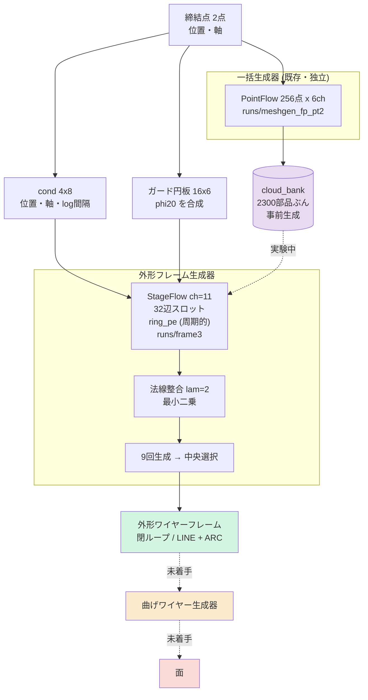
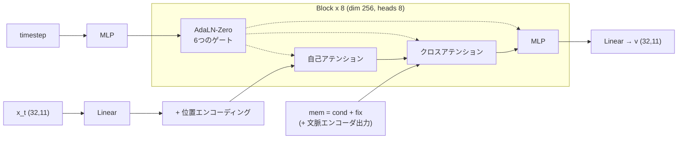
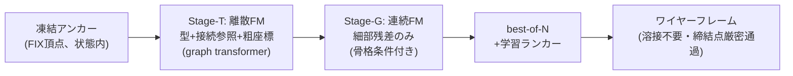

# 過去アーキテクチャの結末(KB 02 + 各報告の要約)

> 統合日 2026-09-05。以下は元文書を順に**そのまま**収録(見出し番号は元のまま。`KB 21.24` のような参照はこのファイル内を検索)。
> 収録元: `KB\02_architecture.md`, `current_architecture.md`, `retrieval_floor_and_direction.md`, `frontier_gaps_and_reform.md`


---

<!-- 元文書: KB\02_architecture.md -->

# 2. アーキテクチャ

## 2.1 全体



## 2.2 外形フレーム生成器 — 現行の主力

**表現: 32辺スロット x 11ch。**

```
[0:3]   角の xyz              辺 i は 角 i から 角 i+1 へ
[3:6]   円弧の膨らみ           弧の中点を「弦の中点から」測った差分
[6]     is_arc
[7]     unused                 使っていないスロット
[8:11]  パネル法線             その辺が囲む面の法線。折り目上では零ベクトル
```

構造的に保証されること:

| 性質 | なぜ無料か |
|---|---|
| **閉ループ** | 順序付きリング。辺 i は 角 i→i+1 と決まっている |
| **接続を生成しなくてよい** | 上に同じ。参照インデックスの生成が不要 |
| **線らしさ** | 辺そのものを出すので滲みようがない |
| **上限がない** | 平面数はスロットではなく辺に乗るので、パネル数も締結点数も伸びる |

**正準化**: 閉ループには自然な始点がない。フレーム第1軸方向に最も進んだ角を
スロット0 にし、第3軸まわりに正の向きに回るよう向きを揃える。これがないと
モデルは部品ごとに任意の回転を形の上に重ねて学習することになる。

> 実装の罠: 辺のループを反転すると辺がずれる。反転後の辺 i は元の角 i+1 から
> 始まるので、配列を1つ roll する必要がある。間違えると角と膨らみの対応が壊れる。

**膨らみを弦の中点からの差分にする理由**: 直線なら零、緩い弧なら小さい値になり、
チャネルが「直線からの逸脱」だけを運ぶ。絶対座標だと部品の位置を再符号化してしまう。

## 2.3 モデル本体 (`StageFlow`)



flow matching。CFG 脱落 0.1、生成時 24ステップ、CFG スケール 1.0。

**クロスアテンションは無条件で実行する。**以前これを「前段があるときだけ」に
していたため、第1段が締結点の情報を一切受け取らず、データセットの平均外形を
出していた。→ [[04_experiment_ledger]]

### 位置エンコーディング

| 段 | 種類 | 理由 |
|---|---|---|
| 外形(点/フレーム) | `ring_pe` **周期的** | 閉ループ。スロット0と n-1 は隣 |
| 曲げストランド | `strand_pe` **非周期** | 開いた線分。最初と最後は「2つの端」 |
| 面 / 素の点群 | なし | 順序に意味がない |

`strand_pe` は前半チャネルが本の中の位置、後半が本の番号。等比の周波数列を使う
(線形の周波数列は高調波がエイリアスして全スロットが等距離になり、何も符号化しない)。

## 2.4 後処理

### 法線整合 (`consistent_corners`, lam=2)

モデルは**平面を正しく知っている**(出力法線は教師から 3.8°、パネル数も一致)が、
**自分の角がその平面に乗っていない**(6.7°ずれ)。2つの出力チャネルが矛盾している。

最小二乗で、元の角の近くに留まりつつ、各辺の窓の角が同じ `n·q` を持つよう解く。
**外から知識を足していない** — モデル自身の出力が既に含意している角を求めるだけ。

| lam | ねじれ | 形状誤差 |
|---|---|---|
| 0 | 0.367mm | 7.31mm |
| 1 | 0.103mm | 7.30mm |
| **2** | **0.067mm** | **7.22mm** |
| 3 | 0.051mm | 7.54mm |

### 中央選択 (`medoid`, K=9)

9回生成し、他の8つに最も近いものを1つ選ぶ。**平均ではなく選択**なので、
選ばれたフレームは無改変で、閉ループ等の保証をすべて保つ(25/25で検証済み)。

| | |
|---|---|
| 単発 | 7.77mm |
| **9回の中央** | **5.47mm** |
| 9回の最良(オラクル、到達不能) | 4.12mm |

## 2.5 一括生成器 (`meshgen_fp_pt2`) — 独立、参照用

| | 教師 | 生成 |
|---|---|---|
| 点数 | — | 256点(48ステップ、cfg 1.5) |
| 面の厚み | 0.78mm | **0.63mm**(教師より薄い) |
| 空間的な広がり | 63.9mm | 64.5mm(1%以内) |
| 点間隔 | — | 3.29mm |
| 種違いの生成同士の差 | — | 5.62mm |

**シルエット(低周波)は捉えている。辺の位置(高周波)は出せない。**
外形生成器とは現時点で**接続されていない**。往復構成で繋ぐのが次の一手。

## 2.6 廃棄されたアーキテクチャ

| 構成 | なぜ廃棄したか |
|---|---|
| 生成器→分類器→抽出器の2周ループ | 段がクラスを決めるので分類器が不要になった。ループの価値は「選択」であって情報蓄積ではないと判明 |
| 曲げの素の点群 (`bend_pc`) | 線にならず滲む。→ [[03_representations]] |
| 曲げの 32x20 スロット | 動くが上限が固定で拡張性がない。配置も崩れる |
| 自己回帰(頂点列+参照) | 個数・順序・参照・停止トークンの組み合わせ構造で破綻 |
| 包絡フレーム | 教師の bbox を渡していた。リーク |


---

<!-- 元文書: current_architecture.md -->

# 現在のアーキテクチャ・ボトルネック・打ち手

Date: 2026-08-27
要件: 締結点2点のみを入力とし、決定論的な形状ルールを使わずに板金中立面を
E2E 生成する。詳しい経緯は `session_knowledge_202608.md`。

---

## 1. パイプライン全体像

```
締結点2点(位置 + 締結軸)
   │
   ├─ 締結点フレームへ正規化 ────────────────────── 教師の bbox は一切使わない
   │    原点=2点の中点、単位長=2点間距離
   │    e1=2点を結ぶ方向、e2=締結軸のうち e1 から遠い方の直交成分
   │
   ▼
【段1】PointFlow ─ 連続 flow matching(実装: wtok/meshgen.py)
   出力: N点 ×(xyz 3, 法線 3, 外形距離場 1, 曲げ距離場 1)= 8ch
   ・置換等変(スロットに位置符号化なし)
   ・相対幾何 attention バイアス
   ・アンカー凍結: 締結点を全ステップ固定 → FIX通過誤差 0.00mm
   ・CFG guidance 2.0
   ・マスク学習: 任意の既知点を追加拘束として受け付ける
   │
   ▼  有向点群
   │
【段2】曲線抽出 ── 現在ここが未確定(下記 §3)
   │   案A(現行): MLS で中立面を復元 → 境界稜線と二面角で曲線
   │   案B(検証済): 稜線モデルが各点から曲線への変位を回帰 → 投影 → 追跡
   ▼
   ワイヤーフレーム(外形 + 曲げ線)
```

### 主要ファイル

| ファイル | 役割 |
|---|---|
| `wtok/meshgen.py` | 段1の生成器。データセット・学習・生成・評価 |
| `wtok/surface.py` | MLS 面復元、境界/二面角による曲線抽出、面積比例サンプリング |
| `wtok/ridge.py` | 段2案Bの稜線モデル(変位回帰) |
| `wtok/mesh_extract.py` | 点群への直接的な特徴判定(旧方式、現在は比較用) |
| `tools/build_mesh_dataset.py` | 中立面 STEP → 有向点群(2,300部品) |

---

## 2. 現在の成績(40部品・中央値・締結点のみ)

| 指標 | 値 |
|---|---|
| ワイヤー Chamfer | **12.50mm** |
| 外形カバレッジ | 5.73mm |
| 曲げ線カバレッジ | 6.62mm |
| FIX 通過誤差 | **0.00mm** |
| (参考)検索ベースライン | 16.12mm |
| (参考)旧路線 C の最良 | 67.9mm ※包絡ありの緩い条件 |

---

## 3. 何がネックか

### 3.1 ネックではないもの(測定で確定済み)

| 工程 | 完璧な入力での上限 | 判定 |
|---|---|---|
| 点群 → 面(MLS) | 2.2mm | 律速でない |
| 面 → ワイヤー(幾何) | 1.26mm | 律速でない |
| ~~点群 → ワイヤー(稜線モデル)~~ | ~~1.51 / 1.99mm~~ | **撤回** |

**幾何的な後処理は律速ではありません。** 完璧な点群を渡せば MLS + 幾何抽出で
2mm 級に収まります。上2行は学習を含まない測定なので有効です。

**3行目は撤回しました(2026-08-28)。** `ridge_ceiling` ep60 の採用率を実測すると
**外形 77.6%・曲げ線 90.3%**(30部品・中央値)。点群の8〜9割を曲線として投影して
おり、カバレッジが良いのは当然でした。塗りつぶせば必ず真の曲線の近くに点があるため、
カバレッジ指標はこれを罰しません。**学習型リーダーの天井は未測定です。**

### 3.2 本当のネック

**A. 生成点群の精度(約10mm)** — これが誤差の大半を占めます。ただし後述の通り
条件の情報限界に近く、モデル改良で下げられる幅は小さい。

**B. 段2に渡す点群の「読みやすさ」** — 点数と均一性の効果を調べた表を以前ここに
置いていましたが、**すべて |変位| による選別で測っており撤回しました
(2026-08-28)**。同じ塗りつぶしが乗っています。

| ~~点群~~ | ~~外形~~ | ~~曲げ線~~ |
|---|---|---|
| ~~ランダム 256点~~ | ~~3.03mm~~ | ~~3.72mm~~ |
| ~~均一 512点~~ | ~~1.27mm~~ | ~~1.47mm~~ |

**波及**: 256→512点への変更はこの表を根拠にしていました。実測では 512点の生成器は
ワイヤー **14.03mm** で 256点の **12.50mm** に負けています。判断の根拠が無効だった
ことになるため、リーダー収束後に点数も再判断します。

**残る教訓**: カバレッジ単独では選別の質を測れません。**採用率と偽陽性(spur)を
必ず併記する**こと。

**C. タスクの情報限界(約14mm)** — 締結条件がほぼ同一の部品ペアでも形状は
14.9mm 違います。**per-sample の精度改善余地はもう小さい**。本質的な改善には
条件の追加(周辺部品・侵入不可領域)が要ります。

---

## 4. どう解決しようとしているか

### 4.1 いま実行中: 生成点群を「読みやすく」する

**512点 + 最遠点サンプリング(FPS)で生成器を再学習。** 変更はデータ側のみ。

- 教師の点を FPS 順で採る(最初の m 点が任意の m に対して均等被覆になる性質)
- 副次的な利点: ランダムサンプルは毎エポック異なる点集合になり、**モデルが
  学習不可能なノイズが教師に乗る**。FPS なら曲面から決定的に決まる

期待効果は §3.2 の表より、稜線予測で **外形 3.03→1.27mm、曲げ 3.72→1.47mm**。

### 4.2 次: 稜線モデルを固定した「フレーム読み取り器」として使う

ユーザー提案の構成。**生成器を点群損失ではなくワイヤーフレーム損失で学習する。**

```
生成器 ──→ 点群 ──→【固定】稜線モデル ──→ フレーム
                                              │
                        教師フレームと比較 ────┘
                        誤差を生成器へ逆伝播
```

役割分担が正しく切れているのが要点です。

- **稜線モデル**は復元可能な劣化(虫食い・ノイズ・密度ムラ)を吸収する。
  教師は元形状のフレームのまま = 復元タスク
- **復元不可能なずれ**(剛体オフセット 2.81mm、滑らかな歪み、空間相関 0.755@5mm)は
  稜線モデルに背負わせない。**生成器の損失として現れ、生成器が学習する**

現在は追跡部分が numpy なので、逆伝播経路を作るには微分可能な形に置き換える必要が
あります。

### 4.3 優先度を下げたもの

**虫食いへの耐性強化**(復元学習)。穴に強くするより**穴が出ない点群を出す**方が
効果が大きいため(§3.2: 穴の影響 1.27→3.21mm に対し、点数増だけで 3.03→1.48mm)。

---

## 4.4 曲線抽出の第3案: 局所カーネル(ユーザー提案、実装済み・学習中)

`wtok/kernel.py`。各点の**近傍だけ**を見て「シート状分布の端にいるか(外形)」
「基準点を境に向きが変わるか(曲げ線)」を判定する演算子。

### なぜ大域 attention では駄目だったか

前案(`wtok/ridge.py`、512点全体の attention)は**部品固有の配置を記憶できてしまう**。
実際に破綻した: 選別を |変位| で行った結果、**全512点を外形としても曲げ線としても
投影**し、部品を塗りつぶした。カバレッジ指標はこれを罰しない(塗りつぶせば必ず
教師の近くに点がある)ため、10.26mm という良い値が出てしまった。**撤回済み。**

### 局所カーネルの根拠(すべて実測)

| 論点 | 実測 |
|---|---|
| 実効データ量 | 2,200部品 → 2,200×512 = **112万近傍** |
| 生成器の誤差が正規化で消えるか | 正規化後の局所統計が GT と生成でほぼ一致(面外成分 0.188 vs 0.160、片側性 0.178 vs 0.158)。剛体オフセット2.81mmと相関0.755@5mmの歪みは局所的にはほぼ剛体変換 → **劣化事前学習は不要** |
| 密度依存 | 手書き検出器は固定kと固定閾値で点数増により誤検出 5.7%→22.8%。近傍配置自体を入力にすれば消える |
| 早期の選別挙動 | 採用率 **19〜21%**、偽陽性 **1.6mm**(大域版は 100%、7.02mm) |

### 学習時の点数削減(精度に影響しない)

1部品あたり128パッチのみ逆伝播に流す。**近傍は必ず512点の完全な点群から構築**し、
推論では全点を分類する。部分集合で近傍を作ると密度が推論時の1/4になり学習と推論が
食い違うため、ここは実装上の要注意点(検証: 近傍スケール 9.882 vs 9.824mm で不変)。

パッチのキャッシュ化と併せて **1,029 → 85秒/エポック(12倍)**。

### 判定基準

- カバレッジが 5mm 級まで下がるか(現行の案A は外形 7.11mm)
- 採用率が 10〜30% に留まるか(塗りつぶしに戻らないこと)

### 現状(ep5、教師点群30部品)

| | 外形 | 曲げ線 | spur | 採用率 |
|---|---|---|---|---|
| 局所カーネル | 6.88mm | 8.02mm | **1.85mm** | **13% / 22%** |
| 大域版(信頼度ヘッド、ep8で停止) | 発火せず | 1.56mm | 4.10mm | **0% / 100%** |
| 大域版(天井、|変位|選別) | 1.51mm | 1.99mm | 2.33mm | **78% / 90%** |

大域版は両方とも退化しています(片方が一度も発火せず、もう片方が全点採用)。
**局所カーネルが現時点で唯一の健全な学習型リーダーです。**

## 4.5 反復ループへの移行(2026-08-28)

段2を一方通行の後処理から、**生成 → 分類 → 確定を5周まわすループ**に変えた。
詳細は `loop_architecture_proposal.md`。実装は `wtok/loop.py`。

```
締結点2点
   │
   ▼  ┌──────────────────────────────────────┐
【生成器】9ch(xyz, 法線, 外形場, 曲げ場, 外れ値) │
   │    確定点は位置・法線・クラス・外れ値を固定  │
   ▼                                          │
【分類器】新規点のみ判定、カーネルは全点から構築  │
   │    近傍の確定クラスを入力チャネルで読む      │
   │    生成器の距離場と順位で配合(外形0.25/曲げ0.75)│
   ▼                                          │
【抽出器】外れ値<0.5 の中から信頼度上位3k        │
   │    → 最遠点順で k 点を確定 ────────────────┘
   ▼
ワイヤーフレーム
```

### 効果(val 12部品、生成点群)

| | 面の誤差 | span比 | AUC 外形 | AUC 曲げ |
|---|---|---|---|---|
| 一発生成 | 8.27mm | 1.025 | 0.928 | 0.735 |
| **ループ(混合初周+分散)** | **7.98mm** | **0.973** | **0.948** | 0.799 |

### 生成器の残る欠陥(実測)

| 項目 | 値 | 対処 |
|---|---|---|
| 法線の誤差 | **15.4度** | 損失の重みを 0.2 から上げる |
| 面外方向の散らばり | 教師の1.3倍 | 異方的な位置損失 |
| 外れ値 | 10.5%を自己申告 | 外れ値チャネルで除外済み |

## 5. 未着手の課題

1. **段2の方式確定** — 案A(面復元+幾何)と案B(稜線モデル)の実運用比較。
   512点化の後に決める
2. **点列 → 直線・円弧のパラメトリック当てはめ** — CAD 出力に必要
3. **可展性拘束** — 板金固有の物理事前分布。曲面表現で初めて書ける
4. **条件の追加** — §3.2C より、これが最も本質的

---

## 6. 評価上の注意(繰り返し踏んだもの)

- **比較は必ず面積比例サンプリングを通す**。メッシュ頂点と面積サンプルを比べると
  同一の面でも 11〜20mm の誤差が出る(3回踏んだ)
- **best.pt は損失でなく幾何プローブで選ぶ**。flow matching の損失は条件付き分散が
  下限で最小値はノイズ
- **GT との Chamfer は2つを混ぜている**。「抽出の誤差」と「生成の逸脱」。
  後者は §3.2C の設計自由度であり抽出精度の指標に混ぜるべきでない。
  **自己整合性**(出力がその点群自身の特徴を捉えているか)を併記する
- **プローブの部品数が少ないと 2mm 振れる**。単一値で結論を出さない


---

<!-- 元文書: retrieval_floor_and_direction.md -->

# 検索ベースラインの衝撃と次の方針 — 文献比較つき

Date: 2026-08-27
前提: docs/frontier_gaps_and_reform.md(改革案と横並び計画)、
docs/architecture_survey_202608.md(2025-26 サーベイ)

---

## 1. 結論: 全モデルが「ルックアップテーブル」に負けている

「締結点2つでは形状が決まらないのでは」という仮説を検証するため、
**学習を一切しない検索ベースライン**を測った。手順:

> val 部品ごとに、**条件ベクトル(FIX 2点+包絡)が最も近い train 部品**を選び、
> そのワイヤーフレームを val 部品の包絡に置き直す。それだけ。

モデル評価と**完全に同一のプロトコル**(realize_points → `[::3]` → chamfer_mm、
40部品・中央値)で測定:

| 手法 | gen Chamfer | FIX通過誤差 | span_ratio | エッジ比 |
|---|---|---|---|---|
| **検索(学習なし)** | **23.4mm** | 12.3mm | **1.00** | **0.99** |
| C (curve3 ep150) 単発 | 67.9mm | 9.6mm | 3.11 | 1.59 |
| C best-of-5 オラクル | 47.4mm | — | — | — |
| AB v2 (ep110) | 86.5mm | 63.7mm | 0.52 | 1.67 |
| (参考)オラクル検索※ | 18.6mm | — | — | — |

※ 条件でなく実距離で train 500件から最良を選んだ場合 = 訓練集合の被覆の限界。

**当プロジェクト最良のニューラルモデルは、検索より 2.9 倍悪い。**
best-of-5 のオラクル選択(推論時には使えない反則値)ですら検索に 2 倍負ける。

### 1.1 この結果が否定した仮説

「疎条件(2点)ではタスクが劣決定で、per-sample Chamfer には下限がある」
→ **否定された**。条件最近傍の検索が 23.4mm を出す以上、
**条件は形状をほぼ決めている**。悪いのはタスクではなくモデル。

### 1.2 この結果が示す病理

- span_ratio: 検索 1.00(定義上正しい)/ C 3.11(3倍に広げすぎ)/ AB 0.52(潰れ)
- エッジ比: 検索 0.99 / C 1.59 / AB 1.67(どちらも出しすぎ)
- つまり**生成系は「部品らしい大きさ・複雑さ」すら再現できていない**。
  検索は構成的にそれを満たす。

## 2. 文献との比較(単位を揃えた上で)

### 2.1 単位の確認

CLR-Wire は **CD を ×10³、EMD を ×10² してテーブルに載せている**。
点群条件付き再構成の CD 8.26 は **正規化空間で 0.00826**。
無条件生成では CD でなく COV/MMD/1-NN(分布指標)を使い、その理由を
「無条件には比較すべき正解が存在しないから」と明記している。

当方を包絡対角(中央値 233.7mm)で正規化すると:

| | 正規化 CD |
|---|---|
| CLR-Wire 点群条件付き(1K点) | 0.008 |
| 当方 検索ベースライン | **0.100** |
| 当方 C 単発 | 0.291 |
| 当方 AB | 0.370 |

### 2.2 直接比較は成立しない(重要)

CLR-Wire の条件は**対象形状から採った 1,000 点**で、実質は再構成タスク。
当方の条件は**締結点 2 点**。情報量が 3 桁違う。
「0.008 vs 0.291 だから 35 倍悪い」という読み方は**無意味**。

当方のタスクは情報量の面では文献の**無条件生成**に近く、そこでは
per-sample CD は指標として使われていない。
**にもかかわらず**当方のデータでは検索が 23.4mm を出す — これは
合成データ(締結点2個・フランジ/ビードのみ)の**ドメインが狭い**ためで、
「狭いドメイン × 疎条件 × 小データ(2.3K)」という文献に存在しない設定にいる。

### 2.3 文献の作法に照らした当方の位置

生成モデルの論文は 1-NN 指標を必ず併記する。これは
「訓練データを丸写ししていないか」を検出するための指標であり、
**当方は逆に「丸写しにすら負けている」**。論文であれば reject 相当の結果。

**ただしこれは悲観材料ではない**: 検索が効くということは、
**条件→形状の写像は学習可能な範囲にある**ということ。到達点が 23.4mm では
なく 18.6mm(オラクル検索)以下にあることも分かった。

## 3. 方針: 検索拡張生成(Retrieval-Augmented Generation)

### 3.1 中核アイデア

**ノイズからではなく、検索した近傍から出発して変形させる。**

現在の G-AGF:
```
Stage-T: 全MASK       → 骨格(型・接続・粗座標)
Stage-G: ガウスノイズ  → 頂点座標
```
提案(G-RAG):
```
検索: 条件最近傍の train 部品 → その頂点集合・エッジ集合を初期状態に
Stage-T: 検索骨格を「部分的にマスクした状態」から出発 → 骨格を修正
Stage-G: 検索座標を source 分布として flow matching → 座標を修正
```

- **flow matching の source をガウスから検索形状に変える**だけで済む。
  FM は元来「任意の 2 分布間」を繋げる枠組みで、source が target に近いほど
  経路が短く学習が容易になる(rectified flow / OT-CFM の情報つきカップリング)。
- **トポロジ生成という最難関を、共通ケースでは解かずに済ませる**。
  必要なときだけ Stage-T が構造を変える。
- 集合ベース表現(plan_g)とは相性が完璧: 検索結果はそのまま
  「頂点スロット+エッジスロット」に載る。実装は初期化の変更が主。

### 3.2 なぜこれは「決定論的エンジン」ではないか

ユーザーが退けたのは「部品形状が増えるほど破綻する決定論的ルール」。
検索は逆の性質を持つ: **形状の種類が増えるほど近傍が見つかりやすくなり、
性能が上がる**。またルールを手で書く箇所は一つもなく、
検索キー(条件埋め込み)も変形も学習対象にできる。
画像分野では RDM / kNN-Diffusion / Re-Imagen として確立した手法。

ただしユーザーの E2E 方針に触れる論点なので、**採否は要判断**。
中間案として「検索を条件として与えるだけ(初期値はノイズのまま)」も可能で、
これなら生成経路は純粋に学習ベースのまま情報だけ増える。

### 3.3 副次的にやるべきこと

1. **基準値の差し替え**: 越えるべきは C の 67.9mm ではなく**検索の 23.4mm**。
   これを満たさない限りニューラル生成を採用する工学的理由がない。
2. **分布指標の追加**(COV/MMD/1-NN): 文献の作法に合わせ、
   「多様だが位置がずれている」のか「縮退している」のかを分離する。
   span_ratio から AB は縮退、C は過膨張と既に分かっているが定量化したい。
3. **検索の改良自体が安い勝ち筋**: 現在の検索キーは cond_features の生ベクトル。
   学習した埋め込み(条件→形状の距離を学ぶ metric learning)にすれば
   23.4mm はさらに下がる。オラクル検索 18.6mm がその上限。

## 4. 実行中の Kaggle run の位置づけ

B-core / G-AGF の比較は続行してよい(アーキテクチャの相対比較として意味がある)。
ただし**どちらが勝っても検索 23.4mm を越えなければ実用価値はない**という
基準で読むこと。結果を見てから G-RAG の設計に入る。


---

<!-- 元文書: frontier_gaps_and_reform.md -->

# Frontier の課題分析と改革案 — 横並び比較実験計画

Date: 2026-08-27
前提: docs/architecture_survey_202608.md(2025-26 サーベイ)の続編。
目的: 最新研究の**未解決課題**を特定し、それに対する改善策・改革策を設計、
「frontier 忠実再現」vs「当方考案アーキテクチャ」の横並び学習比較を計画する。

---

## 1. 各 frontier 研究の課題(個別批判)

### 1.1 CLR-Wire (SIGGRAPH 2025)

1. **順序の病が latent 内部に再侵入している**。トポロジを「BFS ソートした隣接
   リストの差分列」として latent に埋めるが、BFS 正準順序はまさに当方 F1 が
   苦しんだ「グラフへの人工的順序付け」。結果、130K サンプルで学習しても
   トポロジ整合 81.79% 止まり(自己交差・接続誤り・余剰曲線)。
2. **グローバル latent のボトルネック**。付録Dで自認: 「global feature の注入
   だけでは局所詳細を捉えられない」。固定長 64×16 latent は部品複雑度の上限になる。
3. **条件エンコーダが凍結**(PointNet++ frozen)。条件と生成の同時最適化がない。
4. **拘束の保証がない**。点群条件は AdaLN 経由の「傾向」であり、生成形状が
   条件点を厳密に通る保証はゼロ。締結点(必ず部品上にある)用途には致命的。
5. 推論 250 ODE ステップと重い。

### 1.2 Flatten The Complex (2026-01, k-cell particles)

1. **共有パターン(どのセルがどの latent を共有するか)は学習時には GT から
   与えられる**。サンプリング時に共有構造=トポロジをどう決めるかが本当の難所で、
   そこはマッチング/近接判定に依存する(問題が消えたのではなく移動した)。
2. Hungarian/集合マッチング学習は初期の割当が不安定(勾配ノイズ)。
3. 100K+ データ前提。小データでの成立性は未検証。

### 1.3 TG-Diff / DTGBrepGen(2段分離派)

1. **トポロジ段が幾何を見ない(blind topology)**。隣接関係だけ先に決めるため、
   幾何的に実現不可能なトポロジを引いた場合、後段は救えない。**一方向カスケードで
   フィードバックがない**(段1の誤りは段2で修正不能)。
2. **表現が閉じたソリッド中心**。面隣接ベースのトポロジは B-rep solid を仮定。
   板金**中立面 = 開いた非多様体シェル**は彼らの守備範囲外(当方の領域は
   frontier の空白地帯)。
3. 隣接行列の離散拡散は O(N²) スケール。

### 1.4 DeFoG (ICML 2025)

1. ノード/エッジが**カテゴリ属性のグラフ**が主戦場。連続幾何属性(座標)は
   一級市民ではない — 「幾何グラフの離散+連続 joint FM」は未整備。
2. 表現力確保に追加特徴量(スペクトラルなど)が必要で、denoiser 設計は自明でない。

### 1.5 AR 系(BrepARG / BrepGPT / CMT)

1. 100K 規模データ+重いトークン設計が前提。exposure bias の根本解決はしておらず
   データ量で殴っている(当方 2.3K では再現不能なことを実測済み: C=単発67.9mm 収束)。

## 2. 横断的な未解決課題(分野全体の穴)

| # | 穴 | 影響 |
|---|---|---|
| G1 | **条件充足が soft**(global feature 注入のみ)。「この点を厳密に通れ」を保証する機構がない | 締結点用途で致命的 |
| G2 | **妥当性が統計的**(80-90%台)。構成的保証への設計が半端 | 下流 CAD 化で手作業 |
| G3 | **データ飢餓**(全論文 100K+)。小データ regime は完全に未踏 | 実プロジェクトの大半は小データ |
| G4 | **トポロジ⇄幾何のフィードバック欠如**(2段は一方向) | 不可能トポロジで全損 |
| G5 | **test-time scaling 不在**。best-of-N・検証器・自己修正を誰もやっていない(LLM 分野の2024-25の教訓が幾何生成に未輸入) | 安価な品質向上余地の放置 |
| G6 | **開シェル/非多様体(=板金中立面)が空白地帯** | 当方の領域は競合不在 |
| G7 | 評価が分布指標(COV/MMD)偏重。工学的使用可能性(拘束充足・溶接率)を測らない | 論文値と実用の乖離 |

## 3. 改善策と改革策

### 改善策(incremental — frontier に足せば効くもの)

- **I1 頂点共有参照**(Flatten 由来): エッジ端点=頂点トークンへの離散参照。溶接不要
- **I2 離散 FM 統一**(DeFoG 由来): type/参照/座標を単一 FM フレームワークで
- **I3 2段分離**(TG-Diff 由来): 離散骨格 → 条件付き座標

→ この3つの統合が「**B-core**」= frontier 総合ベースライン。survey で設計済み。

### 改革策(reform — どの論文もやっていない、当方の考案)

**R1: アンカー凍結生成(anchor-frozen generation)** — G1 への解答
条件(締結点 FIX)を cross-attention で「見せる」のではなく、**生成状態の中に
ノイズゼロの凍結頂点トークンとして最初から存在させる**。FM の全ステップで
更新対象から除外(velocity=0 固定)。生成物は構成的に締結点を厳密に含む。
画像分野の inpainting(RePaint 系)の発想を「CAD 拘束充足」に転用したもので、
CAD 生成では前例を確認できず。CIRCLE_C fix_ref(参照は座標より強い)の思想の
最終形: **条件は入力ではなく、答えの一部である**。
副次効果: 凍結トークンは denoiser にとって「常に正しい足場」なので、周辺要素の
座標推定が安定する(疎条件 2 点の情報を最大限使い切る)。

**R2: 粗幾何つきトポロジ段(coarse-in-T)** — G4 への解答
Stage-T を「型+接続」だけでなく**粗量子化座標(HI 7bit、当方 codec の遺産)を
離散トークンとして同時生成**する。トポロジが幾何を見ながら決まるので blind
topology を回避。Stage-G は「骨格+粗位置」条件付きで**細部残差のみ**を連続 FM
— 残差は小さく分布も素直で、小データに有利。
(当方の v2 失敗 = 「相対座標で fine が壊れた」の教訓を逆手に取る: 粗/細の
分担を「列内の相対化」でなく「段の分離」で実現する)

**R3: 学習ランカーによる test-time scaling** — G5 への解答
best-of-N 生成 → 自己 rollout の Chamfer ラベルで学習した検証器で選択。
当方実測で headroom は大きい: **C は単発 67.9mm → best-of-5 オラクル 47.4mm(30%減)**。
v2 でも oracle 72→62mm、かつ4特徴ルール検証器が oracle にほぼ一致した実績あり
(これを学習器に置換、E2E 原則維持)。
反復精緻化は N 並列生成が AR より遥かに安い(系列 1/5 × バッチ並列)ため、
案Bと構造的に相性が良い。

**R4: 対称性データ増幅** — G3 への緩和
板金部品の鏡映・回転対称と座標系正準化で実効データ量を増やす(置換不変
アーキテクチャは増幅との相互作用が素直)。全 run 共通に適用可(公平性維持のため
比較では全アーキに同一適用)。

### R1-R3 の合成 = 「**AnchorGraphFlow (AGF, 案G)**」(当方考案アーキテクチャ)



## 4. 横並び比較実験計画

### 4.1 出場アーキテクチャ(4系統、同一プロトコル)

| Run | 学派 | 表現/生成 | 状態 |
|---|---|---|---|
| **C** (curve3) | AR 学派(BrepARG系の縮小版) | 直列トークン AR | **済: 単発67.9 / oracle47.4mm** |
| **AB v2** | latent 学派(CLR-Wire の縮小近似)※ | VAE latent + FM prior + AR decode | **済: 86.5mm(下記)** |
| **B-core** | frontier 総合(I1+I2+I3 忠実統合) | 頂点+エッジ集合、2段 FM | 新規実装 |
| **G-AGF** | 当方改革案(B-core + R1+R2+R3) | 同+アンカー凍結+粗細分離+ランカー | 同一コード、スイッチ |

※ AB は CLR-Wire と完全一致ではない(条件=prefix vs AdaLN、decode=AR vs 集合
デコーダ)。忠実度を上げる「CLR-Wire-lite」(AdaLN 化+集合 decode)はオプション
run として定義するが、実装費対効果から優先度は B-core/G-AGF の後。

### 4.1a 【重要】比較プロトコルの訂正(2026-08-27)

`evaluate_curve2.py` の `--seeds` **既定値は 2**、しかも「2サンプル生成して
**正解 Chamfer が小さい方**を採る」best-of-2 **オラクル**選択だった
(docstring に "best of N seeds" と明記、`--seeds` を渡していない全 run が該当)。
正解は推論時に手に入らないので、**これは単発生成の実力値ではない**。
加えて間引き率も evaluate_curve2 は `[::2]`、plan_ab/plan_g は `[::3]` と不一致だった。

**従って従来の「C = 52.2mm」は単発値ではない。** 以後の全比較は
**単発生成・`[::3]`** を主指標、**best-of-N オラクル**を別列(= R3 ランカーが
取りに行ける上限)とする。plan_g の stage_eval は元からこの二列構成。

C を plan_g と同一プロトコルで測り直した確定値(ep150、40部品、中央値):

| 指標 | C 単発 | C best-of-5 オラクル |
|---|---|---|
| gen Chamfer | **67.9mm** | 47.4mm |

seed 0 では単発 72.5mm、seed 7 では 67.9mm。**seed 差 ~5mm(7%)は誤差の範囲**で、
アーム間の差がこれ未満なら有意ではないと判断すること。

### 4.1b 確定結果(2026-08-27、40部品、中央値、単発生成・`[::3]`)

| 指標 | C (curve3 ep150) | AB v2 (ep110) |
|---|---|---|
| gen Chamfer(単発) | **67.9mm** | z-on 86.6 / z-off **86.5mm** |
| best-of-5 オラクル | 47.4mm | 未計測 |
| 外形カバレッジ | **12.7mm**※ | 53.0mm |
| 曲げ線カバレッジ | **12.7mm**※ | 45.9mm |
| **FIX 通過誤差** | **9.6mm** | 63.7mm |
| エッジ比 | 1.59 | 1.67(145本 vs GT 87) |
| span_ratio(生成寸法/教師寸法) | **3.11**(出しすぎ) | **0.52**(潰れ。個別は0.06-0.30) |

※ カバレッジは旧 evaluate_curve2 の値(best-of-2 選択後)なので単発より甘い。

同一条件では **C 67.9 vs AB 86.5 で C が 19% 優位**(従来報告の「66%優位」は
プロトコル不一致による誤り)。ただし**形状の質的な差は変わらない**:
C は span_ratio 3.11 で「形は合うが出しすぎ」、AB は 0.52 で「形が成立しない」。

**AB は形状として成立していない**。レンダリングで確認した破綻は2モード:
(a) 潰れ — 145本以上のエッジが実寸の6-30%の小さな塊に固まり締結点から離れる。
(b) 発散 — 円弧/円が包絡外へ散乱(1件 span_ratio 45、Chamfer 3503mm)。
`infill` が潰れ事例で8-15mmと小さいのに外形カバレッジが72-103mm、という
**縮退解のシグネチャ**(小さな塊は「生成点はどれも教師の近く」を安く満たす)。
C は「形は大まかに合って細部が違う」、AB は「形自体が成立しない」という質的な差。

**計画チャネルは不活性**: 中央値で z-on 86.57 / z-off 86.52 とほぼ同一。
GT の正解計画を渡してもデコーダの成績が変わらない = 潜在計画が情報を運んでいない。
AB案の前提(潜在計画が細部生成を導く)が成立していない。
(注: 平均値では z-off 85.7 < z-on 103.8 と逆転して見えるが、これは外れ値由来。
同じ理由で「v2 は v1 より悪化」も平均の artifact で、z-off 平均は 84.0→85.7 と実質同等。
**規模拡大は効かなかった**が悪化とは言えない、が正確な記述)

留保: AB v2 は val NLL 下降中(2.907)の未収束で打ち切り。ただし より収束した
v1 でも z-off 84.0mm(平均)で C に遠く及ばず、路線の劣位は学習不足では説明できない。

### 4.2 公平性プロトコル

- データ: runs/wtok_synth 2,300 部品、val 100 固定(val_names_100.json)
- パラメータ: 全 run ~11-13M(C=10.5M / AB=13.25M と同格)
- 学習時間: Kaggle T4 で同一 wall-time(150ep 相当 ≈1.5-2h。反復精緻化は
  系列 1/5 なので ep 数は多めに回る — wall-time で揃える)
- 増幅(R4): 採用する場合は**全アーキに同一適用**(アーキ比較の交絡を避ける)
- ランカー(R3): 「素の1発生成」と「best-of-5+ランカー」を**別列で報告**
  (アーキの地力と test-time scaling の寄与を分離)

### 4.3 評価指標(evaluate_curve2 拡張)

既存: gen Chamfer 中央値 / outline・bend カバレッジ / false positive / infill
新設(G2/G7 への当方の答え):
- **FIX 通過誤差**(締結点と生成形状の距離): G-AGF は構成的に 0、他は実測
- **トポロジ妥当率**(溶接成功率/ぶら下がり端点率): CLR-Wire の 81.8% に相当する
  当方版の観測
- 多様性: 同条件 5 サンプルの相互 Chamfer(疎条件では複数正解を許すべき)

### 4.4 実行順序(承認単位)

1. B-core 実装 + ローカルスモーク(数 ep、文法・溶接率・損失降下の確認)
2. G-AGF スイッチ実装(R1 凍結 → R2 粗細 → R3 ランカーの順に積む)+ スモーク
3. **Kaggle 投入(要承認)**: B-core 150ep 相当 → 結果確認 → G-AGF 同条件
4. 4系統比較レポート(md、z-on/z-off 同様の分離提示)
5. (オプション)CLR-Wire-lite run、R1-R3 の ablation(効いた要素の特定)

### 4.4b 実装結果(2026-08-27、cae_mesh_generator/wtok/plan_g.py)

1ファイル・スイッチ方式で両アームを実装。`--stage topo/geo/eval/smoke`、`--arm bcore/gagf`。

| 実装項目 | 内容 |
|---|---|
| スロット | K_v=160 / K_e=128(データ実測 max 148 / 124) |
| 置換等変性 | スロットに位置埋め込みを置かない。参照は**ポインタ注意**(頂点の埋め込みとの内積)で
  生成するため、インデックスではなく頂点そのものを指す。加えて毎エポック非アンカースロットを
  シャッフルして順序依存を実証的に潰す |
| I1 共有参照 | エッジは頂点スロット番号を持つ = **溶接処理が存在しない**(距離しきい値なし) |
| I2 離散FM | マスク経路(t で独立マスク→レート dt/(1-t) で逐次確定)。24ステップ |
| I3 2段 | topo(離散)→ geo(連続FM、AdaLN-Zero 条件) |
| R1 アンカー凍結 | FIX スロットは topo で常に非マスク、geo で全ステップ x_t := x_1 |
| R2 coarse-in-T | gagf のみ: topo が粗7bit座標も生成、geo は**セル内残差**のみ |
| 規模 | topo 6.28M + geo 5.99M = **12.27M/arm**(C 10.5M / AB 13.25M と同格) |

自己チェック(`--stage smoke`)で確認済み:
- **表現の可逆性**: GT スロット → decode が頂点(T,bin)・エッジ(tau,cls,端点bin)の
  多重集合として**完全一致**(両アーム、順序シャッフル下で)
- 両段とも損失低下、生成が decode 可能
- **FIX 通過誤差: gagf 0.00mm / bcore 36.93mm**(未学習状態での比較 = 純粋に機構の差。
  R1 が構成的に効いていることの証明)

**R3 は初回runでは学習ランカーを回さず、best-of-5 の oracle 値を併記**する方針に変更。
理由: ランカー学習には全部品×N ロールアウトの生成が要り、無料枠を第1関門(単発67.9mm 越え)
より先に消費してしまう。oracle 値は「ランカーが取りに行ける上限」を示すので、
run2 で実装する価値の判断材料になる(v2 で同じ手順を踏んだ実績あり)。

Kaggle 投入(kernel version 8、2026-08-27): 両アームを**1セッション**で
topo→geo→eval ×2、epochs=200、batch16、budget 8.0h を4分割。
同一GPU・同一データ・同一 wall-time なのでアーム間比較は完全に公平。

### 4.4c 【結果】Kaggle run 完了(2026-08-27、各200ep、40部品・中央値・単発・`[::3]`)

| 指標 | 検索(学習なし) | **B-core** | G-AGF(当方改革) | C (curve3) | AB v2 |
|---|---|---|---|---|---|
| **gen Chamfer 単発** | 23.4mm | **31.7mm** | 54.5mm | 67.9mm | 86.5mm |
| best-of-5 オラクル | 18.6mm | **24.7mm** | 35.7mm | 47.4mm | — |
| 外形カバレッジ | — | 16.0mm | **10.7mm** | 12.7mm※ | 53.0mm |
| 曲げ線カバレッジ | — | 11.5mm | **9.4mm** | 12.7mm※ | 45.9mm |
| infill(偽陽性) | — | **16.5mm** | 46.2mm | — | 22.2mm |
| FIX通過誤差 | 12.3mm | **5.9mm** | 9.4mm | 9.6mm | 63.7mm |
| エッジ比 | 0.99 | 0.70(出し足りない) | 1.18 | 1.59 | 1.67 |
| トポロジ妥当率 | — | 63.1% | **86.3%** | — | — |

**結論1: 集合ベース(直列化の廃止)は正しかった。B-core が C を 2.1 倍上回る。**
best-of-5 では 24.7mm と**検索ベースライン 23.4mm にほぼ到達**。同一データ・同一
パラメータ規模・同一 wall-time での比較なので、差はアーキテクチャに帰属する。

**結論2: 当方の改革案 R1・R2 はいずれも失敗した。** 以下、原因の特定。

#### R2(coarse-in-T)が失敗した理由 — 設計上の誤り

学習曲線が決定的: bcore/geo は train 0.356 / val 0.384(乖離なし)に対し
**gagf/geo は train 0.507 / val 1.352 と激しい過学習**。

原因: R2 は「重要な幾何(粗座標)を離散トポロジ段へ、細部残差を連続段へ」と
分割したが、**包絡 234mm ÷ 128 セル ≈ 1.8mm** なので geo 段に残る残差は
**サブミリの、Chamfer 31mm には無関係な量**だった。学習可能な信号がほぼ無く、
訓練残差の丸暗記に陥った。同時に**本当に効く粗座標を、連続FMが得意な問題から
128way 離散分類という不得意な問題へ移してしまった**。
→ **R2 は破棄**。幾何は B-core 方式(連続FMで絶対座標)に戻す。

#### R1(アンカー凍結)が保証を果たさなかった理由 — 実装の欠落

`fix_err < 1mm` は **0/40 部品**。診断で原因が確定:

```
bcore: FIX頂点 2個が生き、そのうち 2個がエッジから参照される → 5.9mm
gagf : FIX頂点 2個が生きるが、**参照するエッジが 0個**       → 9.4mm(5部品すべて)
```

**R1 は頂点の「配置」を固定するが、エッジがそれを「参照する」ことは強制していない。**
どのエッジからも参照されない頂点は realize_points に現れないので、
ワイヤーは締結点を通らない。しかも凍結した結果、**むしろ参照されなくなった**。
→ **R1 は破棄ではなく修正**: 必要なのは *anchor placement* でなく
**anchor incidence**(各アンカーを最低1本のエッジが参照する制約)。
これは curve3 のスロット型マスクと同種の文法制約で E2E 原則を侵さない。

#### 形状の質(レンダリング所見)

- **B-core: 位置・寸法・向き・包絡が合っている**(締結点にも近い)。
  しかし内部が走り書きで、平行な曲げ線や閉じた外形ループになっていない。
- G-AGF: 包絡外へ大きな円弧が散乱し中央は密な走り書き(infill 46mm と整合)。

**理論(整合長)との関係で重要な観察**: AR系は「局所は正しく大域が破綻」だったが、
**集合ベースでは逆転し「大域(配置)は正しく局所(接続)が破綻」している**。
集合表現は大域配置を連続FMの得意な問題に変換した一方、
**難所を『どの頂点とどの頂点が繋がるか』という組合せ問題へ移した**。
B-core の**エッジの 34% が PAD 頂点を参照して破棄されている**(妥当率 63.1%)のが
その定量表現で、残る誤差はここに集中している。

### 4.5 判定基準

- 第一関門: B-core または G-AGF が **C の単発 67.9mm を下回る**か
  (旧記載 52.2mm は best-of-2 オラクル値だった。4.1a 参照。
   オラクル同士なら C 47.4mm が相手)
- 改革の証明: G-AGF − B-core の差分(R1-R3 の寄与)。特に FIX 通過誤差 0 と
  小データでの安定性(学習曲線の分散)
- 撤退条件: 両者とも 150ep 相当で 67.9mm に届く傾向なし → 集合生成路線を
  再考し、データ増強(PartMaker 拡充)を優先課題に切替


---

## 退役文書の要約(原本は `../_archive/`)

2026-06〜08 の「中立面オートエンコーダ」期の文書。結論だけを残す。

| 文書 | 日付 | 何をしたか | 結末 |
|---|---|---|---|
| `cae_adaptive_shell_mesh_model` | 06-27 | 中立面 STEP から CAE シェルメッシュを生成する MVP の初期設計(粗メッシュ+局所細分化) | 点群 AE の段で止まり、メッシュ生成には届かず |
| `cae_midsurface_autoencoder_experiment_001` | 06 | filled midsurface を点群化し AE で復元(最小構成) | 単一部品では暗記(V2 の決定的知見) |
| `cae_structured_scaffold_autoencoder_architecture` | 07 | 粗トークン+scaffold+局所点の構造化 AE | 24 部品で coverage 不足、未知部品に汎化せず |
| `cae_structured_q20_60_*`(2 本) | 07 | 同 AE に coverage/scaffold 損失を追加、epoch 延長 | 損失は下がるが未知部品の被覆は改善せず(損失に書いて負けた初例) |
| `cae_tangent_frame_decoder_design` | 07 | 局所点を接平面座標で出す decoder | 薄肉の偽面積は減るが根本(データ多様性)は変わらず |
| `cae_typed_cross_attention_lattice_design` | 07 | 型付き cross-attention 格子 | 未実装のまま方針転換 |
| `fable5_local_diagnostic_report` / `_diagnostic_response` | 07-02 | 数値の突き合わせと診断(評価がサンプリング解像度の床に律速) | 「データ多様性が律速」を確認 → 合成データ(PartMaker)へ |
| `fable5_progress_to_constraint_point_generation` / `_response` | 07-02 | 中立面入力をやめ、拘束点だけを条件に生成する方針への転換 | anchored scaffold を経て、締結点条件付き生成(現行)へ |
| `elastic_proposal_review` | 08-27 | 弾性体 3 ネットワーク案の後付け実測 | 効果なし、棄却 |
| `two_point_generation_model_design` | 08-26 | 2 点締結 → 中立面生成の初期設計(1300 部品) | 現行の段階生成器に置き換え |
| `wireframe_flow_ae_plan` | 07-08 | ワイヤーフレーム教師 + flow matching AE の計画 | 点群 flow(wireflow)は床 12.7 倍で頭打ち → パラメトリック外形フレームへ |

**通底する教訓**: 単一対象は暗記になる / 損失に書いても直らない / 評価器の床を先に測る(knowledge/04, 05)。
