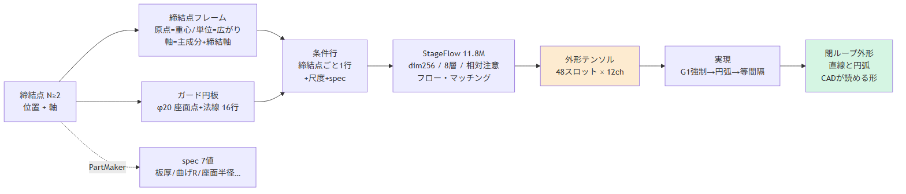
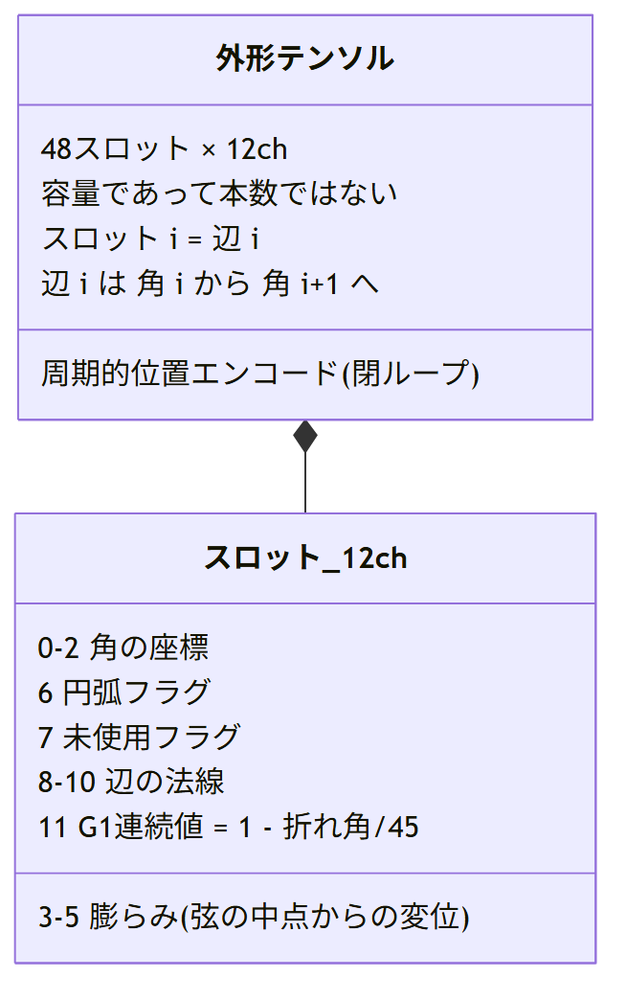
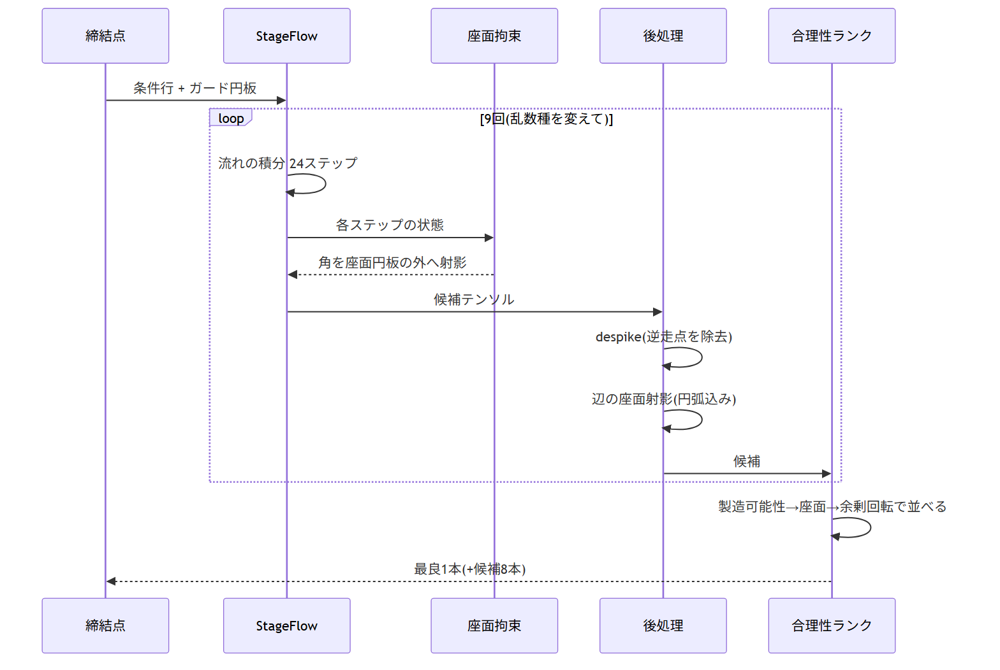
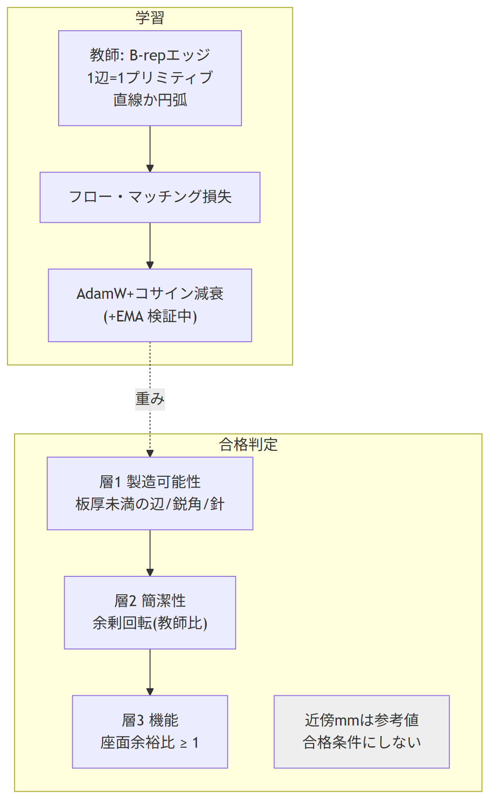
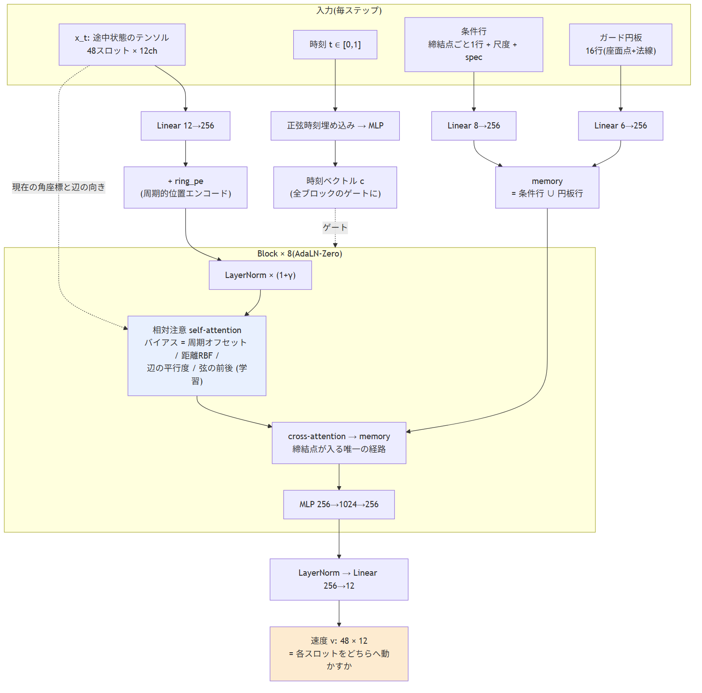
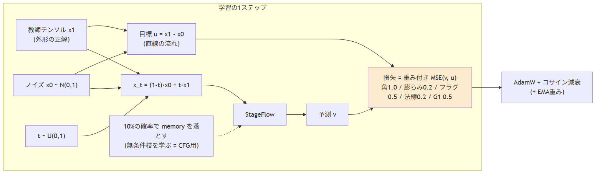
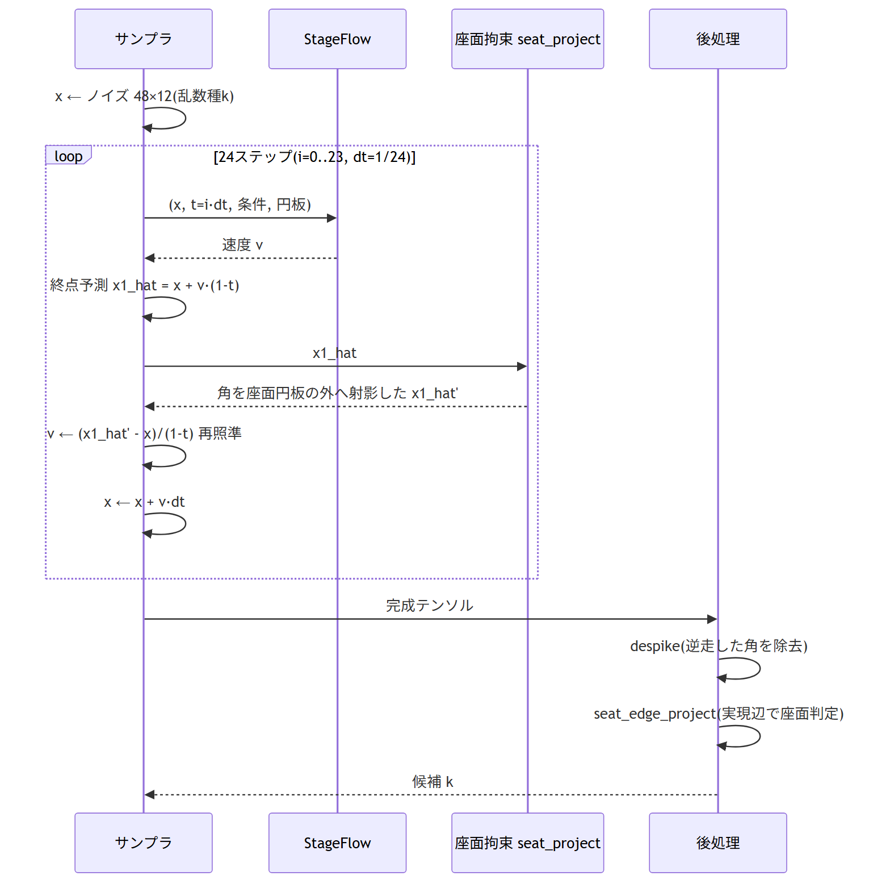
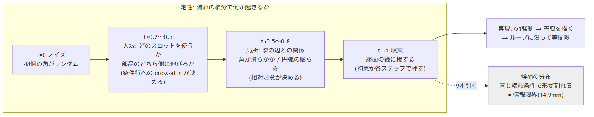

# 外形生成器の仕組み(学習用、UML 付き)

作成 2026-09-05。図は `figures/uml/*.png`(ソース `*.mmd`、`npx @mermaid-js/mermaid-cli -i x.mmd -o x.png` で再生成)。
数値はすべて実測値(出典は `../knowledge/`)。

## 1. 全体の流れ

入力は締結点(位置+軸、N≥2)だけで、形の情報は与えない。spec(板厚・曲げ R・座面半径など 7 値)は PartMaker の
生成入力で、締結点から導出できない唯一の有効な条件(knowledge/05 の条件付けの法則)。出口は閉ループの直線+円弧で、
CAD がそのまま読める。

## 2. 表現(設計の核)

- スロット i がそのまま辺 i。辺は角 i から角 i+1 へ走るので**接続を生成しなくてよい**(自己回帰方式の失敗を構造で回避)
- 点群だと「線に乗る」を学ぶ必要があり、実測ではぼやけた帯になった。辺はにじまない
- 膨らみは弦の中点からの差分。直線なら 0 で、チャンネルは「直線からのずれ」だけを運ぶ
- 48 は容量(予算)であって本数ではない。実際の辺数は族ごとに 12〜40(`WTOK_EDGE_SLOTS`)

## 3. 生成時: 9 本の候補を出して合理性で選ぶ

同じ締結条件の実部品どうしが 14.9mm 違う(情報限界)ので、答えは一意ではない。最終成果物は「候補+合理性ランク」。
拘束は損失ではなくサンプリング時に掛ける(損失に書いて負けた履歴 6 件、knowledge/05)。

## 4. 学習と合格判定の分離

損失が下がったのに誤差が 9→39mm に崩れた事故があるため、判定は 3 層の工学的成立性(knowledge/06)で行い、
教師への距離は参考値に落としている。

## 5. StageFlow の 1 ステップ(アーキテクチャ)

StageFlow は外形を直接出すのではなく、途中状態 x_t を見て「各スロットをどちらへ動かすか」(速度 v)を返す。

| 部品 | 役割 |
|---|---|
| Linear 12→256 + ring_pe | 辺を 256 次元に持ち上げ、周期的位置エンコードでループ上の位置を与える(線形だと最初と最後が隣と分からない) |
| 時刻埋め込み → ゲート | t の正弦埋め込み → MLP → 全ブロックの LayerNorm と残差ゲート(AdaLN-Zero)。ノイズ段階と仕上げ段階で同じ重みを違う強さで使う |
| memory | 締結点・尺度・spec・ガード円板を 256 次元に。cross-attention 経由で締結点が入る唯一の経路 |
| 相対注意 | スロット対の関係(周期オフセット、距離 RBF、辺の平行度、弦の前後)から学習したバイアスを足す。位置は x_t から読むので形が現れるにつれて注意先を決め直す |
| head(ゼロ初期化) | 学習開始時は「動かさない」から始まる安定化。生成時は学習済み重み |

相対注意の導入理由: is_arc の一致が 64% だったのに、折れ角と隣の長さだけの規則で 79% 出た(情報はモデル出力の中にあるのに
使えていなかった)。折れ角をチャンネルに手書きする案は「どの関係が重要かをモデルの代わりに決める」ので棄却。

## 6. 学習 = フロー・マッチング

ノイズ x0 と教師 x1 を t で内挿した x_t を作り、まっすぐな流れ u = x1 − x0 を当てさせる。損失は重み付き MSE
(角 1.0、膨らみ 0.2、フラグ 0.5、法線 0.2、G1 0.5)。10% の確率で memory を落として無条件枝も学ぶ(無いと「2 点が許す
全外形の平均 = ぼやけた帯」が出た)。

## 7. 生成 = 24 ステップの積分と拘束

各ステップで終点予測 x1_hat = x + v·(1−t) を作り、座面拘束を掛けてから速度を再照準する。分母 (1−t) の下限は dt
なのでゼロ割は起きず、最後のステップで x は射影済みの終点にぴったり乗る。本当のリスクは発散ではなく
「早い段階の射影が軌道を曲げる」ことで、辺の座面拘束は積分後の 1 回射影に移した(decisions/face_loops.md 21.24)。
ステップ数を 24→64 にすると生の針は 33% 減るが、despike+選択の後の指標には効かない(knowledge/05)。

## 8. 定性: 流れの積分で何が起きるか(解釈を含む)

t が小さい間は大域(どのスロットを使うか、部品がどちら側に伸びるか)、中盤で局所(角か滑らかか、円弧の膨らみ)、
t→1 で座面の縁に収束。測定で裏づけられている部分: 候補が族の間で割れるのは大域の決定が締結点だけでは定まらないため
(情報限界)、針は 1 スロットの逆走(積分の粗さ+位置ノイズ)。
