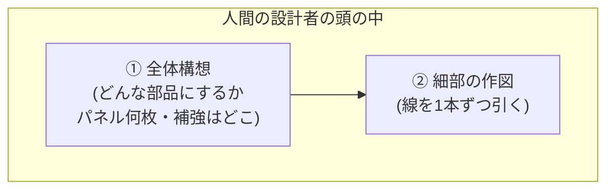
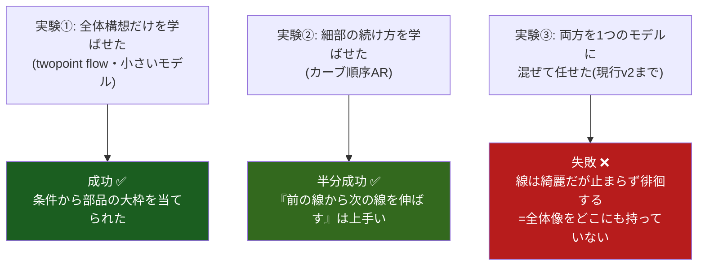
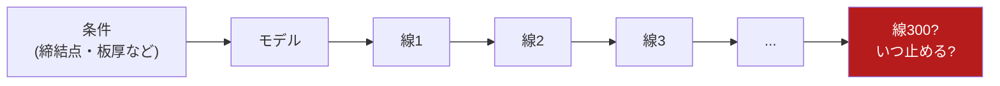
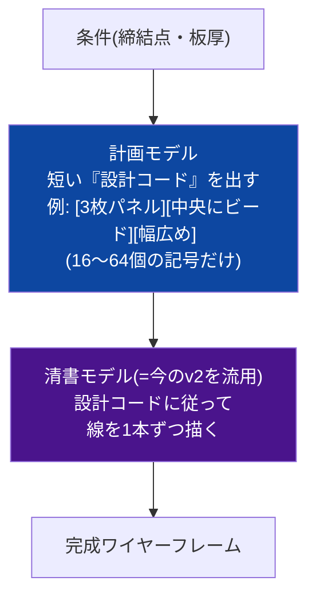
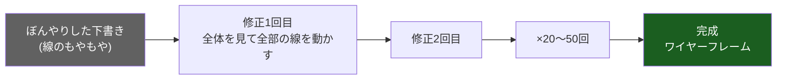
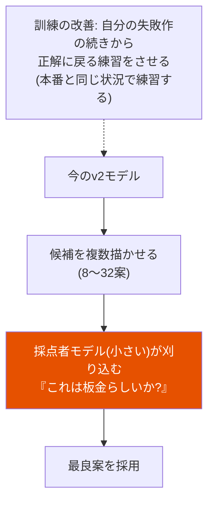
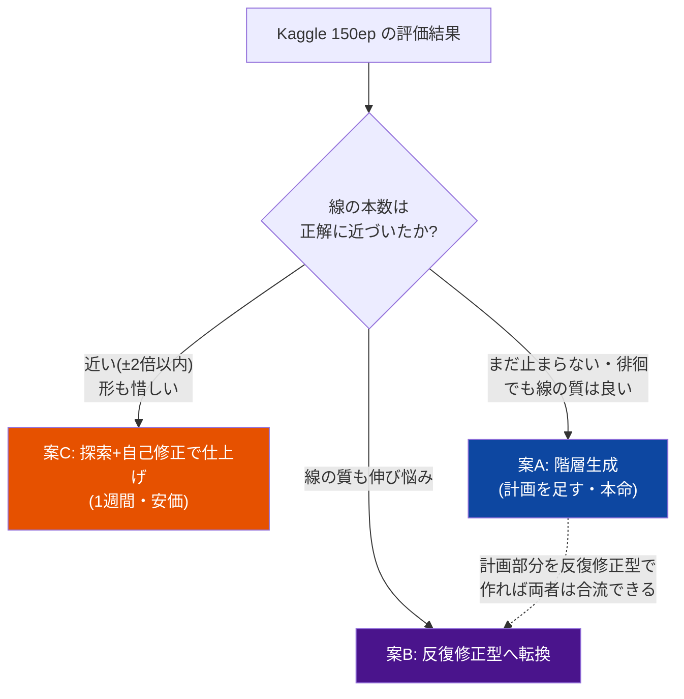
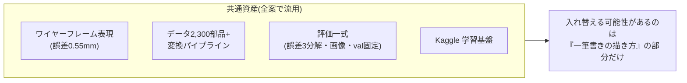

# スケーリングと容量の見積り

> 統合日 2026-09-05。以下は元文書を順に**そのまま**収録(見出し番号は元のまま。`KB 21.24` のような参照はこのファイル内を検索)。
> 収録元: `model_scaling_estimate.md`, `next_architecture_overview.md`


---

<!-- 元文書: model_scaling_estimate.md -->

# データ多様性の診断とモデルパラメータ数の数学的見積もり

Date: 2026-08-27
Author: fable5
質問: ①2,300合成部品に多様性不足はあるか ②締結点数十個・構造種拡大(ボス/ディアボロ/リブ/組合せ)・
実車1車種1,000部品級に対して現行10.5Mパラメータで足りるか

## 1. Q1: 多様性の実測と診断

### 1.1 パラメータ空間カバレッジ(実測、2,300部品)

各部品は (条件8次元, 自由DOF+特徴 ≈ 10-11次元) のベクトルで完全記述される。正規化空間での
最近傍(NN)距離を実測:

| クラス | n | 次元 | NN距離中央値 | 一様配置の理論spacing | 周辺分布の歪み(max-KS) |
|---|---:|---:|---:|---:|---:|
| flange | 491 | 10 | 0.409 | 0.538 | 0.87(1次元が強く偏る=成立性制約による切断) |
| bead | 1,809 | 11 | 0.472 | 0.506 | 0.35 |

読み方:
- NN距離が一様配置の理論値とほぼ一致 → **サンプルは空間に綺麗に散っている**(サンプリング設計は健全)
- しかし絶対値は各次元レンジの40-47%相当 — **10次元超で「密度によるカバー」は原理的に不可能**
  (密度を2倍にするにはデータ 2^10〜2^11 倍が必要 = 次元の呪い)
- それでも twopoint flow(約1Mパラメータ)は検索ベースラインに大差で勝った
  = モデルは密度でなく**滑らかさの補間**で学べている → **連続DOFの多様性は不足していない**

### 1.2 本当に不足しているもの: 構造多様性

- 構造の語彙は実質2種(flange/bead)+分岐(単曲げ/3パネル、side/direction)のみ。
  締結点数も K=2 固定
- v1 の val NLL が ep165 で底打ち(過学習開始)し、以降のチャンク追加の限界効用が逓減した事実は、
  「**同一族内の追加サンプルが持つ新情報が枯れ始めた**」ことのシグナルと整合
- rollout 破綻(v1→v2 の主戦場)は多様性起因ではない(データ+76%で不変だった)

**結論**: ①連続DOFの多様性は十分(補間学習が成立)。②不足は**構造(トポロジ)側**。
次のデータ投資は「同族チャンク追加」より「**新 motif テンプレート・K>2 テンプレートの追加**」が
情報価値で1桁上。

## 2. Q2: パラメータ数の見積もり

### 2.1 見積もりの枠組み(トークン律速則)

AR 言語モデルの経験則(Chinchilla / データ制約下の Muennighoff 2023)を上限指針として使う:

```text
D_eff = ユニークトークン数 × min(実効エポック数, 4)     ※増強(jitter/mirror)は実効2-4倍
N_opt ≈ D_eff / 20        (計算最適 = これ以上大きくしても収穫逓減)
N_max ≈ D_eff / 3〜1      (これ以上は記憶リスク。正則化で緩和可能だが上限の目安)
```

注: これは自然言語の則で、CAD系列はエントロピーが低い(冗長・規則的)ため必要Nはさらに小さい側に
倒れる。**上限見積もり**として使う。

### 2.2 系列長モデル(トークン/部品)

実測アンカー: 合成2点(K=2, motif=1)は E≈86エッジ・930トークン(10.8 tok/edge)。
実部品(K≈21joints、複数motif)は E中央値120・約1,490トークン(12.4 tok/edge)。

```text
E(K, M) ≈ 40 + 4K + 45M   (K=締結点数, M=motif数)
tokens ≈ 11-12 × E
検算: K=30, M=4 → E≈340 → ≈4,000トークン(実部品のp90=4,485と整合)
```

### 2.3 シナリオ別の推奨パラメータ数

| シナリオ | 部品数 | tok/部品 | D(ユニーク) | **推奨 N** |
|---|---:|---:|---:|---|
| 現状(2点合成) | 2,300 | 930 | 2.1M | **0.5〜2M で十分**(10.5Mは過剰側 — 実際 v1 は過学習した) |
| 近未来合成(motif 5-6種, K≤8) | 30k | 2,000 | 60M | **10〜30M** |
| 大規模合成(motif 10種+組合せ, K≤30) | 300k | 3,000 | 0.9B | **50〜150M** |
| 実データ 1車種 | 1,000 | 4,000 | 4M | 事前学習済みモデルの**微調整のみ**(単独学習は不可能) |
| 実データ 10車種 | 10,000 | 4,000 | 40M | 同上(微調整 or LoRA的適応) |

### 2.4 構造種の組合せ爆発はパラメータ爆発を意味しない

motif 数 S、部品あたり組合せ ≤4 の場合、組合せ空間は O(S⁴) だが、transformer は motif を
**共有語彙(再利用可能なサブプログラム)**として学ぶため、必要容量は**組合せ数でなく
motif 数にほぼ加算的**(+相互作用項)。S: 2→10 で容量需要は数倍、100倍ではない。
これが成立する条件はデータ側にあり: **各 motif の単独例+代表的な組合せ例**が被覆されていること
(全組合せの網羅は不要 — 組合せ汎化は AR モデルの得意分野)。

### 2.5 パラメータより先に当たる壁(優先順位の再確認)

1. **rollout gap**(現在 v2 で対処中)— 容量を増やしても直らないことは実証済み
2. **構造多様性**(§1.2)— 生成器の motif 拡張が律速
3. 条件エンコーダ — K数十点はトークン化で自然にスケール。**周辺部品・NG領域の文脈符号化**が
   将来の本命拡張
4. 系列長 — 4k〜10kトークンで KVキャッシュ実装が実用上必須(計算量、容量ではない)

### 2.6 監視シグナル(いつ容量を増やすか)

- val NLL の底がデータ追加のたびに下がり続け、**かつ**教師強制のトークン精度が頭打ち
  → その時が width/depth 拡大の時(dim 256→384→512 の順)
- 逆に val が train から乖離(現状)している間は、容量追加は害しかない

## 3. 結論

- **多様性**: 連続パラメータは十分・構造が貧困(実質2種)。次の投資は新テンプレート
- **パラメータ**: 現行10.5Mは現データに対し**過剰**。自動車板金の実用域(数十万合成部品+
  実データ微調整)でも **50〜150M で到達見込み、billions は不要**。
  Kaggle T4(16GB)でも 100M級 AR の学習は現実的
- **原則**: モデルサイズはデータ(トークン)量に追従させる。N ≈ D_eff/20 を目安に、
  データが1桁増えるごとに容量を見直す


---

<!-- 元文書: next_architecture_overview.md -->

# 次期アーキテクチャ 図解版 — 何を狙って、なぜその形なのか

Date: 2026-08-27
対象読者: 技術詳細版(next_architecture_proposals.md)の前に読む概要。
数式・専門用語は極力使わない。

---

## 1. おおもとの設計思想 — たった1つの原則

これまでの実験(点群 → 点の逐次生成 → ワイヤーの逐次生成)が3回とも同じ形で失敗し、
そこから得られた原則は1つだけです:

> **「全体の計画」と「細部の作業」は別の仕事であり、別の仕組みに担当させるべき**

人間の設計者もそうしています。いきなり細部から描き始める設計者はいません。



### 実験が示した証拠



つまり**部品はそれぞれ学べるのに、混ぜると壊れる**。だから次の一手は
「もっと大きなモデル」でも「もっとデータ」でもなく(→ 見積もり済みで両方否定)、
**役割分担の入れ方**の問題です。3つの案は、その分担のさせ方が違うだけです。

---

## 2. 現行 v2 の仕組みと、その構造的な弱点

今のモデルは「一筆書き」です。線を1本描いては次を考え、を数百回繰り返します。



**弱点**: 各ステップは直前までしか見ておらず、「部品全体としてどうあるべきか」の
設計図を誰も持っていない。小さなズレが数百ステップで雪だるま式に膨らみ(複利)、
終わりどころも分からない。練習(お手本をなぞる)では上手いのに、本番(一人で描く)で
崩れる — 試験勉強と実戦の乖離と同じ構造です。

---

## 3. 案A: 階層生成 — 「ラフスケッチしてから清書する」(本命)



- **狙い**: 「全体像がない」問題への正面からの答え。全体像を**16〜64個の記号**に
  圧縮してから描き始めるので、①全体の一貫性は短い列の問題になり(雪だるまが起きない)、
  ②「どこで止まるか」は設計コードが最初から教えてくれる
- **ポイント**: 設計コードの語彙は人間が決めるのではなく、**モデルが部品データから
  自分で発明する**(だから新しい構造が増えても語彙が勝手に育つ)。以前議論した
  「構造形状と詳細形状を分けるべき」というあなたの提案の、学習版そのものです
- **流用**: 清書側は今の v2 がほぼそのまま使える

---

## 4. 案B: 反復修正型(diffusion) — 「彫刻のように全体を削り出す」

一筆書きをやめて、**最初から下書き全体を置き、全体を見ながら何度も直す**方式です。



- **狙い**: 雪だるま問題を「緩和」ではなく**根絶**する。順番に描かないので、
  誤差が積み上がる経路そのものが存在しない。毎回の修正は完成形の下書き全体を
  見て行うので、大域の一貫性が構造的に保たれる。「何本で止めるか」問題も消える
  (線の有無も同時に決まるため)
- **先例**: 間取り図の自動生成(HouseDiffusion)がほぼ同じ問題をこの方式で解決済み。
  部屋の壁ループ=板金の輪郭ループ、ドア位置の制約=締結点の制約、という対応
- **代償**: 今の理論が持つ「確率計算の厳密さ」の保証を1つ手放す。ただし3回の実験が
  「厳密さより全体の一貫性の方が支配的」と示したので、妥当な取引と考えます

---

## 5. 案C: 探索と自己修正 — 「今のモデルに採点者と書き直しを付ける」(安価・即効)

モデル本体は変えず、**使い方**を変えます。



- **狙い**: 診断によれば「練習では上手い」のだから、本番の崩れ方だけ直せば良い、
  という発想。採点者の訓練データ(失敗作)はモデル自身が無限に量産できるので安上がり
- **限界**: 一筆書きという枠は変わらないので、全体像の欠如が本因なら頭打ちする。
  **「惜しい失敗」だった場合の第一手**

---

## 6. どう選ぶか — v2 の結果を見てからの分岐



私の予想は、最終形は **A+B のハイブリッド(全体計画は反復修正型で、清書は一筆書きで)**
です。人間の設計と同じ形 — 構想は行きつ戻りつ練り、作図は順に進める — に落ち着くだろう、
という読みです。

## 7. どの案でも捨てないもの


