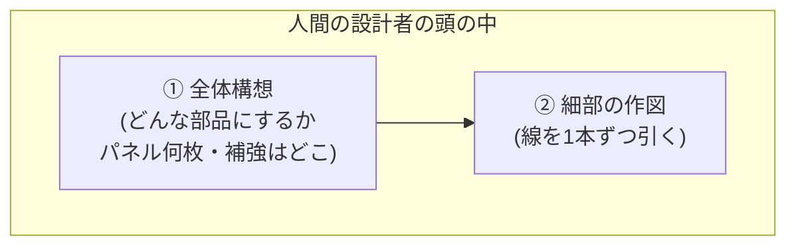
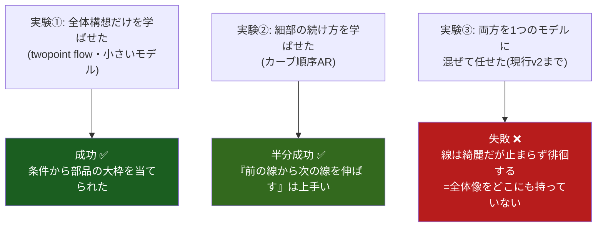
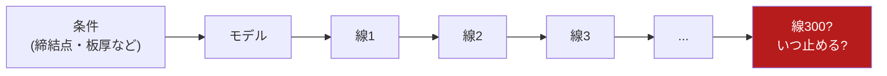
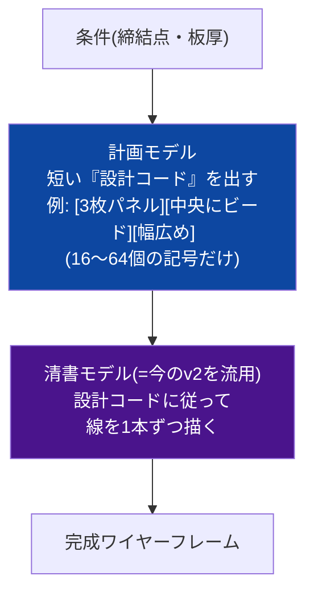
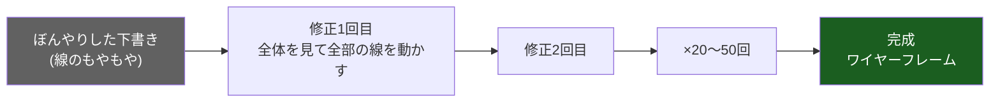
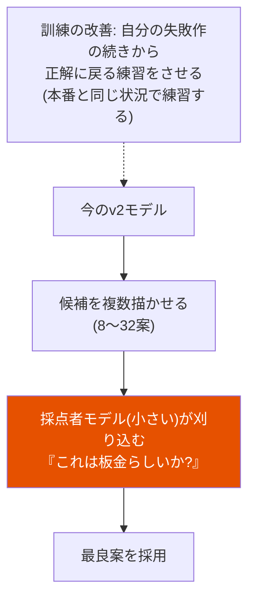
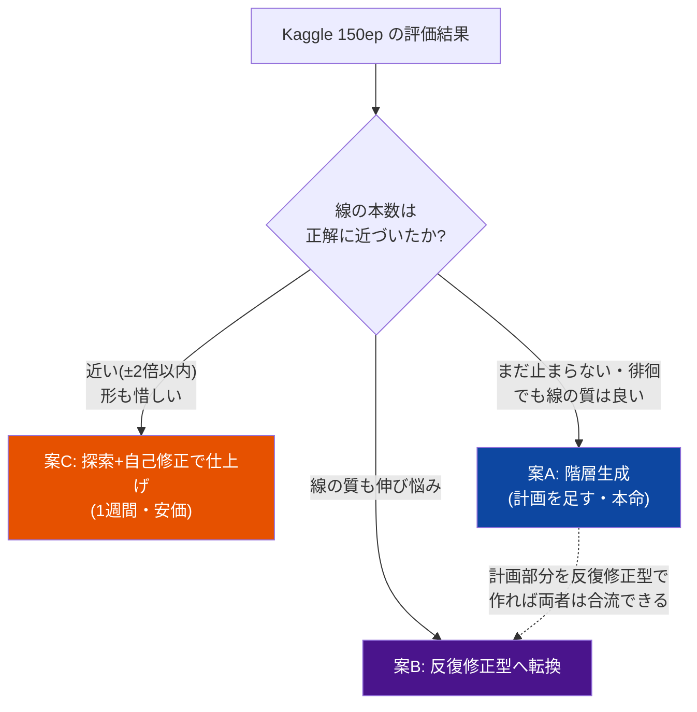
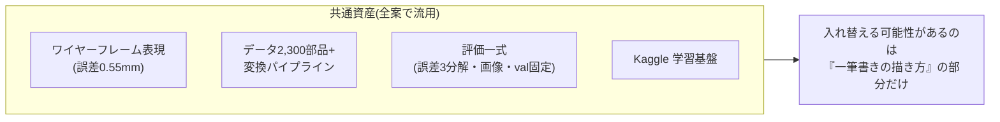

# 次期アーキテクチャ 図解版 — 何を狙って、なぜその形なのか

Date: 2026-08-27
対象読者: 技術詳細版(next_architecture_proposals.md)の前に読む概要。
数式・専門用語は極力使わない。

---

## 1. おおもとの設計思想 — たった1つの原則

これまでの実験(点群 → 点の逐次生成 → ワイヤーの逐次生成)が3回とも同じ形で失敗し、
そこから得られた原則は1つだけです:

> **「全体の計画」と「細部の作業」は別の仕事であり、別の仕組みに担当させるべき**

人間の設計者もそうしています。いきなり細部から描き始める設計者はいません。

### 実験が示した証拠

つまり**部品はそれぞれ学べるのに、混ぜると壊れる**。だから次の一手は
「もっと大きなモデル」でも「もっとデータ」でもなく(→ 見積もり済みで両方否定)、
**役割分担の入れ方**の問題です。3つの案は、その分担のさせ方が違うだけです。

---

## 2. 現行 v2 の仕組みと、その構造的な弱点

今のモデルは「一筆書き」です。線を1本描いては次を考え、を数百回繰り返します。

**弱点**: 各ステップは直前までしか見ておらず、「部品全体としてどうあるべきか」の
設計図を誰も持っていない。小さなズレが数百ステップで雪だるま式に膨らみ(複利)、
終わりどころも分からない。練習(お手本をなぞる)では上手いのに、本番(一人で描く)で
崩れる — 試験勉強と実戦の乖離と同じ構造です。

---

## 3. 案A: 階層生成 — 「ラフスケッチしてから清書する」(本命)

- **狙い**: 「全体像がない」問題への正面からの答え。全体像を**16〜64個の記号**に
  圧縮してから描き始めるので、①全体の一貫性は短い列の問題になり(雪だるまが起きない)、
  ②「どこで止まるか」は設計コードが最初から教えてくれる
- **ポイント**: 設計コードの語彙は人間が決めるのではなく、**モデルが部品データから
  自分で発明する**(だから新しい構造が増えても語彙が勝手に育つ)。以前議論した
  「構造形状と詳細形状を分けるべき」というあなたの提案の、学習版そのものです
- **流用**: 清書側は今の v2 がほぼそのまま使える

---

## 4. 案B: 反復修正型(diffusion) — 「彫刻のように全体を削り出す」

一筆書きをやめて、**最初から下書き全体を置き、全体を見ながら何度も直す**方式です。

- **狙い**: 雪だるま問題を「緩和」ではなく**根絶**する。順番に描かないので、
  誤差が積み上がる経路そのものが存在しない。毎回の修正は完成形の下書き全体を
  見て行うので、大域の一貫性が構造的に保たれる。「何本で止めるか」問題も消える
  (線の有無も同時に決まるため)
- **先例**: 間取り図の自動生成(HouseDiffusion)がほぼ同じ問題をこの方式で解決済み。
  部屋の壁ループ=板金の輪郭ループ、ドア位置の制約=締結点の制約、という対応
- **代償**: 今の理論が持つ「確率計算の厳密さ」の保証を1つ手放す。ただし3回の実験が
  「厳密さより全体の一貫性の方が支配的」と示したので、妥当な取引と考えます

---

## 5. 案C: 探索と自己修正 — 「今のモデルに採点者と書き直しを付ける」(安価・即効)

モデル本体は変えず、**使い方**を変えます。

- **狙い**: 診断によれば「練習では上手い」のだから、本番の崩れ方だけ直せば良い、
  という発想。採点者の訓練データ(失敗作)はモデル自身が無限に量産できるので安上がり
- **限界**: 一筆書きという枠は変わらないので、全体像の欠如が本因なら頭打ちする。
  **「惜しい失敗」だった場合の第一手**

---

## 6. どう選ぶか — v2 の結果を見てからの分岐

私の予想は、最終形は **A+B のハイブリッド(全体計画は反復修正型で、清書は一筆書きで)**
です。人間の設計と同じ形 — 構想は行きつ戻りつ練り、作図は順に進める — に落ち着くだろう、
という読みです。

## 7. どの案でも捨てないもの

