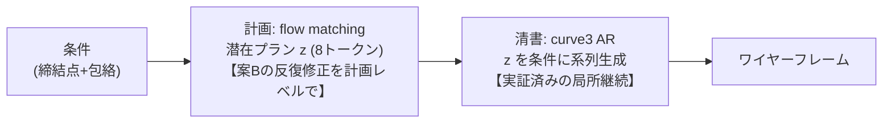

# 案A+B ハイブリッド設計 — 「flow で計画、AR で清書」

Date: 2026-08-27
Author: fable5
位置づけ: Kaggle の curve3(v2.1)と並行するローカル実験。小規模パラメータで開始。

## 1. 設計思想(1分)

3世代の実験の結論は「**大域計画と局所作業を別の仕組みに担当させよ**」だった。
本設計はそれを最短の実証済み部品だけで組む:



- **計画側(案B由来)**: 全体レイアウトを 8トークンの連続潜在 z に圧縮し、
  条件付き flow matching で生成。反復精緻化なので複利誤差が構造的に無い。
  **twopoint flow(1M params で検索に勝利)の実証済みアーキテクチャの潜在版**
- **清書側(案A由来)**: curve3 の AR デコーダに z を条件トークンとして追加するだけ。
  「どこに何を置き、どこで止まるか」を z が教えるため、AR は得意な局所継続に専念できる
- VQ(離散コード)でなく連続潜在を選ぶ理由: 小規模ローカル実験ではコード崩壊の
  リスク管理が重く、連続+flow は当プロジェクトで唯一完全成功しているパラダイムのため。
  離散化は連続版が成立してからの改良枠

## 2. 構成(3コンポーネント、全て学習・手設計ルールなし)

### 2.1 PlanEncoder(学習時のみ使用)

```text
入力: GT ワイヤーフレームのエッジ集合
      各エッジ = [τ one-hot(4), 端点3頂点の正規化座標(9)] = 13次元
構造: Linear → TransformerEncoder(3層) → 学習クエリ8個で cross-attn プーリング
      → LayerNorm → z (8 × dim)
訓練トリック: z にガウスノイズ σ=0.1 を注入(twopoint の cond-jitter で実証した
      「潜在の丸暗記防止+prior が合わせやすい滑らかな潜在空間」の処方)
```

### 2.2 デコーダ = PlanCurveAR(curve3 の最小拡張)

条件プレフィックスを [FIX行, 包絡行, bucket行] → [同, **+ z の8行**] に拡張するだけ。
絶対座標・ソフトCE・エッジ数自己条件は curve3 のまま。

### 2.3 PlanPrior(推論時の計画生成)

```text
条件ベクトル(FIX+包絡 24次元) → FiLM 条件付き MLP flow matching → z
twopoint の FlowMLP と同型(隠れ512×4ブロック、Euler 20-40step、~1M params)
```

## 3. 学習手順(2段、ローカルで完結)

| Stage | 内容 | 時間見込み(GTX 1660) |
|---|---|---|
| **AE** | Encoder+Decoder を教師強制で同時学習(z=GT由来+ノイズ) | 60-90s/epoch × 100ep ≈ 2h |
| **Prior** | 全 train 部品を凍結 encoder で z 化 → flow matching 学習 | 数分 |

推論: 条件 → prior が z をサンプル → AR が清書。
評価は恒例の z-on(GT計画で復元=デコーダ診断)/ **z-off(条件のみ=本命)** を分離報告。

## 4. 小規模パラメータ(ローカル 6GB 制約)

| 部品 | 構成 | params |
|---|---|---:|
| PlanEncoder | dim192 × 3層 | ~1.4M |
| PlanCurveAR | dim192 × 6層(curve3 は 256×8) | ~5.4M |
| PlanPrior | 512×4 FiLM MLP | ~1M |
| 合計 | | **~8M**(バッチ6・AMPなしで 6GB に収まる設計) |

## 5. 成功判定

- z-on 復元が curve3(無計画AR)の生成を大きく上回る → 「計画の情報が効く」ことの証明
- z-off 生成で **配置精度(外形カバー)と量制御の両立** — curve3 の Kaggle 結果と同一プロトコルで直接比較
- z-off ≈ z-on に近いほど prior が良い(乖離が大きければ prior 側を強化)

## 6. 実装

`wtok/plan_ab.py` 単一モジュール(--stage ae / prior / eval)。
dataset・collate・sampler・評価(誤差3分解)は curve3 系を継承・流用。
