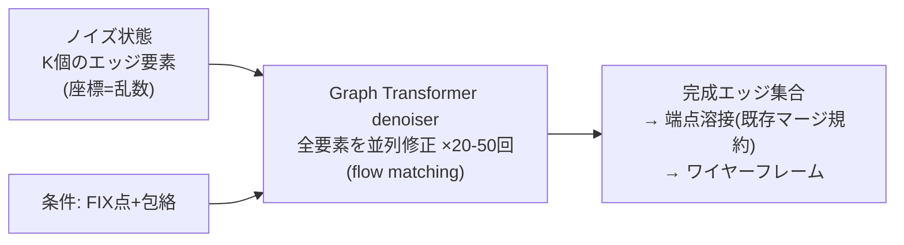

# 案B設計: グラフ反復精緻化 — Graph Transformer denoiser による E2E 生成

Date: 2026-08-27
Author: fable5(ユーザーの graph transformer 適用提案を受けて)
位置づけ: C(純AR、収束済み単発67.9mm)・AB(計画+AR、単発86.5mm)に続く第3路線。
一筆書きを完全に廃止する唯一の案。

## 1. 中核の主張

3世代の失敗はすべて「グラフ(ワイヤーフレーム)を列に直列化した」ことに由来する。
本設計は直列化をやめ、**エッジ集合を丸ごと持ち、graph transformer が反復修正する**。



- 複利誤差の経路が存在しない(毎ステップ完成形全体を見る)
- STOP 問題が存在しない(要素数は最初に決まる)
- 順序が存在しない(トラバース順の工学も F1 の正準順序も不要)

## 2. 表現(エッジ・アズ・トークン)

1エッジ = 1トークン。**頂点は独立ノードにせず、エッジが端点座標を内包**する
(頂点共有は decode 時の座標溶接=既存の定義6マージ規約で回復。HouseDiffusion と同じ割り切り):

```text
edge_i = [ type ∈ {LINE, ARC, CIRCLE, CIRCLE_C, PAD},     … 離散
           p_a(3), p_b(3), p_mid(3),                        … 連続(正規化座標)
           fix_ref ∈ {0..K_fix, none} ]                     … CIRCLE_C 用の離散参照
要素数 K: 条件から count head が予測(curve3 の bucket 資産を流用)、
          K_max=192 に PAD(存在は type=PAD が担う → 存在フラグ不要)
```

- ARC は p_mid を使用、LINE は p_mid を無視(損失マスク)、CIRCLE は3点、
  CIRCLE_C は fix_ref + 半径点 — 全4型が同一スロット構造に収まる
- **CIRCLE_C の同芯性は fix_ref の構成的参照として保存**(座標でなく参照を生成
  するので、学習が悪くても中心はずれようがない — 理論の思想の継承)

## 3. Denoiser = Graph Transformer

ベース: 全結合 transformer(K≤192 なので疎化不要)+ **構造バイアス**:

```text
attn_bias(i,j) = f_prox(‖端点i−端点j‖の現在値)      … 動的: 毎ステップ再計算
              + f_type(type_i, type_j)                  … エッジ型ペア埋め込み
条件注入: FIX ノード(座標+軸)と包絡トークンを cross-attention で全要素に供給
時刻 t: FiLM(twopoint/PlanFlow で実証済みの機構)
```

- f_prox が「端点を共有しそうな要素同士」の注意を強めるため、denoiser は
  接続構造を意識した修正ができる(= graph transformer の本質的な寄与)
- 下書きの接続はノイズなので bias は毎ステップ現在座標から計算(HouseDiffusion 方式)

## 4. 生成スキーム(離散×連続の混合)

| 成分 | 手法 |
|---|---|
| 連続座標(p_a, p_b, p_mid) | **flow matching**(当プロジェクト唯一の完全成功パラダイム。source は包絡内一様) |
| 離散 type / fix_ref | **マスク型離散拡散**(初期値=全MASK、各ステップで一部を確定・再サンプル。DiGress/MaskGIT 系) |
| 要素数 K | count head(条件→分布からサンプル)。ソフトであり、type=PAD への崩壊で自己修正可 |

学習: GT のエッジ集合に (a) 座標へ FM ノイズ、(b) type/fix_ref へマスクノイズを独立に
かけ、denoiser に両方を復元させる joint 損失(座標は MSE、離散は CE)。
教師の要素順は無意味なので、**予測とGTの対応は Hungarian マッチング**
(コスト=座標距離+型不一致。K≤192 なので毎バッチ計算しても軽い。
wireflow で実装済みの Sinkhorn/OT 資産を流用可)。

## 5. 評価・比較(全て既存資産)

- decode: 端点溶接 → Q 形式 → realize_points → **evaluate_curve2 と同一の
  Chamfer・誤差3分解・レンダリング**(arch 追加のみ)
- 対戦相手: C=単発67.9 / oracle47.4mm、AB=単発86.5mm
  (旧記載52.2mmはbest-of-2オラクル値。frontier_gaps_and_reform.md 4.1a参照)
- 本案固有のチェック: 溶接後のぶら下がり端点率(接続がどれだけ自然に閉じるか —
  ルールでなく観測指標として)

## 6. 規模と計画

| 項目 | 値 |
|---|---|
| モデル | dim 256 × 8層 + バイアス表(~11M、C/ABと同格) |
| 系列長 | **K≤192 トークン**(AR の 930〜1450 の 1/5-1/7 → 学習・推論とも大幅に軽い) |
| 学習 | 反復数 T=30 の FM/拡散。バッチ32でも軽い(トークン数が短いため) |
| 手順 | 実装 → ローカルスモーク → **Kaggle 投入は承認後**(C打ち切りで空いた枠を使用) |

## 7. リスク(正直に)

1. 端点溶接の失敗(座標が微妙にずれて溶接されない)→ 溶接許容を量子化ステップに
   連動+溶接率を学習中モニタ。最悪でも「ほぼ接続したワイヤー集合」は得られ、
   後処理スナップで救済可能(構成的でなく観測ベース)
2. 離散×連続の joint 拡散は AR より実装が繊細 — MVP は「type は最初に count head と
   同時に一括サンプルし固定、座標のみ FM」の簡易版から始めて段階的に joint 化する
3. マッチング学習(Hungarian)の局所解 — wireflow で OT が機能した実績があり既知の領域
