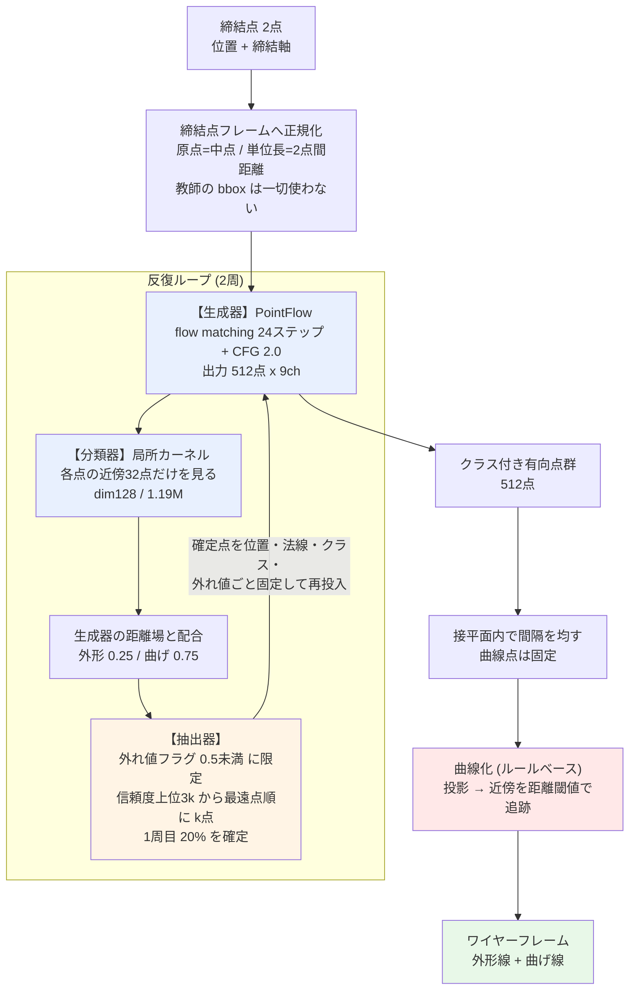
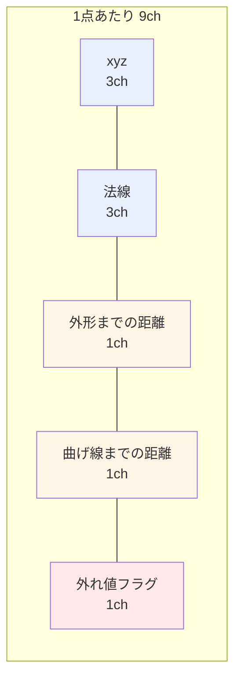
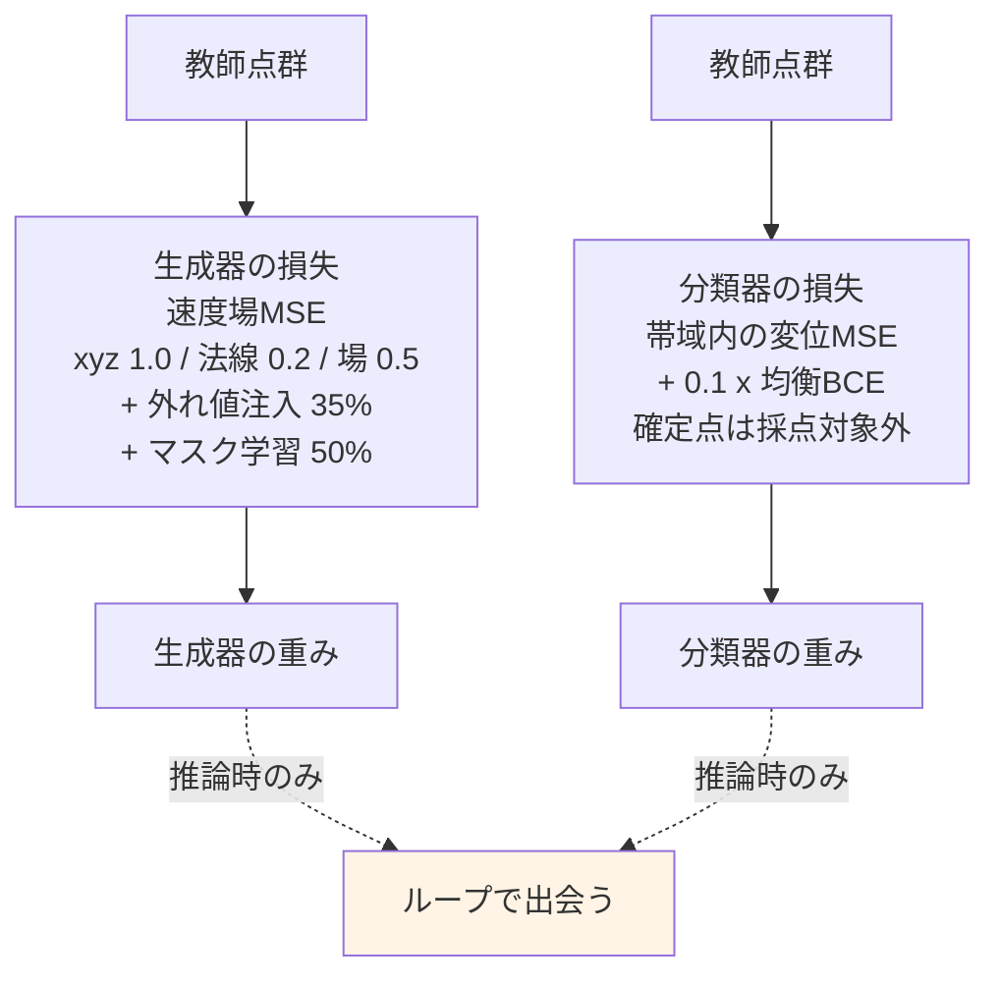

# 研究ログ — 発案・結果・原因・処遇の一覧

Date: 2026-08-29

目的: **締結点2点(位置と締結軸)のみを入力に、板金部品の中立面ワイヤーフレームを
E2E 生成する。** 形状ルールは書かず、すべて学習で行う。

このファイルは「何を、何のために試し、どうなり、なぜそうなり、採用したか捨てたか」
を一覧にしたもの。個別の測定値は `loop_architecture_proposal.md`、経緯は
`session_knowledge_202608.md`、直近の進捗は `progress_202608.md`。

**処遇の凡例**: 🟢採用 / 🔴破棄 / 🟡保留 / ⚪未着手

---

## 0. まず押さえるべき前提

| 事実 | 値 | 意味 |
|---|---|---|
| **タスクの情報限界** | **14.9mm** | 締結条件がほぼ同一の部品ペアでも形状はこれだけ違う。**特定の部品を当てることは原理的に不可能** |
| 検索ベースライン | 16.12mm | 学習なしで最も似た部品を引いてくる |
| 確定している最良のワイヤー精度 | **12.50mm** | 256点モデル + 面復元 |
| 生成点群の面誤差 | 8〜9mm | ここ数か月ほぼ動いていない |

**したがって目標は「その部品を当てる」ことではなく「工学的に使える板金形状を出す」
ことにある。** 評価も教師との距離だけでなく、出力そのものの質(曲線の細さ、点分布の
均一さ)で見る必要がある。

---

## 1. 表現の選択 — ワイヤー直接生成からの転換

| # | 発案 | 目的 | 結果 | 原因 | 処遇 |
|---|---|---|---|---|---|
| 1.1 | **路線C / curve3**(曲線を直列に自己回帰生成) | ワイヤーを直接出す | 67.9mm(単発)。破綻 | 失敗はすべて**組合せ的**だった — 無効な参照、辺数、順序、STOP の誤り | 🔴破棄 |
| 1.2 | **AB**(潜在プラン + 自己回帰) | 大域構造を先に決める | 意味のある形状にならず | 同上 | 🔴破棄 |
| 1.3 | **B-core**(集合 + マスク離散フロー) | 順序の問題を消す | train 0.356 / val 0.384 | — | 🔴破棄(路線転換) |
| 1.4 | **R2 coarse-in-T**(粗い離散化を先に) | 大域を粗く決める | train 0.507 / val 1.352。**記憶** | 包絡234mm ÷ 128格子 ≈ 1.8mm。**学習不可能な残差**が残り、幾何が連続FMから128分類へ移った | 🔴破棄 |
| 1.5 | **有向点群への転換**(ユーザー発案) | ワイヤーというインターフェースを捨て、曲面を大まかに出して後処理で曲線を得る | **現在の路線**。面 8〜9mm | **曲面のサンプルには壊すべき接続情報が無い** — 組合せ的失敗が構造的に起こり得ない | 🟢採用 |

**1.5 が最大の転換点。** ユーザーの「ワイヤーというインターフェースを直接生成するのを
捨て、弾性力学的なメッシュ構造を大まかに生成する」という提案による。

---

## 2. 条件付けと座標系

| # | 発案 | 目的 | 結果 | 原因 | 処遇 |
|---|---|---|---|---|---|
| 2.1 | **包絡(bbox)を条件に使う** | 部品の大きさを教える | **リーク**。過去の全数値が無効に | `env_lo/env_hi` が教師ワイヤーの bbox そのもので、条件行かつ座標系だった。**全モデルが正解の外形寸法を見ていた** | 🔴破棄 |
| 2.2 | **締結点フレーム**(ユーザーが 2.1 を指摘) | 教師情報を一切使わない座標系 | リーク解消。回帰テスト `check_no_envelope_leak` を常設 | 原点=2点の中点、単位長=2点間距離、e1=2点を結ぶ方向 | 🟢採用 |
| 2.3 | **アンカー凍結**(締結点を全ステップ固定) | 締結点を必ず通す | **FIX通過誤差 0.00mm** | 生成の全ステップで該当スロットを教師値に固定 | 🟢採用 |
| 2.4 | `force_anchor_incidence` | アンカーを参照する辺を保証 | FIX誤差 9.4 → 0.60mm | 頂点を固定しても**それを参照する辺が無かった**(実測 0/2) | 🟢採用(路線Cごと破棄) |
| 2.5 | **マスク学習**(任意の既知点を追加拘束に) | 将来の柔軟性 | 実装済み。**完成利得曲線の前提**になった | 拘束点と締結点を同じ機構で扱う | 🟢採用 |
| 2.6 | **CFG(classifier-free guidance)** | 平均へのヘッジを打ち消す | span比 0.92 → 1.06(スケール1.0→4.0) | 一発生成は複数候補の平均を出す。guidance で分布の峰へ寄せる | 🟢採用(scale 2.0) |

---

## 3. 曲線の抽出 — 3世代

| # | 発案 | 目的 | 結果 | 原因 | 処遇 |
|---|---|---|---|---|---|
| 3.1 | **符号なし距離場 + 等値面** | 点群から面を作る | 誤差13mm、三角形14〜22倍 | 開いたシートを**枕状に包む**閉曲面になる。点数を増やしても直らない | 🔴破棄 |
| 3.2 | **MLS(局所平面への符号付き距離)** | 同上 | **2.2mm** | 局所的に平面を当て符号を決める。開いた面を扱える | 🟢採用 |
| 3.3 | **距離場の等値面で曲線を得る** | 曲線抽出 | 18.33mm | 距離場の等値線は**曲線のオフセット**。下げれば交差せず、上げれば内側にずれる | 🔴破棄 |
| 3.4 | **面の境界稜線 + 二面角**(案A) | 曲線抽出 | 外形5.73 / 曲げ6.62mm | 幾何的な判定 | 🟡保留(比較用の基準) |
| 3.5 | **大域稜線モデル**(512点全体のattention、変位回帰) | 学習で曲線を読む | **塗りつぶし**。撤回 | 選別を \|変位\| で行い、**全512点を両クラスに投影**。カバレッジ指標はこれを罰しない | 🔴破棄 |
| 3.6 | **局所カーネル**(ユーザー発案。近傍だけを見る演算子) | 部品固有の配置を記憶させない | **現行**。採用率13〜19%、偽陽性1.6mm | 近傍しか見せなければ記憶できない。実効データ量が2,200部品→112万近傍に増える | 🟢採用 |
| 3.7 | **信頼度ヘッド** | 塗りつぶしの再発防止 | AUC 0.90、上位5%適合率97.5% | \|変位\| でなく学習した確からしさで選別 | 🟢採用 |

**3.5 → 3.6 はユーザーの「空間カーネル」提案による。**
> Bbox内の点群がシート状に展開していて基準点が端にあるなら外形、
> 基準点を境に点群の角度傾向が変わるなら曲げ線

---

## 4. 測定の誤りと撤回(重要)

| # | 何を | 何が起きたか | 処遇 |
|---|---|---|---|
| 4.1 | **学習型リーダーの天井 1.51/1.99mm** | 採用率を実測すると**外形77.6% / 曲げ90.3%を塗りつぶし**ていた | 🔴撤回 |
| 4.2 | **点数・均一性の表**(256点3.03mm、512点1.27mm等) | 同じ選別で測定。同じ水増し | 🔴撤回 |
| 4.3 | 「256→512点にすべき」 | 4.2 が根拠だった。実測では512点は**ワイヤー14.03mm**で256点の12.50mmに負ける | 🟡保留(未再検討) |
| 4.4 | 「劣化事前学習は不要」 | 正規化後の局所統計が一致することから**推論**していた。直接測ると AUC 0.897 → 0.750 の実差 | 🔴撤回 |
| 4.5 | 「完成利得曲線がループの有効性を示す」 | 測っていたのは**新しい情報の価値**であって確定の価値ではなかった | 🔴撤回 |
| 4.6 | 「100%自己生成の確定点は使えない」 | **ユーザーの指摘が正しく、私が誤り**。矛盾しない | 🔴撤回 |

### 恒久ルール(この経験から)

- **曲線抽出の評価には、カバレッジと同時に「採用率」と「偽陽性」を必ず併記する。**
  塗りつぶしはカバレッジで罰されず、絵で見ても分かりにくい(3モデルが同じ罠に落ちた)
- **best.pt は損失でなく幾何プローブで選ぶ。** flow matching の損失は条件付き分散が
  下限で、最小値はノイズ
- **比較は必ず面積比例サンプリングを通す。** メッシュ頂点と面積サンプルを比べると
  同一の面でも11〜20mmの誤差(3回踏んだ)
- **切り口を1つに絞ると設計を誤る。** 外形先行の件では、教師点群だけを見れば
  「無意味」、生成点群で外形だけを見れば「外形100%が正解」となり、どちらも誤りだった
- **施策の前提は、着手する直前に測り直す**(§6.1 の失敗から)
- **中間チェックポイントで機構を語らない**(§5.3 で不要な設計変更を提案した)
- **数値を報告する前にログを確認する**(通知の値を転記して2度誤った)

---

## 5. 反復ループ(ユーザー発案) — 現行アーキテクチャの中核

> 生成器 → クラス分類器 → 抽出器 を直列に複数回まわし、信頼度上位を確定して
> 次周の入力にする。点群には(面/外形/曲げ線/締結点/外れ値)のクラスを持たせ、
> 全ての器で利用する。

| # | 要素 | 目的 | 結果 | 原因 | 処遇 |
|---|---|---|---|---|---|
| 5.1 | **ループ本体** | 平均のぼやけを鋭い単一仮説にする | 全指標で一発生成を上回る | ただし機序は**情報の蓄積ではなく選別**(外れ値除去と信頼度による絞り込み) | 🟢採用 |
| 5.2 | **確定点のクラスを近傍チャネルで読む**(P1) | 確定情報を座標以外にも使う | **曲げ線の誤り率 6.7% → 2.0%** | 対照群(チャネルなし)は確定率を上げても完全に横ばい。利得はクラス情報から来ている | 🟢採用 |
| 5.3 | **外れ値クラス**(ユーザー発案) | はみ出した点を確定候補から除く | **AUC 0.872→0.928、span比 1.051→1.021** | 生成点群は真形状より2〜5%大きく、**そのはみ出しを分類器が最も強く外形と判定**していた(8.21mm 対 平均4.88mm)。教師に外れ値が無いので学習時に注入 | 🟢採用 |
| 5.4 | **距離場との配合** | 生成器の出力を使い切る | 曲げ 0.736→**0.804**、再学習不要 | **生成器自身の曲げ距離場(0.798)がカーネル(0.736)より正確**だった。法線が15.4度ずれており幾何から読みにくいため | 🟢採用(外形0.25 / 曲げ0.75) |
| 5.5 | **クラス順序スケジュール**(ユーザー発案。外形→曲げ→一般) | 読める順に確定する | 仮説は正しい(外形64点で曲げ 0.735→0.849)が、**無作為の方が上**(0.939) | 効いているのは**クラスではなく空間的被覆**。外形の点は縁に集中し内部を拘束しない | 🟡修正して採用 |
| 5.6 | **空間分散選択**(信頼度上位3kから最遠点順) | 被覆を買う | 面 8.47→8.14mm、span 1.004→0.981 | 5.5 の測定から | 🟢採用 |
| 5.7 | **周回数の削減**(ユーザー発案。5周→2周) | 計算量 | **2周で等価かそれ以上**。5周が最悪(8.88mm) | 機序が選別なら、選別と引き直しは1回ずつで足りる | 🟢採用(2周・20%確定) |

---

## 6. 効かなかった施策 — すべて原因が特定できている

| # | 発案 | 目的 | 結果 | 原因 | 処遇 |
|---|---|---|---|---|---|
| 6.1 | **劣化学習**(教師点群を生成器出力らしく劣化) | 分類器のドメイン差を埋める | **効果ゼロ** | **埋めるべき差が先に消えていた。** 外れ値クラスが AUC を 0.872→0.928 に上げており、計画の根拠だった 0.852 は既に無効 | 🔴破棄 |
| 6.2 | **法線の損失重み 0.2→1.0** | 法線誤差15.4度を減らす | **改善せず**(18.7→19.8度)、曲げAUCも低下 | 法線のずれは**学習不足ではなくタスクの不確実性**。締結点2点から形状が決まらない以上、面の向きも決まらない | 🔴破棄 |
| 6.3 | **自己条件付け学習**(scheduled sampling) | 自分の点を確定したときの利得ゼロを解消 | **3設定すべて失敗**。40エポック完走しても基準を上回る点なし | 自分の点に情報が無いという事実は**学習では変えられない**。得たのは「固定点を無視する能力」で、教師の点という本物の情報も活かせなくなった(3.59→3.95mm) | 🔴破棄 |
| 6.4 | **反発項v1**(近すぎるペアを罰する) | 点分布の不均一を直す | 重複 2.7→1.9%、**ばらつきは 0.580→0.582 で無変化** | **罰すべき現象の取り違え。** 密な領域と空隙が共存する点群には「近すぎるペア」が存在しない | 🔴破棄 |
| 6.5 | **反発項v2**(半径2倍の局所密度の均一化) | 同上 | **項は7分の1に下がったが、実際の出力は悪化**(0.0248→0.0303) | **代理指標の最適化。** 罰しているのは「1ステップ先の予測終点」の密度で、24ステップ積み重ねた実際の着地点とは別物 | 🔴破棄 |
| 6.6 | **最適輸送(OT)によるノイズ-データ対応** | 同上 | 実装前に否定 | 測定: 出力で重なるペアは**初期ノイズでは典型間隔の4.5倍離れていた**。塊はノイズ由来ではなく生成過程で作られる | 🔴破棄(未実装) |

**6.1〜6.3 に共通するのは、欠陥の存在を確認しただけで原因を確認せずに施策を選んだこと。**
6.4〜6.5 は原因を追ったが、罰の対象を2度取り違えた。

---

## 7. 軽量化

| # | 発案 | 目的 | 結果 | 処遇 |
|---|---|---|---|---|
| 7.1 | **サンプリング 48→24ステップ** | 推論コスト半減 | **0.50x、劣化は測定ノイズ内**(8.27→8.51mm) | 🟢採用 |
| 7.2 | 分類器 dim192→128(2.67M→1.19M) | 学習・推論コスト | **0.54x、AUC同等、上位5%適合率はむしろ改善** | 🟢採用 |
| 7.3 | CFGを切る | 同じ半減 | 8.91mm と明確に悪化。**ステップ削減の方が良い** | 🔴破棄 |
| 7.4 | パッチのキャッシュ + per-item 抽出 | 分類器の学習速度 | **1,029→85秒/エポック(12倍)** | 🟢採用 |

**計算時間の96%は生成器**(分類器は1回が5倍重いが、生成器は480回呼ばれる)。
軽量化の狙いどころは生成器のステップ数。

---

## 8. 保留・未着手

| # | 項目 | 状況 |
|---|---|---|
| 8.1 | **点分布の不均一**(0.52 対 教師0.12) | **最大の未解決課題。** 損失側の手当ては2度失敗。後処理 `relax_spacing` で 0.521→0.463、重複 3.1→1.2% | 🟡 |
| 8.2 | **異方的な位置損失**(面内の誤差は無害、面外だけが有害) | 未着手。6.2 と同型の疑いがあり、着手前に「面外誤差が重み付けの問題か不確実性か」の切り分けが必要 | ⚪ |
| 8.3 | 点列→直線・円弧のパラメトリック当てはめ | CAD出力に必要。未着手 | ⚪ |
| 8.4 | 可展性拘束 | 板金固有の物理事前分布 | ⚪ |
| 8.5 | **条件の追加**(周辺部品・侵入不可領域) | 情報限界14.9mmを動かす唯一の手段 | ⚪ |
| 8.6 | 曲線化(trace/densify)の学習化 | 現在ルールベース。分類が良くなるほどここが律速 | ⚪ |
| 8.7 | 256点 vs 512点の再検討 | 根拠だった表が撤回されている(4.3) | 🟡 |
| 8.8 | 弾性項(ラプラシアン緩和) | `plan_g.py` に実装があるが**現行パイプラインでは未使用**。反発項と符号が逆で併用不可 | 🟡 |

---

## 9. 現在のアーキテクチャ

### 生成器の9チャネル

### 学習の構成 — 2つは完全に独立

**勾配のやり取りは一切ない。** ワイヤーフレーム損失から生成器への逆伝播は存在せず、
曲線化が numpy の離散処理で微分不可能なため、経路を作るには置き換えが要る(8.6)。

---

## 10. 現在の到達点

| 指標 | 生成 | 教師(参照) | 判定 |
|---|---|---|---|
| 外形の線らしさ | **0.255** | 0.297 | 教師より細い |
| 曲げ線の線らしさ | **0.575** | 0.627 | 同水準 |
| **点分布の均一さ** | **0.52** | **0.12** | **4.3倍ばらつく** |
| 面の誤差 | 8〜9mm | — | 情報限界14.9mmに対し妥当 |
| span比 | 0.97〜0.98 | 1.00 | ほぼ一致 |
| FIX通過誤差 | **0.00mm** | — | 構成的に保証 |

**クラス分類は下流(メッシュ生成・ワイヤーフレーム生成)に渡せる品質に達している。**
残る唯一の障害は点分布の不均一(8.1)。
