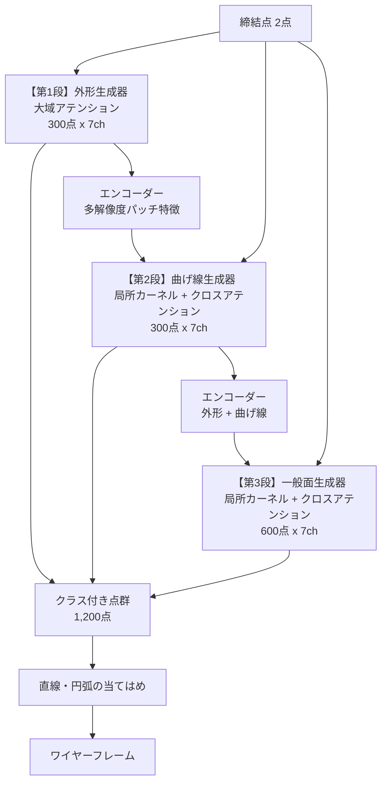

# 段階生成器の設計 — 外形 → 曲げ線 → 一般面

Date: 2026-08-29
発案: ユーザー(クラス別の回路を直列につなぐ / エンコーダー・デコーダー構成)
前提となる測定: `research_log.md`、`progress_202608.md`

---

## 1. なぜこの構成か — 測定された3つの根拠

### 1.1 点数の配分が律速になっている

現在は512点を1つのモデルが生成し、そのうち外形は約77点(15%)しかない。
真の形状を N 点でどれだけ表現できるかを実測した(val 50部品、被覆=真の形状から
最寄りのサンプル点までの平均距離):

| N | 外形 | 曲げ線 | 一般面 |
|---|---|---|---|
| 38 | 1.32mm | 2.54mm | 7.39mm |
| **77(現行相当)** | **0.57mm** | **1.04mm** | **4.92mm** |
| 150 | 0.21mm | 0.32mm | 3.38mm |
| **300** | **0.04mm** | **0.08mm** | 2.28mm |
| 600 | — | 0.00mm | **1.47mm** |

**曲線は300点でサブミリに収まるが、一般面は600点でも1.47mmで収束していない。**
1つのモデルに全てを担わせると、この配分の違いを表現できない。

### 1.2 外形の断片化は点数不足が原因

真の外形を N 点でサンプリングし、鎖が途切れる箇所を数えた:

| N | 端点の割合 |
|---|---|
| **77(現行相当)** | **29.9%** |
| 150 | 17.3% |
| **300** | **10.0%** |

**77 → 300点で2.5分の1になる。** 残る10%は本物の隙間ではなく、指標が角を端点と
誤判定するもの(円 0%、正方形4点=角の数、L字8点=角の数で検証済み)。

現行の生成点群で外形の端点が教師の1.6倍だったのは、この点数不足の症状である。

### 1.3 1次元と2次元の混合を1つのフローに担わせている

外形と曲げ線は3次元空間に埋まった**曲線**(1次元多様体)、一般面は**曲面**(2次元)。
現在はこの混合を単一の flow matching で生成しており、本質的に難しい要求になっている。

---

## 2. 全体構成

**各段の出力はクラスが確定している。** 現在のように生成してから分類するのではなく、
**どの段が作ったかがそのままクラス**になる。分類器という段が消える。

---

## 3. 各段の設計

### 3.1 第1段 — 外形生成器

| 項目 | 内容 |
|---|---|
| 入力 | 締結点フレームの条件行のみ |
| 出力 | **300点 × 7ch**(xyz 3、接線 3、外れ値 1) |
| 構造 | **大域アテンション**(現行 PointFlow と同型、dim 256 / 8層) |
| 学習 | flow matching、CFG 0.1 脱落 |

**法線ではなく接線を持たせる。** 外形は曲線なので、その点で意味のある方向は曲線に
沿う接線である。法線は面の属性であって曲線の属性ではない。接線があれば後段の
直線・円弧の当てはめが直接行える。

**ここだけ空間カーネルを使わない。** 以前の測定で確定している通り、**外形は設計上の
決定であって曲率の痕跡を持たない** — 局所近傍からは原理的に読めない。局所カーネルの
長所(近傍しか見ないので記憶できない)は、大域的決定を要するこの段では短所になる。

### 3.2 第2段 — 曲げ線生成器

| 項目 | 内容 |
|---|---|
| 入力 | 締結点 + **第1段の外形300点**(エンコーダー経由) |
| 出力 | **300点 × 7ch**(xyz 3、接線 3、外れ値 1) |
| 構造 | 局所カーネル特徴 + **外形へのクロスアテンション** |
| 学習 | flow matching |

**外形を与えると曲げ線が読みやすくなることは実測済み** — 真の外形を64点確定すると
曲げ線の AUC が 0.735 → 0.849 に上がる。

### 3.3 第3段 — 一般面生成器

| 項目 | 内容 |
|---|---|
| 入力 | 締結点 + 外形 + 曲げ線 |
| 出力 | **600点以上 × 7ch**(xyz 3、法線 3、外れ値 1) |
| 構造 | 局所カーネル特徴 + クロスアテンション |
| 学習 | flow matching |

面は境界(外形)と折れ目(曲げ線)が決まれば充填問題になる。**点数はここが最も要る**
(600点で1.47mm、まだ収束していない)ので、精度が足りなければこの段だけ増やす。

### 3.4 エンコーダー(共有)

既にできている点群を多解像度で符号化する。**パッチ正規化(中心化・自分の点間隔で
正規化・法線/接線に整列)を近傍数を変えて3階層**で作る:

| 階層 | 近傍数 | 見ている範囲 |
|---|---|---|
| 細 | k=8 | 点の直近。局所の向き |
| 中 | k=32 | 現行の局所カーネルと同じ。曲率、端 |
| 粗 | k=128 | パネル規模の構造 |

**尺度と密度に不変**であることが本質的に効く。段ごとに点密度が変わる構成では、
絶対距離に依存する表現は使えない。この不変性は分類器で検証済み(教師点群 AUC 0.99)。

---

## 4. 学習の順序と、既知の失敗を踏まえた設計

### 4.1 順序

1. **第1段を単独で学習**(教師の外形300点を目標)
2. **第2段を学習。条件は教師の外形と第1段の出力を混ぜる**
3. **第3段を学習。条件は教師と前段出力を混ぜる**

### 4.2 前段の出力を混ぜる理由 — 自己条件付けの失敗との違い

自己条件付け(施策3)は3設定すべて失敗した。理由は**自分の点に新しい情報が無い**
こと。自分の出力を固定しても、既に自分が選んだ答えの繰り返しにすぎない。

**ここは違う。** 第2段が受け取るのは**第1段という別のモデルが、専用の容量と教師信号を
使って作った外形**である。情報が実際に増えている。実測でも外形の確定は曲げの精度を
上げる(0.735 → 0.849)。

ただし**露出バイアスは残る**。第2段を教師の外形だけで学習すると、それを全面的に
信頼するよう学び、第1段の不完全な外形を渡されたときに増幅する。**教師と前段出力を
混ぜる**のはそのため。混ぜる比率は 0 から始めて 0.5 程度まで上げる。

**教師信号は常に真の点群のままにする。** 条件だけを前段出力にする。両方を前段由来に
すると自分の誤りを学んで発散する。

---

## 5. リスクと対策 — すべて測定に紐づく

| # | リスク | 根拠 | 対策 |
|---|---|---|---|
| R1 | **外形が誤ると後段すべてが誤る** | 外形は最も決めにくいクラス(曲率の痕跡が無い) | 外れ値チャネルを全段に持たせる。第1段の失敗を後段が検出できるようにする |
| R2 | 露出バイアス | 施策3が3設定で失敗 | §4.2。ただし性質が違うことを確認済み |
| R3 | **点分布の不均一が残る** | 現行 0.52 対 教師 0.12。損失側の手当ては2度失敗 | 曲線は1次元なので等間隔化が容易。**面の段には残る可能性** — 第3段の評価で必ず測る |
| R4 | 計算量が増える | 3モデル | 1回あたりは300〜600点で現行512点と同程度。段は3回。**現行の2周ループ(2回)より重い** |
| R5 | 学習データ規模 | 訓練500部品 | 過去のオートエンコーダは24部品規模の診断で止まっていた。500での挙動は未知 |

---

## 6. 評価 — 各段の合格条件

**情報限界を踏まえた設計にする。** 締結条件が同じでも部品は14.9mm違うので、
**教師との距離を合格条件にしてはいけない**。物理的な妥当性と自己の質で見る。

| 段 | 主指標(合格条件) | 副指標 |
|---|---|---|
| **1** | **外形の端点割合 ≤ 12%**(角による下限。教師データ実測 10.0%) | 教師外形の被覆(参考値。改善は期待しない) |
| **2** | 曲げ線の被覆が現行(1.04mm相当)より改善 外形を条件に**入れた場合と外した場合で差が出ること** | 曲げ線が直線・円弧に当てはまるか |
| **3** | **面の被覆 ≤ 2.5mm**(現行 4.92mm相当) 点間隔のばらつきが教師と同等 | 可展性が教師と同等(0.074) |
| 全体 | 第1段の検査(可展性・パネル数・平面性)を維持 | ワイヤー Chamfer(参考値のみ) |

**第2段の「外形を入れた場合と外した場合で差が出ること」を明示的な合格条件に含める。**
差が出なければ直列構成の前提が崩れており、その時点で設計を見直す。

### 訂正(2026-08-29): 点間隔のばらつき 0.2 は曲線には適用できない

当初、第1段の合格条件に「点間隔のばらつき ≤ 0.2」を入れていたが、**これは誤り**。
0.12 という値は**面の点群**(4,096点から最遠点サンプリングした512点)で測ったもの。
面は2次元に広がるので均等に並ぶが、**外形は1次元の曲線**で、角や短い辺があるため
最遠点サンプリングでも間隔は一様にならない。

教師データ自身の実測値は **0.958**。モデルも epoch 30 で 0.958 と一致しており、
この指標では既に教師と同等。**別の対象の値を条件として持ち込んでいた。**

第1段の合格条件は**端点割合のみ**とする(教師 10.0%)。

---

## 7. 実装の段取りと判断点

| 段取り | 内容 | 判断点 |
|---|---|---|
| **A** | データ側: クラス別の教師点群を作る(外形300 / 曲げ300 / 面600) | 被覆が §1.1 の値と一致するか |
| **B** | 第1段を実装・学習 | 端点割合とばらつき。**ここで不合格なら全体を見直す** |
| **C** | エンコーダーを実装 | 多解像度特徴が段間で機能するか |
| **D** | 第2段を実装・学習 | **外形の有無で差が出るか** |
| **E** | 第3段を実装・学習 | 面の被覆とばらつき |
| **F** | 通しで評価、現行構成と比較 | 第1段の物理検査を維持しているか |

**B が最初の判断点。** 外形専用の300点生成器が閉じた鎖を出せなければ、この設計の
前提(点数が律速)が誤っていたことになる。§1.2 の測定は「真の外形を300点で表現
できる」ことしか示しておらず、「モデルが300点の外形を生成できる」ことは未知。

---

## 8. 現行構成の扱い

**破棄しない。** 現行(生成器 + 分類器 + 2周ループ)は動作しており、比較対象として
必要。段階生成器が F で現行を上回れなければ、現行に戻る。

現行から引き継ぐもの:

| 要素 | 引き継ぐ理由 |
|---|---|
| 締結点フレーム | リーク防止。必須 |
| アンカー凍結 | FIX 通過誤差 0.00mm |
| 外れ値チャネル | AUC 0.872→0.928、はみ出し 1.051→1.021 |
| CFG(scale 2.0) | 平均ヘッジの打ち消し |
| 24ステップ | 計算量0.5倍で劣化なし |
| パッチ正規化 | エンコーダーの基礎 |

引き継がないもの: 分類器(段がクラスを決めるので不要)、2周ループ(段が置き換える)、
密度均一化の損失(2度失敗)。
